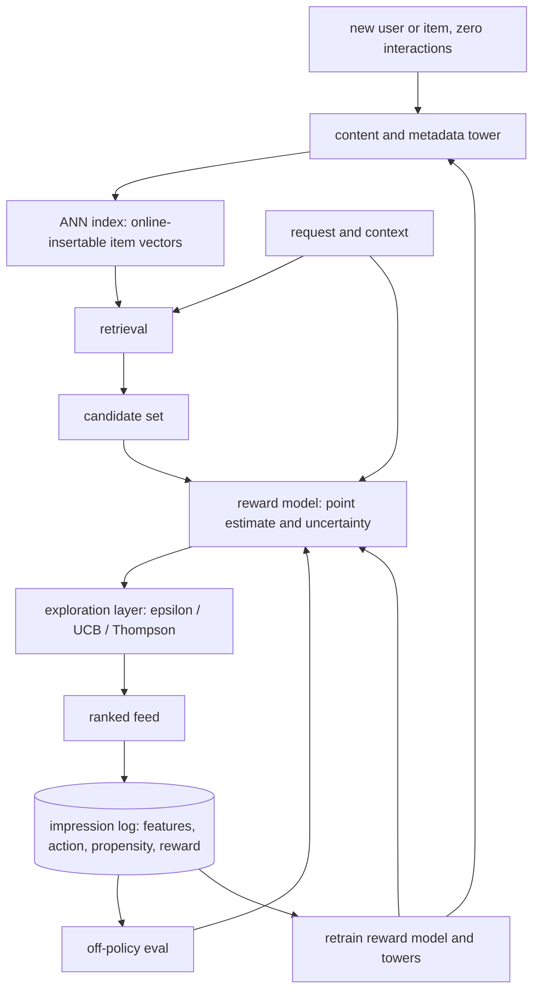

# Cold Start and Exploration

> **Style note.** This chapter follows the same teach-first arc as the
> candidate-retrieval chapter: one dialogue to gather requirements, then a
> consistent frame-data-model-evaluate-serve sequence, one small figure per
> idea, real production case studies, "when to use which" tables, worked
> KaTeX, and interview Q&A. Sections are split one-per-file so no single
> file grows long.

An interviewer rarely says "design a bandit." They say **"your feed keeps
surfacing the same things; new items never get a chance; brand-new users see
garbage on day one. Fix all three."** That is cold start and exploration: the
two problems that break every purely-greedy recommender. This chapter builds
the fix end to end, and shows how Netflix, Spotify, Yahoo, Stitch Fix,
Instacart, Duolingo, DoorDash, and Google actually ship it.

## Sections

1. [Clarifying the requirements](01-clarifying-requirements.md) - the dialogue that scopes the problem.
2. [Framing it as an ML task](02-frame-as-ml-task.md) - explore/exploit; the bandit framing; input and output.
3. [Data preparation](03-data-preparation.md) - content features for cold items and users, feedback logging with propensity.
4. [Model development](04-model-development.md) - epsilon-greedy, UCB, Thompson sampling, contextual bandits, "when to use which."
5. [Evaluation](05-evaluation.md) - off-policy evaluation, regret, online lift, "when to use which."
6. [Serving and scaling](06-serving-and-scaling.md) - exploration budget, feedback loops, bottlenecks.
7. [How teams do it in production](07-how-teams-do-it-in-production.md) - where designs diverge and first-party links.
8. [Interview Q&A](08-interview-qa.md) - commonly asked, tricky, and commonly-answered-wrong.
9. [Summary](09-summary.md) - one-page recap, mermaid, and self-test.

## The whole system on one page

Read the sections in order the first time; they build on each other. Each
opens with the question an interviewer actually asks, then answers it.
