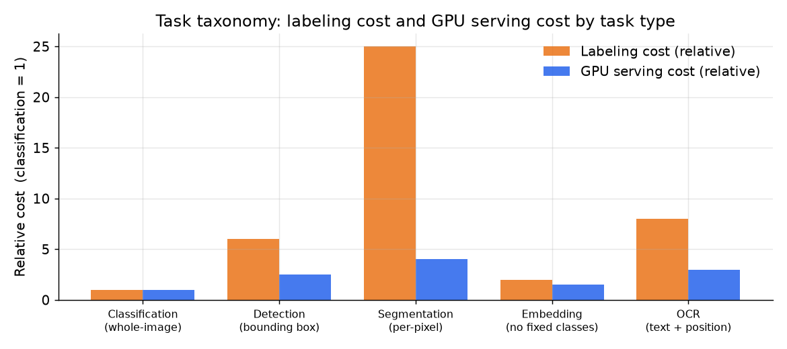

# 2. Framing it as an ML task

## The five task types

The most common junior mistake in a CV interview is reaching for classification
when the product needs detection or segmentation. Before picking a backbone, map
each product requirement to the output shape the head must emit.

*Each task type carries a different label cost (orange) and GPU serving cost
(blue), both relative to whole-image classification. Detection boxes cost six times
more to label than image-level tags. Pixel masks (segmentation) cost about
twenty-five times more. This is why task-head choice is a labeling-budget decision,
not just a modeling decision. Illustrative.*

### Classification (whole-image)

**Input:** one image. **Output:** a probability score per class, one class or
several (multi-label). Used for room-type tagging, blur detection, moderation
gates where the harmful content fills most of the frame.

The head is a linear layer over the backbone's pooled feature vector, followed
by sigmoid (multi-label) or softmax (single-label). Each class gets its own
threshold.

### Detection (bounding boxes)

**Input:** one image. **Output:** a set of (class, confidence, x, y, w, h) tuples.
Used when position matters: amenity detection, finding the harmful region in a
large image, document field localization for OCR.

A detection head adds a region proposal and regression branch on top of a
feature pyramid. Label cost is high (annotators must draw and verify boxes), and
the metric shifts to mean average precision (mAP) at an IoU threshold.

### Segmentation (per-pixel masks)

**Input:** one image. **Output:** a class label or instance mask per pixel.
Semantic segmentation (one label per pixel, e.g., "building" vs "background")
uses an encoder-decoder like U-Net. Instance segmentation (one mask per object)
adds a mask branch to a detector, as in Mask R-CNN.

Used when shape matters: garment cutout for virtual try-on, building footprint
mapping, medical regions of interest. Label cost is the highest of all five
tasks. The metric is mean IoU (mIoU).

### Embedding (vector for retrieval)

**Input:** one image. **Output:** a fixed-length vector in a learned metric space,
where nearby vectors are semantically similar images.

There is no fixed class list, which is exactly why embedding handles a growing
catalog. The head projects the backbone feature to a unit-hypersphere; training
uses contrastive or metric-learning losses. The catalog is precomputed offline and
served via an approximate-nearest-neighbor (ANN) index. Query time is one forward
pass plus one ANN lookup.

### OCR (text extraction)

**Input:** one image. **Output:** word tokens with bounding boxes. OCR is itself
a two-stage pipeline: a text-detection model finds text regions (classification or
detection), followed by a recognition model that reads the characters. It is not a
single classifier.

Used when the value lies in the text inside the image: document search (Dropbox),
ID verification (Uber), reading product labels.

## Mapping the three product asks

| Product requirement | Task type | Head | Why not the alternative |
|---|---|---|---|
| Room-type tagging | Multi-label classification | Sigmoid per class | Detection would add box labeling cost with no product benefit; one tag per image is enough |
| Moderation (nudity, weapons, off-marketplace) | Classification plus detection for small-region harms | Sigmoid gate + detection head for region-level flags | Classification alone misses harms in a small corner of the image; detection adds targeted coverage |
| Visual search (image query) | Embedding retrieval | Projection head to unit sphere | Classification needs a closed class list; the catalog is open and growing |

## When to use which task framing

| Reach for | When | Instead of |
|---|---|---|
| Whole-image classification | the product decision is one label per image, the harm or category fills the frame | detection, when the relevant region is small |
| Detection | position matters, the target is a localized object, you need to count or locate | classification for a localization job (the classic junior mistake) |
| Semantic segmentation | per-pixel labels matter, e.g., garment cutout, building maps | detection when a bounding box is precise enough |
| Instance segmentation (Mask R-CNN style) | you need per-object masks and counts, not just per-class pixel coverage | semantic segmentation when objects do not need to be separated |
| Embedding retrieval | the catalog is open, growing, or has no fixed class list | classification when the taxonomy keeps changing |
| OCR as a pipeline | the product value is the text content of the image | one-shot classification, which does not produce text |

The next section covers how to get training data for each of these heads, and
why labeling cost is the true early budget line.
