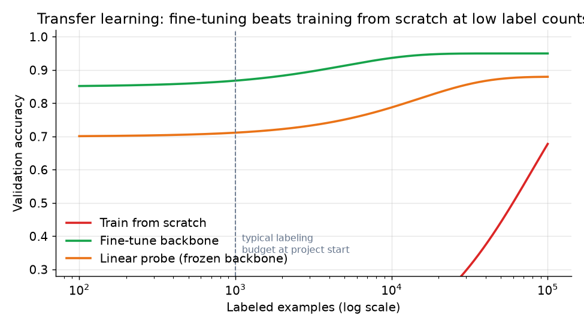

# 3. Data preparation

## Labeling cost per task

Labels are the budget, not GPUs, in the early phase of every CV project. The
cost difference between task types is large enough to change the architecture
decision.

| Task | Label unit | Rough relative cost | Dominant quality lever |
|---|---|---|---|
| Image classification | one tag per image | 1x | Consensus between annotators on edge cases |
| Multi-label classification | a set of tags per image | 2-3x (more tags per image) | Per-class calibration, agreement on rare classes |
| Detection | a drawn and verified bounding box per object | 5-10x | Box tightness, occlusion policy, active learning |
| Segmentation (semantic) | pixel-level masks, often polygon-traced | 20-30x | Labeling tool quality, boundary adjudication |
| Segmentation (instance) | per-object masks | 30-40x | Overlapping object policy, crowd regions |
| OCR (text in image) | text-region boxes plus transcription | 8-12x | Rotation, font, language coverage |

Given this table, starting with a detection or segmentation head for a moderation
gate is usually wrong. A classification gate is far cheaper to bootstrap and
is often good enough; you add detection only once you have measured that small-
region harms are the binding failure mode.

## Free and cheap label sources

Before paying annotators, mine what you already have:

- **EXIF and upload context.** The seller-provided category, the listing type, or
  the filename may already supply a weak label for room type or product class.
- **Human review decisions.** Every time a human reviewer blocks or approves
  content in the moderation queue, that is a gold label. Wire it back automatically
  as a first-class training signal, not an afterthought.
- **Zero-shot from a pretrained embedding.** A CLIP-style model can score an image
  against text prompts ("a photo of a kitchen," "a photo containing a weapon") with
  no labeling at all, giving a noisy but free bootstrapping signal for new classes.
- **Programmatic / weak supervision.** Aggregate multiple noisy signals (EXIF,
  text in the listing, CLIP zero-shot) into a consensus label with a learned
  label-model. Noisy but free.

## Active learning

Once you must spend annotator budget, spend it on the images the model is most
uncertain about. Active learning cycles:

1. Train on the current labeled set.
2. Score all unlabeled images; surface the lowest-margin or highest-entropy examples
   to annotators.
3. Annotate, add to the training set, repeat.

This is the steepest accuracy-per-dollar curve, especially for the long tail of
rare classes where random sampling almost never surfaces an example. Pinterest and
Airbnb both use active selection for their annotation queues; the gains are
largest in the first few cycles, before the model saturates.

## Augmentation

Augmentation is free labels: it multiplies the training set and injects
invariances. Apply with care; not every transform is label-preserving.

| Augmentation | Applies to | Breaks for |
|---|---|---|
| Random horizontal flip | most classification, detection | OCR (text direction), orientation-sensitive tasks |
| Random crop and resize | classification, detection with box adjustment | tasks where the full image context matters |
| Color jitter (brightness, contrast, saturation) | most tasks | image quality scoring (blur, exposure detection) where color is the signal |
| RandAugment or AutoAugment | classification with enough data | small datasets where strong augmentation adds noise |
| Mixup and CutMix | classification | detection and segmentation (mixing bounding boxes is ambiguous) |
| Mosaic (YOLOv4 style) | detection | full-image classification |

The cardinal rule: **the decode-resize-normalize path in augmentation must
exactly match the serving pipeline.** A mismatched preprocessing step is the
single most common silent quality killer. The model trains on one normalization
and serves on another; the accuracy gap never surfaces in offline metrics, only
in production.

## Transfer learning: why almost no one trains from scratch

A pretrained backbone carries millions of labeled images' worth of learned
features. Fine-tuning it with a few thousand domain labels almost always beats
training from scratch with tens of thousands, because the backbone already
encodes edges, textures, shapes, and object parts. The data-efficiency advantage
disappears only once you have hundreds of thousands of domain-specific labels.

*With a small labeling budget (left of the dashed line), a linear probe or fine-
tuned backbone reaches accuracy that training from scratch cannot match until
label counts grow by one to two orders of magnitude. At very large label counts
the gap closes, but few real projects reach that regime before launch. Illustrative.*

**Choosing the transfer strategy:**

| Strategy | When | Instead of |
|---|---|---|
| Linear probe (freeze backbone, train only head) | very few labels, domain is close to pretraining (natural photos) | fine-tuning, which needs more labels to avoid overfitting |
| Partial fine-tune (unfreeze later layers, small LR) | moderate labels, domain partly overlaps with pretraining | full fine-tune, which risks forgetting general features |
| Full fine-tune (unfreeze all layers, decayed LR) | enough labels and domain shifts from natural images (medical, satellite) | training from scratch, which wastes all pretrained knowledge |
| Train from scratch | massive proprietary domain data, no useful public pretraining | fine-tuning, which is almost always better at practical label counts |

## Class imbalance and the long tail

Real image taxonomies are Zipfian: a few classes dominate, hundreds are rare.

- **Never report or optimize plain accuracy.** A model can score 95% by predicting
  the head class on every image. Use macro precision and recall to expose the tail.
- **Loss adjustments.** Class-balanced loss (weight each class by inverse frequency)
  or focal loss (down-weight easy, abundant negatives) are standard fixes.
- **Per-class thresholds.** For multi-label output, one global threshold is wrong.
  Calibrate a threshold per class on a held-out validation split to hit its
  precision or recall target.
- **Tail strategy.** For extreme-tail classes with fewer than a few dozen labeled
  examples, consider retrieval (ANN over embeddings) or zero-shot scoring instead
  of a dedicated head, since the head cannot generalize from so few samples.

With clean data and a sensible augmentation policy in hand, the next section
builds the model.
