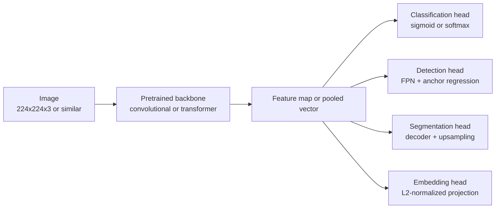
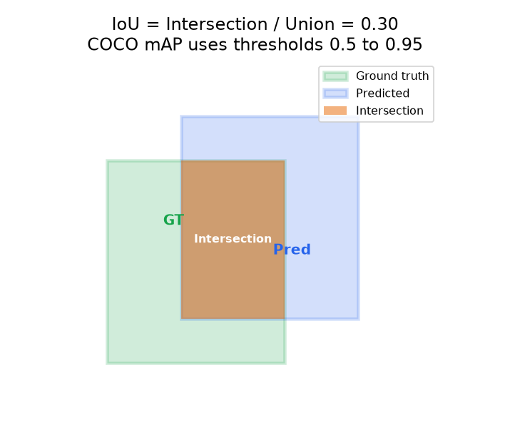

# 4. Model development

## The backbone-plus-head pattern

Almost every production CV system follows the same structural pattern: a
pretrained backbone (CNN or transformer) extracts rich features from the image,
and a lightweight task-specific head converts those features into the output shape
the product needs. The backbone is shared infrastructure; the head is swapped per
task.



Sharing one backbone across heads is the single biggest structural cost win.
A trunk improvement lifts every downstream task at once, and serving one trunk
instead of N separate models cuts GPU cost linearly with N. Pinterest's unified
embedding and Airbnb's plan to share the backbone across the room-type and
amenity-detection heads are both applications of this principle.

## Choosing a backbone

| Backbone | Relative FLOPs | When to reach for it | Strength | Watch out |
|---|---|---|---|---|
| ResNet-50 | 1x (baseline) | Default trunk for classification and detection with a few hundred thousand labels | Proven, debuggable, many pretrained checkpoints | Larger ViTs now dominate when data permits |
| EfficientNet-B0 to B4 | 0.4-1.5x | High-volume batch jobs where cost-per-image dominates (Bumble moderation gate) | Compound scaling: best accuracy per FLOP at moderate scale | Slower to fine-tune than ResNet for small datasets |
| Swin-Tiny to Swin-Base | 1-3x | Detection and segmentation where hierarchical features and shifted-window attention help (better than plain ViT for localization tasks) | Hierarchical feature maps, good for multi-scale tasks | More sensitive to pretraining data volume than ResNet |
| ViT-B/16, ViT-L/16 | 2-8x | When very large pretraining corpora are available; best ceiling on classification | Scales well with data and compute | Needs more labels than CNN to beat fine-tuned ResNet |
| CLIP ViT-B/32, ViT-B/16 | 1-4x | Image-text joint embedding, visual search, zero-shot tagging | Shared image-text space, text-to-image query out of the box | Higher serving latency than a pure image encoder |

> **Trace these backbones live.** ResNet-50, EfficientNet-B0, U-Net, ViT-B/16,
> Swin-Tiny, and CLIP ViT-B/32 are all validated architecture graphs in the
> [Model Zoo](https://github.com/neurarch-ai/awesome-llm-model-zoo) with real
> tensor shapes you can follow block by block.

## Task heads in detail

### Classification head

A global average pool over the backbone's spatial feature map, followed by a
linear layer:

$$\hat{y}_c = \sigma\!\left(W_c \cdot \text{GAP}(F)\right), \quad c \in \{1, \ldots, C\}$$

where $\sigma$ is sigmoid for multi-label (independent per class) or softmax for
single-label (mutually exclusive). For moderation, per-class sigmoid is correct
because a photo can simultaneously trigger multiple harm classes.

### Detection head

Built on a Feature Pyramid Network (FPN) that produces multi-scale feature maps
from the backbone, then two parallel branches per scale: one predicts class
probabilities per anchor, one regresses the (dx, dy, dw, dh) offsets. After
training, non-maximum suppression (NMS) removes duplicate boxes. NMS is a greedy
loop: keep the highest-scoring box, drop every remaining box that overlaps it by
more than an IoU threshold, and repeat on what survives.

```python
import numpy as np
def nms(boxes, scores, iou_thr=0.5):       # boxes: Nx4 as [x1, y1, x2, y2]
    area = (boxes[:,2]-boxes[:,0]) * (boxes[:,3]-boxes[:,1])
    idx = scores.argsort()[::-1]           # process highest score first
    keep = []
    while len(idx):
        i = idx[0]; keep.append(i)         # keep top box, suppress its overlaps
        xx1 = np.maximum(boxes[i,0], boxes[idx[1:],0]); yy1 = np.maximum(boxes[i,1], boxes[idx[1:],1])
        xx2 = np.minimum(boxes[i,2], boxes[idx[1:],2]); yy2 = np.minimum(boxes[i,3], boxes[idx[1:],3])
        inter = np.clip(xx2-xx1, 0, None) * np.clip(yy2-yy1, 0, None)
        iou = inter / (area[i] + area[idx[1:]] - inter)
        idx = idx[1:][iou <= iou_thr]      # drop boxes overlapping the kept one
    return keep
# boxes=[[0,0,10,10],[1,1,11,11],[20,20,30,30]], scores=[.9,.8,.7] -> keep [0, 2]
```

Quality is measured with mean average precision (mAP). The average precision
(AP) for one class is the area under its precision-recall curve. Mean AP averages
over all classes and (for COCO-style evaluation) over IoU thresholds from 0.5 to
0.95 in steps of 0.05:

$$\text{mAP} = \frac{1}{C} \sum_{c=1}^{C} \int_{0}^{1} p_c(r)\, dr$$

where $p_c(r)$ is the precision of class $c$ at recall level $r$.

#### Why dense detectors need focal loss

A single-stage detector scores on the order of tens of thousands of anchors per
image, and the overwhelming majority land on background. Under plain cross-entropy
$\text{CE}(p_t) = -\log(p_t)$, each easy background anchor still contributes a
small but nonzero loss, and summed over tens of thousands of them that trickle
swamps the gradient from the handful of hard foreground anchors. Two-stage
detectors dodge this by sampling (a fixed positive-to-negative ratio, hard-negative
mining); a dense detector has no such stage.

Focal loss (Lin et al., FAIR, 2017, "Focal Loss for Dense Object Detection", the
RetinaNet paper) fixes this by multiplying cross-entropy by a modulating factor:

$$\text{FL}(p_t) = -(1 - p_t)^{\gamma} \log(p_t)$$

The mechanism is entirely in $(1 - p_t)^{\gamma}$. With the common $\gamma = 2$, an
easy example already scored at $p_t = 0.9$ has its loss scaled by $(0.1)^2 = 0.01$,
a hundredfold reduction, while a hard example at $p_t = 0.5$ is scaled by only
$(0.5)^2 = 0.25$, a fourfold reduction. Easy negatives are pushed toward
irrelevance so the few informative examples dominate the gradient, without any
explicit sampling. It is usually paired with an $\alpha$ class-balance weight. The
practical lesson: focal loss is the loss that lets you drop the sampling heuristics,
not a drop-in accuracy knob for an already-balanced two-stage pipeline.

#### Anchor-based vs anchor-free heads

Anchor-based heads (Faster R-CNN, RetinaNet, YOLOv2 and v3) tile every feature-map
location with a preset bank of anchor boxes across scales and aspect ratios, then
regress an offset from each anchor and classify it, matching anchors to ground
truth by an IoU threshold. This introduces hyperparameters a senior engineer has to
tune per domain: anchor scales, aspect ratios, and the positive/negative IoU cutoffs,
all of which interact with the object-size distribution of your data. Anchor-free
heads (FCOS, Tian et al., 2019; CenterNet, 2019) instead predict object centers or
keypoints and regress box extent directly from each location, removing the anchor
bank and its matching thresholds along with the memory of storing many anchors per
location. The tradeoff: anchor-free heads shift the burden onto center/scale
assignment rules and can be more sensitive to crowded, overlapping objects, whereas
a well-tuned anchor set can still edge them out on a domain with a narrow, known
object-size range.

### Segmentation head

**Semantic (U-Net style):** an encoder-decoder where skip connections carry
fine-grained detail from early encoder layers to the decoder's upsampling path.
Each pixel gets a class label. Quality is measured with mean intersection over
union (mIoU):

$$\text{mIoU} = \frac{1}{C} \sum_{c=1}^{C} \frac{\lvert A_c \cap B_c \rvert}{\lvert A_c \cup B_c \rvert}$$

**Instance (Mask R-CNN style):** after RoIAlign extracts per-region features, a
small FCN predicts a binary mask for each detected box. Each object instance gets
its own mask.

IoU for a single prediction is the overlap between the predicted region $A$ and
the ground-truth region $B$:

$$\text{IoU}(A, B) = \frac{\lvert A \cap B \rvert}{\lvert A \cup B \rvert}$$

A common operating threshold is IoU $\geq 0.5$; COCO reports at thresholds from
0.5 to 0.95.



*Green box is the ground truth, blue box is the model prediction, orange region
is the intersection. IoU is the ratio of the orange area to the total area covered
by either box. A prediction with IoU above 0.5 counts as a true positive in most
detection benchmarks.*

### Embedding head

A linear projection layer mapping the backbone's pooled feature to a
$d$-dimensional vector, followed by L2 normalization:

$$e = \frac{W \cdot \text{GAP}(F)}{\lVert W \cdot \text{GAP}(F) \rVert_2}$$

Training uses contrastive or proxy-metric losses that pull matching image pairs
together and push non-matching pairs apart. Cosine similarity between two
embeddings is then a meaningful semantic similarity score.

## Vision foundation models: segment, detect, and embed zero-shot

The biggest recent shift in CV is that you often no longer train a task model from
scratch: large pretrained vision foundation models solve many tasks zero-shot or
serve as a frozen backbone. The reference points:

- **Segment Anything (SAM, Meta, 2023, [arXiv:2304.02643](https://arxiv.org/abs/2304.02643); SAM 2 adds video, 2024, [arXiv:2408.00714](https://arxiv.org/abs/2408.00714)).** A promptable segmentation model: give it a point, box, or mask prompt and it returns a segmentation mask for any object, with no per-class training. Use it for annotation acceleration, interactive selection, and as a class-agnostic mask proposer.
- **DINOv2 (Meta, 2023, [arXiv:2304.07193](https://arxiv.org/abs/2304.07193)).** A self-supervised ViT that produces strong general-purpose image features with no labels, so you can attach a light head (linear probe, segmentation, depth) and get competitive results with little task data. The modern default frozen backbone when labels are scarce.
- **Open-vocabulary detection (Grounding DINO, 2023, [arXiv:2303.05499](https://arxiv.org/abs/2303.05499); YOLO-World, 2024, [arXiv:2401.17270](https://arxiv.org/abs/2401.17270)).** Detect objects described by a text prompt rather than a fixed label set, so a new category needs a phrase, not a labeled dataset.
- **Real-time detectors keep advancing** (the YOLO line through YOLOv8 to v11 from Ultralytics, and RT-DETR), and CLIP (OpenAI, 2021) remains the open-vocabulary classification and image-text retrieval backbone.

When to still train your own: a foundation model is the fast baseline and the
annotation accelerator, but a tuned task-specific model (a detector fine-tuned on
your labeled data) usually still wins on a narrow production task with a fixed label
set and a tight latency budget, because the general model pays for breadth you do not
need. Reach for the foundation model first (especially for cold-start, few labels, or
open-vocabulary needs), then specialize if the metric or latency demands it.

## When to use which backbone and head

| Reach for | When | Instead of |
|---|---|---|
| ResNet-50 plus classification head | multi-label tagging with a few thousand to a few hundred thousand labels, standard natural-image domain | a transformer, which needs more data to pay off |
| EfficientNet plus classification head | high-volume inference where cost per million images is the constraint (Bumble, Cars24) | ResNet, which is less efficient per FLOP at the same accuracy |
| Swin plus detection head | amenity detection, moderation with small-region harms, multi-scale objects | plain ViT, which lacks the hierarchical feature maps detection heads need |
| U-Net plus semantic segmentation head | per-pixel tasks over large images (satellite, medical) where a compact decoder matters | a heavy transformer decoder, when memory and compute are constrained |
| CLIP backbone plus embedding head | visual search, text-to-image retrieval, zero-shot tagging | a classification head, when there is no fixed class list or the catalog keeps growing |
| Shared multi-head (Pinterest pattern) | multiple tasks share most of the computational cost and would benefit from joint feature learning | one model per task, which multiplies serving cost and technical debt |

**Provenance.** The plain ViT trunk is the Vision Transformer (Google, 2020), and
the CLIP backbone is from OpenAI (2021). Detection heads trace to the two-stage
Faster R-CNN (Microsoft, 2015) and its instance-segmentation extension Mask R-CNN
(Meta FAIR, 2017), the single-stage YOLO family (Redmon et al., 2016), and the
set-prediction transformer detector DETR (Meta, 2020).

**Tools.** timm carries pretrained ResNet, EfficientNet, Swin, and ViT backbones behind one interface, and torchvision (Meta) ships ResNet plus detection reference models. For detection and instance heads reach for Detectron2 (Meta) or Ultralytics YOLO; for the U-Net encoder-decoder segmentation head, segmentation-models-pytorch. Swin, ViT, and CLIP encoders come from Hugging Face Transformers or OpenCLIP, and the embedding head is served through an approximate-nearest-neighbor index such as FAISS (Meta).

**Worked example.** A photo app tags user uploads with a multi-label classification head on a ResNet-50 trunk (timm), since a transformer would need more labels to pay off at that data scale. When one high-volume batch job makes cost per image the binding constraint, it swaps in an EfficientNet trunk for better accuracy per FLOP. For a "find similar photos" feature over an open, growing library, a fixed class list does not fit, so it uses a CLIP backbone plus an embedding head indexed in FAISS rather than a classifier. If it later needs to flag a small harmful region, it adds a Swin plus detection head whose hierarchical feature maps a plain ViT lacks. Once several of these heads coexist, it shares the one backbone instead of paying to serve a separate model per task.

## Implementation and training pitfalls

A CV model rarely fails on the backbone choice. It fails on the preprocessing that
differs between train and serve, on the imbalance between objects and background,
and on augmentations that quietly corrupt the label.


*Four shapes a training run takes: healthy convergence (train and val fall together), overfitting (val turns up, early-stop there), learning rate too high (loss oscillates or diverges), and underfitting (loss stays high and flat). Illustrative.*

| Problem | Symptom | Fix |
|---|---|---|
| Foreground/background imbalance in detection | the model predicts mostly background, with low recall on small objects | use focal loss or hard-negative mining, and balance the sampling of positive anchors |
| Train/serve preprocessing mismatch | offline mAP is good but production is worse from a different resize, normalization, or channel order | pin one preprocessing (resize, mean and std, RGB vs BGR) shared by training and serving |
| Frozen-backbone BatchNorm in fine-tuning | validation accuracy is stuck or unstable when fine-tuning on a new domain | freeze the BatchNorm running statistics, or use GroupNorm when the batch is small or the domain shifts |
| Augmentation that changes the label | flips or crops break orientation-sensitive or boundary labels, producing noisy gradients | apply only label-preserving augmentations, and transform boxes and masks together with the image |
| Resolution mismatch train vs inference | small objects vanish at serving resolution and detection recall drops | train and serve at a consistent resolution, or use multi-scale training and an FPN |
| NMS threshold miscalibrated | duplicate boxes survive, or true positives are suppressed in crowded scenes | tune the IoU threshold to scene density, and consider soft-NMS for heavily overlapping instances |
| Overfitting a small labeled set | train loss goes near zero while validation mAP or mIoU plateaus low | freeze more of the backbone, add stronger augmentation, start from a pretrained trunk, and stop early |
| Label noise in masks and boxes | the mIoU ceiling sits below expectations with inconsistent boundaries | audit annotation consistency, relax the boundary IoU, and reconcile rater disagreements |

The through-line: most surprising CV regressions trace to the pixels the model
never saw the same way twice, so lock preprocessing and label handling before
blaming the architecture.
