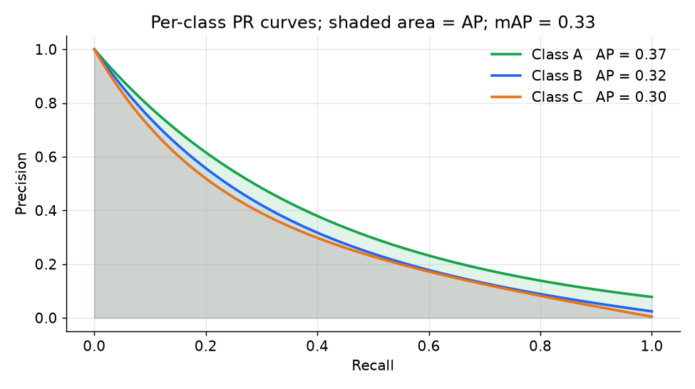

# 5. Evaluation

Picking the wrong metric is the most common CV interview mistake. Accuracy is
almost never the right headline number. The correct metric depends on what the
output shape is and what the product actually gates on.

## Metric by task

### Classification: per-class precision and recall

**Accuracy** (the fraction of correctly classified examples over the total, a
number in [0, 1]) collapses all classes into one number. A model that predicts
the majority class every time can score 95% on an imbalanced dataset while
completely failing on every rare class. Use per-class precision and recall, and
macro-average to expose the tail.

For a binary gate (moderation), the operating point matters more than any single
number. The model outputs a confidence score per image; **precision** is the
fraction of flagged images that are true violations and **recall** is the fraction
of true violations that are flagged, both numbers in [0, 1]. Fix a minimum
precision floor $P_{\min}$ and take the highest recall achievable at or above it:

$$R_{\text{op}} = \max \left\lbrace R : P(t) \geq P_{\min} \right\rbrace$$

For example: "at 90% precision, what is our recall on the nudity class?" That
question maps directly to the product tradeoff (how many violations do we catch
vs. how many legitimate photos do we wrongly flag).

For medical or screening use cases (diabetic retinopathy), the model classifies
each image as positive or negative; **F1** scores those binary predictions against
ground truth and returns a number in [0, 1]. It is the harmonic mean of precision
and recall, punishing a collapse in either equally:

$$F_1 = \frac{2 \cdot P \cdot R}{P + R}$$

### Detection: mAP at IoU thresholds

A predicted bounding box $\hat{B}$ is matched to a ground-truth box $B^{\ast}$ using
**intersection-over-union (IoU)**, which measures spatial overlap and returns a
number in [0, 1]:

$$\text{IoU} = \frac{\text{area}(\hat{B} \cap B^{\ast})}{\text{area}(\hat{B} \cup B^{\ast})}$$

The intersection is the overlap rectangle; the union is the two areas minus that
overlap, so a non-overlapping pair scores 0 and a perfect match scores 1.

```python
def iou(a, b):                       # boxes as (x1, y1, x2, y2)
    ix1, iy1 = max(a[0], b[0]), max(a[1], b[1])       # top-left of the overlap
    ix2, iy2 = min(a[2], b[2]), min(a[3], b[3])       # bottom-right of the overlap
    inter = max(0, ix2 - ix1) * max(0, iy2 - iy1)     # 0 when the boxes do not overlap
    union = (a[2]-a[0])*(a[3]-a[1]) + (b[2]-b[0])*(b[3]-b[1]) - inter
    return inter / union
```

A detection counts as a true positive when its IoU with the best-matching
ground-truth box exceeds a threshold (commonly 0.5). The model produces a set
of (box, class, confidence-score) triples. **Average precision (AP)** for one
class is the area under its precision-recall curve at a fixed IoU threshold.
**mAP** is the mean of AP over all classes, returning a number in [0, 1]:

$$\text{AP}^{(c)} = \int_0^1 P^{(c)}(r)\,dr, \qquad \text{mAP} = \frac{1}{C}\sum_{c=1}^{C} \text{AP}^{(c)}$$

COCO-style mAP further averages over IoU thresholds from 0.5 to 0.95 in steps
of 0.05, written mAP@[.5:.95].



*Each colored curve is one class. The shaded area under each curve is that
class's average precision (AP). mAP is the mean of the AP values across all
classes. A class with a curve that drops steeply (orange) has low AP even if
its peak precision is high, because recall does not extend far.*

Also report precision and recall at the **chosen confidence operating point**,
since the product must pick one threshold to run at.

### Segmentation: mean IoU (mIoU)

The model assigns a class label to each pixel; **mIoU** scores those per-pixel
labels against ground-truth segmentation masks and returns a number in [0, 1].
Let $A_c$ be the set of pixels predicted as class $c$ and $B_c$ the ground-truth
pixels for class $c$; mIoU averages IoU over all classes so a dominant class
cannot hide weak ones:

$$\text{mIoU} = \frac{1}{C} \sum_{c=1}^{C} \frac{\lvert A_c \cap B_c \rvert}{\lvert A_c \cup B_c \rvert}$$

**Boundary IoU** is a stricter variant that restricts evaluation to pixels within
a narrow band around the predicted and ground-truth contours, useful when edge
quality matters (garment cutout, where a rough boundary is visible to the user).

### Embedding retrieval: recall at k

The model produces an embedding for each query image; **R@k** measures retrieval
quality by checking whether the ground-truth relevant item appears in the top-k
nearest neighbors, returning a number in [0, 1] over a labeled query set $Q$:

$$R@k = \frac{1}{\lvert Q \rvert} \sum_{q \in Q} \mathbf{1}\!\left[\text{rel}(q) \in \text{top-}k(q)\right]$$

Measure at the k you actually serve (the ANN shortlist before any re-ranking).
Tuning to look good at k=5 when you serve k=100 optimizes the wrong point.

Also track **mean average precision (MAP)** over the ranked list for cases where
multiple relevant items exist per query. AP(q) is the mean of the precision
values at each rank position where a relevant item appears; MAP averages that
over all queries, returning a number in [0, 1]:

$$\text{AP}(q) = \frac{1}{|R_q|}\sum_{k=1}^{K} P@k(q)\cdot\text{rel}(q,k), \qquad \text{MAP} = \frac{1}{|Q|}\sum_{q \in Q} \text{AP}(q)$$

where $R_q$ is the set of relevant items for query $q$ and $\text{rel}(q,k)$ is
1 if the item at rank $k$ is relevant, 0 otherwise.

### OCR: text accuracy and field coverage

The model produces a text transcription from a document image; **WER** and
**CER** score how many edit operations separate it from the reference. Let $S$,
$I$, $D$ be substitutions, insertions, and deletions and $N$ the reference count:

$$\text{WER} = \frac{S + I + D}{N_{\text{words}}}, \qquad \text{CER} = \frac{S_c + I_c + D_c}{N_{\text{chars}}}$$

Both output error rates (0 = perfect; values above 1 are possible when insertions
are numerous). For structured documents (ID cards, receipts), also report
per-field extraction accuracy (all characters in the target field correct).

## When to use which metric

| Reach for | When | Instead of |
|---|---|---|
| Per-class recall at a fixed precision floor | a harm gate (moderation) where missing a violation has an asymmetric cost | accuracy, which hides recall on rare harm classes |
| Macro precision and recall per class | multi-label tagging over a long-tailed taxonomy | overall accuracy, which is dominated by the head classes |
| F1 | screening with balanced harm cost on FP and FN (medical grading) | accuracy on imbalanced data |
| mAP at IoU (COCO style) | detection quality across all classes and thresholds | accuracy or per-class threshold, which do not measure localization |
| mIoU | semantic segmentation where per-class coverage matters | pixel accuracy, which is dominated by background |
| Recall at k at the serving k | embedding retrieval quality | classification metrics, which do not measure ranked retrieval |

**Tools.** scikit-learn computes precision, recall, F1, and precision-recall curves for the classification rows, and torchmetrics offers the same plus batched GPU implementations of mAP and mIoU. COCO-style mAP at IoU thresholds is standard through pycocotools, while segmentation mIoU and boundary IoU come from torchmetrics. Recall at k is measured against the same approximate-nearest-neighbor shortlist you serve, for example a FAISS (Meta) index.

**Worked example.** A photo app picks a headline number per task instead of defaulting to accuracy. For its moderation gate, missing a violation is far costlier than an occasional false flag, so it reports per-class recall at a fixed precision floor (scikit-learn), which accuracy would hide on the rare harm class. For its long-tailed tagging taxonomy it macro-averages precision and recall so the head classes cannot mask a weak tail. When it adds a detector for small-region harms it switches to mAP at IoU (pycocotools), because accuracy does not measure localization. For a garment-cutout feature it reports mIoU rather than pixel accuracy that the background dominates, and for visual search it reports recall at the k it actually serves.

## Evaluation discipline

Several practices separate a real evaluation from a flattering one:

- **Frozen per-task test set.** Never tune thresholds on the test set. Hold out a
  fixed labeled test split per task and refresh it periodically as the data
  distribution changes.
- **Time-based split for retrieval.** Hold out future queries and evaluate whether
  today's index retrieves them. A random split leaks future items into the training
  embeddings.
- **Sliced metrics.** Report metrics sliced by category, geography, skin tone, and
  photo quality, not just aggregate. A gap that passes the aggregate bar can still
  be a launch blocker on a specific slice.
- **Calibration.** Raw softmax logits are not probabilities. Temperature-scale
  (or Platt-scale) the outputs so that a threshold of 0.9 actually means 90%
  precision. Especially important for the moderation escalate band.
- **Online proxy.** Offline metrics are necessary but not sufficient. Pair each
  offline metric with an online proxy: human-review overturn rate for moderation,
  click or conversion for visual search. A regression in overturn rate is live
  precision signal.

The next section translates these metrics into serving requirements and the
cost-per-million-images number that actually drives infrastructure decisions.
