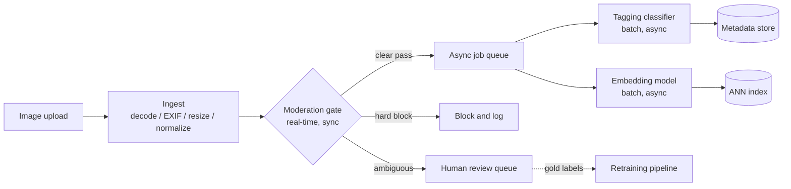

# 6. Serving and scaling

## The real-time versus batch split

The single most important infrastructure decision is which tasks sit on the
synchronous publish path and which can run asynchronously. This split determines
the GPU fleet shape, the latency budget per model, and the fail-closed versus
fail-open policy.

**Moderation** runs synchronously and must complete before a publish decision is
made. The latency budget is p99 under a few hundred milliseconds. Any model on
this path must be distilled or quantized to hit that budget, and there must be a
defined fail-closed behavior (hold for human review) for timeouts.

**Tagging and embedding** run asynchronously off a job queue. They can use larger,
more accurate models on throughput-optimized GPU instances (spot capacity is viable
here), and delay is measured in minutes, not milliseconds.

## GPU cost and efficiency levers

At 5 million uploads per day, the number that matters is cost per million images,
not cost per request. The levers, roughly in order of impact:

1. **Backbone choice.** Replacing ResNet-50 with EfficientNet-B0 can cut FLOPs by
   50-60% at similar accuracy. For the moderation gate this is the first thing to
   measure.
2. **Knowledge distillation.** Train a small "student" model to mimic the logits of
   a large "teacher." The student runs at 5-10x lower latency. Bumble's approach:
   distill the heavy model, keep the heavy model for borderline cases only.
3. **Quantization (int8, FP16).** INT8 quantization cuts memory bandwidth by 4x and
   is near-lossless for most classification tasks when properly calibrated.
   TensorRT and ONNX Runtime can compile and quantize in one step.
4. **Dynamic batching.** Group multiple requests into one forward pass. On the async
   tagging path this is trivial (just fill the batch). On the real-time moderation
   path, use a short batching window (1-5 ms) with a fallback to single-image
   inference to protect p99.
5. **Backbone sharing.** Running one trunk with multiple heads reduces per-image
   compute proportionally to the number of heads that share it.
6. **CPU decode off the critical path.** JPEG decode is CPU-heavy. If it is serial,
   it starves the GPU. Use a dedicated decode stage, prefetch, and GPU decode where
   available.

## ANN index for visual search

For the embedding path, serving is a two-step pipeline: one forward pass to
embed the query image, then an ANN lookup in the catalog index.

At 80 million catalog images, a flat exact search is too slow. Use an approximate
index. The same recall-latency-memory tradeoff from candidate retrieval systems
applies here.

| Index type | When | Recall vs. latency | Memory |
|---|---|---|---|
| HNSW | catalog is stable, memory is available | Best recall per ms | High (full-precision vectors) |
| IVF (inverted file) | catalog churns, filtering by category or date | Good recall, cheap filtering | Medium |
| HNSW with PQ (product quantization) | index must fit memory at 80M+ items | Slightly lower recall, compact | Low (4-bit to 8-bit vectors) |
| Flat / brute force | small catalog (under a million), or to establish a recall ceiling | Exact, slowest | High |

New uploads must be embedded and upserted into the index within minutes (per the
freshness requirement). Content features, not the learned ID embedding, carry cold
items until they accumulate interactions.

## Bottlenecks

| Bottleneck | First sign | Fix | Tradeoff |
|---|---|---|---|
| Moderation p99 blows latency budget | user-visible publish delay, SLO breach | Distill to a faster gate model; run heavy model only on the escalate band; add dynamic batching | Slightly lower accuracy on borderline cases |
| GPU decode starves the GPU on tagging | GPU utilization below 60% despite high queue depth | Separate decode workers, prefetch pipelines, or GPU decode (DALI) | Extra infrastructure, more moving parts |
| ANN recall degrades after retrain | search relevance drops, click rate falls | Version and re-embed the full catalog when the backbone changes; coordinate index rebuild with model swap | Heavy offline job; must budget the rebuild window |
| Long tail of rare harm classes at near-zero recall | moderation miss rate increases for specific harm class | Add dedicated active-learning cycle for that class; or use retrieval (hash matching + ANN) as a fallback | More labeling cost or a slower fallback path |
| EXIF orientation bug | sideways photos consistently miscategorized | Assert EXIF correction is applied in the ingest stage before any model runs | One-time fix, easy to verify |

**Details.** The rare-harm-class fallback that pairs hash matching with ANN is
where perceptual hashing earns its place: PDQ (Meta) computes a compact perceptual
hash so known-violating images survive re-encoding, resizing, and mild edits and
can be matched by Hamming distance with no per-class training data, making it a
viable floor while the active-learning loop slowly gathers labels. On the p99 row,
the distilled gate model runs on every item and only the escalate band pays for the
heavy model, so average cost tracks the small escalate rate rather than the heavy
model's per-item cost.

## Fail-closed versus fail-open

For any task on the publish critical path, you must state what happens when the
model is unavailable or returns a very low confidence:

- **High-harm classes (weapons, illegal content):** fail closed, route to human
  review. Publishing and reviewing later is worse than holding temporarily.
- **Low-harm classes (listing quality gate):** can fail open (allow publish,
  correct async). A short delay on a quality flag is acceptable; blocking all
  uploads during a model outage is not.
- **Tagging and embedding:** both are async and off the critical path. An outage
  means tags and search appear delayed, not that the publish is blocked.

State these policies explicitly in the design. They are what the interviewer
is actually probing when they ask "what happens if the model times out?"
