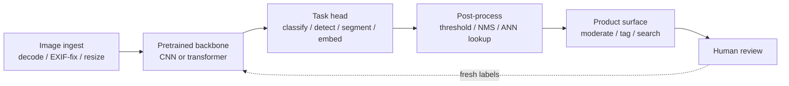

# 7. How teams do it in production

Every large CV system converges on the same skeleton: a canonical ingest stage
feeds a pretrained backbone, and a task-specific head converts features into a
product decision. What actually differs between companies is the task the head
serves and whether the output gates a publish, tags a photo, or lands in an ANN
index.

## The shared pipeline

Read every design below as a specialization of this canonical flow.

What changes across systems is the head and the serving tail. The ingest stage
and backbone are shared infrastructure. A backbone improvement lifts every
downstream task at once.

## Where real designs diverge

| System | Task | Backbone | Serving | Headline metric | When it wins | Watch out |
|---|---|---|---|---|---|---|
| Airbnb room-type | Multi-label classification | ResNet-50 fine-tuned | Offline batch | Per-class precision and recall | Fixed taxonomy, cheap image-level labels, batch is fine | Long tail sinks macro recall; one global threshold is wrong for multi-label |
| Airbnb amenity detection | Detection | CNN with detection head | Offline batch | mAP at IoU | Localized objects, supports consumer features and region-level moderation | Box labels cost 5-10x more; small objects drag mAP down |
| Meta Mask R-CNN | Instance segmentation | CNN with FPN plus mask branch | Batch, research eval | COCO mask AP | Per-object masks and counts, not just a box | Mask labels are the most expensive; heaviest head to serve; RoIPool quantization hurts without RoIAlign |
| Dropbox OCR | OCR (two-stage: detect then recognize) | DenseNet-121 corner detection, OCR engine | Async batch | Text and search accuracy | Value is searchable text at 20B-image scale; document gate saves most compute | Two-stage pipeline; orientation matters; gate on OCR-ability first to avoid running on all images |
| Pinterest unified embedding | Embedding, multi-task | SE-ResNeXt, shared backbone | Offline ANN index | Retrieval relevance plus engagement | Open growing catalog; one trunk lifts all three product surfaces | Re-embed the whole catalog on retrain; visual similarity is not purchase intent |
| Zalando Shop the Look | Segmentation plus embedding | CNN plus U-Net for background removal | Offline ANN index | Retrieval relevance | Real-world photos have noisy backgrounds; whitening aligns with clean catalog | Two models to keep in sync; segmentation errors propagate into retrieval |
| Google Africa buildings | Semantic segmentation | U-Net with edge loss | Offline batch (continental scale) | Precision-recall at 0.5 IoU by terrain type | Per-pixel building maps over huge satellite imagery | Domain shift from natural images forces full fine-tune; adjacent buildings merge without edge weighting |
| Netflix pixel error | Detection over video frames | Full-resolution CNN, 5-frame window | Batch QC | Defect precision and recall | Pixel-level defects erased by any downsampling; temporal context rejects false positives | Cannot resize; full-resolution inference is compute-heavy; synthetic training data required |
| Netflix in-video search | Image-text embedding | CLIP-style contrastive model | Offline ANN index (Elasticsearch) | Recall on text queries | Text-to-image search over open set, zero-shot; one index for both query types | Precompute and re-embed cost; video-level pooling needed over frame-level; fine-tuning image-text models on in-house shot-text pairs adds 15-25% on retrieval tasks |
| Google diabetic retinopathy | Binary classification | Deep CNN | Batch screening | F1 vs. ophthalmologist graders | High-stakes single-label medical grading; expert labels only | Calibration, slice and fairness gaps are launch blockers; multi-grader consensus is required |
| Bumble Private Detector | Binary classification (real-time gate) | EfficientNetV2 | Real-time inline gate | Accuracy at fixed precision and recall | Fast yes/no gate on message path; tight latency budget | Needs fail-closed policy on timeout; adversarial evasion (cropping, overlays); hard negatives (arms, legs) are essential |
| Cars24 blur detector | Binary classification (image quality gate) | DCT feature pipeline plus classical classifier | Inline, CPU only | Test accuracy, false-reject rate | 12 ms per image on one CPU core; runs ahead of all GPU models | Aggregate accuracy hides seller-facing false-reject rate; DCT only catches optical blur |
| Shopify product categorization | Multi-label classification, multimodal | Multilingual BERT plus MobileNet-V2, concatenated | Batch | Precision and coverage per taxonomy level | Large hierarchy (5500 classes); text disambiguates ambiguous images | Per-level thresholds to control precision-coverage tradeoff; soft hierarchy in training |
| Uber document check | Multi-task classification (quality) plus detection (field extraction) | TFLite multi-task on-device, server-side OCR and fraud | On-device real-time plus server async | Auto-capture rate, field accuracy | On-device quality gate cuts bad uploads before they reach the server; user-facing friction reduced | Quantization needed for mid-range phones; region-based retention and encryption are non-optional |
| Canva shape recognition | Sequence classification (stroke) | Single LSTM, 64K params | On-device, browser, under 10 ms | Shape accuracy | Tiny model runs offline in the browser; coordinate sequence enables geometric augmentation | Sigmoid over 9 classes (not softmax) allows "no match" rejection; RDP simplification is required |

## The systems

First-party engineering writeups: read them for what an interview answer skips (who the system serves, the eval bar, the deployment shape).

- **Airbnb** [Categorizing Listing Photos at Airbnb](https://medium.com/airbnb-engineering/categorizing-listing-photos-at-airbnb-f9483f3ab7e3): ResNet-50 classifies 500M+ listing photos by room type to organize home tours.
- **Airbnb** [Amenity Detection and Beyond](https://medium.com/airbnb-engineering/amenity-detection-and-beyond-new-frontiers-of-computer-vision-at-airbnb-144a4441b72e): Object detection finds amenities in listing photos for moderation and consumer features.
- **Meta (FAIR)** [Mask R-CNN](https://ai.meta.com/research/publications/mask-r-cnn/): Instance segmentation extending Faster R-CNN with a mask branch; top COCO results.
- **Dropbox** [Using machine learning to index text from billions of images](https://dropbox.tech/machine-learning/using-machine-learning-to-index-text-from-billions-of-images): In-house classifier, corner detection, and OCR make scanned text searchable at 20B-image scale.
- **Pinterest** [Unifying visual embeddings for visual search](https://medium.com/pinterest-engineering/unifying-visual-embeddings-for-visual-search-at-pinterest-74ea7ea103f0): One multi-task embedding replaces per-product models across Lens, crop, and Shop the Look.
- **Zalando** [Shop the Look with Deep Learning](https://engineering.zalando.com/posts/2018/09/shop-look-deep-learning.html): ConvNet matching plus U-Net segmentation finds catalog items from real-world photos.
- **Netflix** [Accelerating Video Quality Control with Pixel Error Detection](https://netflixtechblog.com/accelerating-video-quality-control-at-netflix-with-pixel-error-detection-47ef7af7ca2e): A full-resolution CNN over 5 frames detects pixel defects, cutting manual QC to minutes.
- **Netflix** [Building In-Video Search](https://netflixtechblog.com/building-in-video-search-936766f0017c): Contrastive image-text embeddings, precomputed and served via Elasticsearch, let editors search footage by text.
- **Google Research** [Mapping Africa's Buildings with Satellite Imagery](https://research.google/blog/mapping-africas-buildings-with-satellite-imagery/): A U-Net trained on 1.75M labeled buildings maps 516M structures across Africa.
- **Google Research** [Deep Learning for Detection of Diabetic Eye Disease](https://research.google/blog/deep-learning-for-detection-of-diabetic-eye-disease/): A CNN on 128K retinal images detects diabetic retinopathy at ophthalmologist-level F-score.
- **Bumble** [Open-sourcing Private Detector](https://medium.com/bumble-tech/bumble-inc-open-sources-private-detector-and-makes-another-step-towards-a-safer-internet-for-women-8e6cdb111d81): An EfficientNetV2 binary classifier flags and blurs unsolicited lewd images at over 98% accuracy.
- **Cars24** [Blur Classifier: Image Quality Detector](https://medium.com/cars24-data-science-blog/blur-classifier-image-quality-detector-7c1de5ff8e59): A CNN blur classifier gates used-car listing photos on quality before they publish.
- **Shopify** [Using Rich Image and Text Data to Categorize Products at Scale](https://shopify.engineering/using-rich-image-text-data-categorize-products): A multimodal image-plus-text model auto-classifies merchant products into a large taxonomy.
- **Uber** [Uber's Real-Time Document Check](https://www.uber.com/en-GB/blog/ubers-real-time-document-check/): On-device image-quality ML plus verification checks ID documents in real time across 60+ countries.
- **Canva** [Ship Shape](https://www.canva.dev/blog/engineering/ship-shape/): A tiny 64K-param LSTM recognizes hand-drawn shapes in the browser in under 10 ms, fully offline.

The core dividing line across all of these: what the head emits. A fixed-class
label, a localized box or mask, or an open-set vector. That one choice sets the
label cost, the serving shape, and which metric you report.
