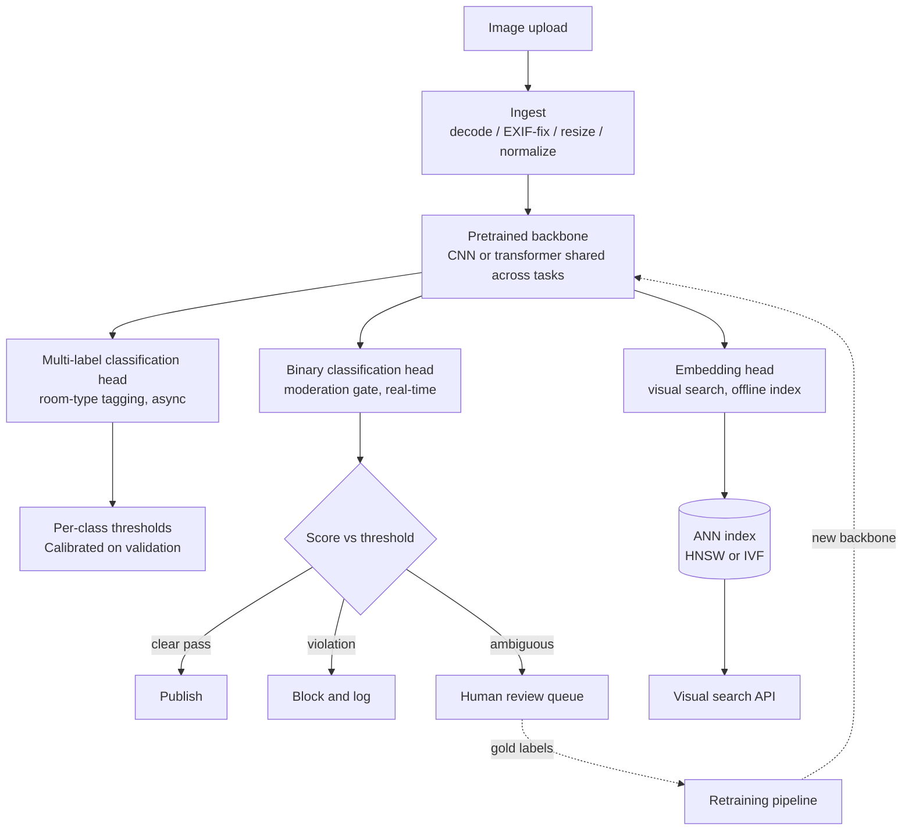

# 9. Summary

## One-page recap

- **Task taxonomy is the first deliverable.** "Tag, moderate, and search" maps to
  at least three distinct ML task types. State which task the head serves before
  choosing a backbone. Using classification for a localization job is the classic
  junior mistake.
- **Labeling cost, not GPU cost, is the early budget line.** Pixel masks cost
  25-30x more than image-level tags. The task-head decision is a labeling-budget
  decision first.
- **Almost no one trains from scratch.** A pretrained backbone carries orders of
  magnitude more labeled-data equivalent than a project's annotation budget.
  Fine-tune the backbone; swap the head.
- **Share one backbone across heads.** One trunk improvement lifts every task at
  once. Pinterest, Airbnb, and Shopify all exploit this.
- **Pick the metric the product actually implies.** Per-class recall at a fixed
  precision floor for a harm gate. mAP at IoU for detection. mIoU for
  segmentation. Recall at k at the serving k for retrieval. Accuracy is almost
  never right.
- **Real-time vs. batch is an infrastructure decision, not a modeling one.**
  Moderation gates sync on the publish path and need distilled or quantized
  models. Tagging and embedding run async on cheaper throughput-optimized
  capacity.
- **Train-serve preprocessing skew is the most common silent killer.** Assert the
  decode-resize-normalize path is byte-identical between training and serving
  before blaming the model.
- **Human review is part of the system.** Overturn rate is live precision signal
  for moderation. Review decisions are the highest-quality labels in the pipeline.

## The whole pipeline

## Test yourself

1. A seller uploads a photo. The room-type classifier says "kitchen" with 0.6
   confidence. The moderation classifier says "weapons" with 0.3 confidence.
   What does the system do? What does the answer depend on?
2. You are asked to add "amenity detection" (find the pool, the fireplace) to the
   existing room-type classification pipeline. What changes and what stays the
   same? What is the labeling cost impact?
3. Visual search is returning visually similar but wrong-category items. Name two
   root causes and a fix for each.
4. You retrain the shared backbone with a better pretraining recipe. The offline
   mIoU for the segmentation head improves 3 points but recall at k for visual
   search drops 2 points. What do you do?
5. The moderation team reports a recall regression on the "weapons" class after the
   last retrain. Walk through how you would diagnose it without access to the
   training code.
6. Your CLIP-based embedding serving latency at p99 is 180 ms but the SLO is
   50 ms. Name three levers you can pull, and the tradeoff each one makes.

## Further reading

- Dense reference with all case studies, comparisons, math, and production
  diagrams: [../../topics/12-computer-vision.md](../../topics/12-computer-vision.md).
- Model Zoo (trace ResNet-50, EfficientNet-B0, U-Net, ViT-B/16, Swin-Tiny, CLIP
  ViT-B/32 at real tensor shapes):
  [https://github.com/neurarch-ai/awesome-llm-model-zoo](https://github.com/neurarch-ai/awesome-llm-model-zoo).
