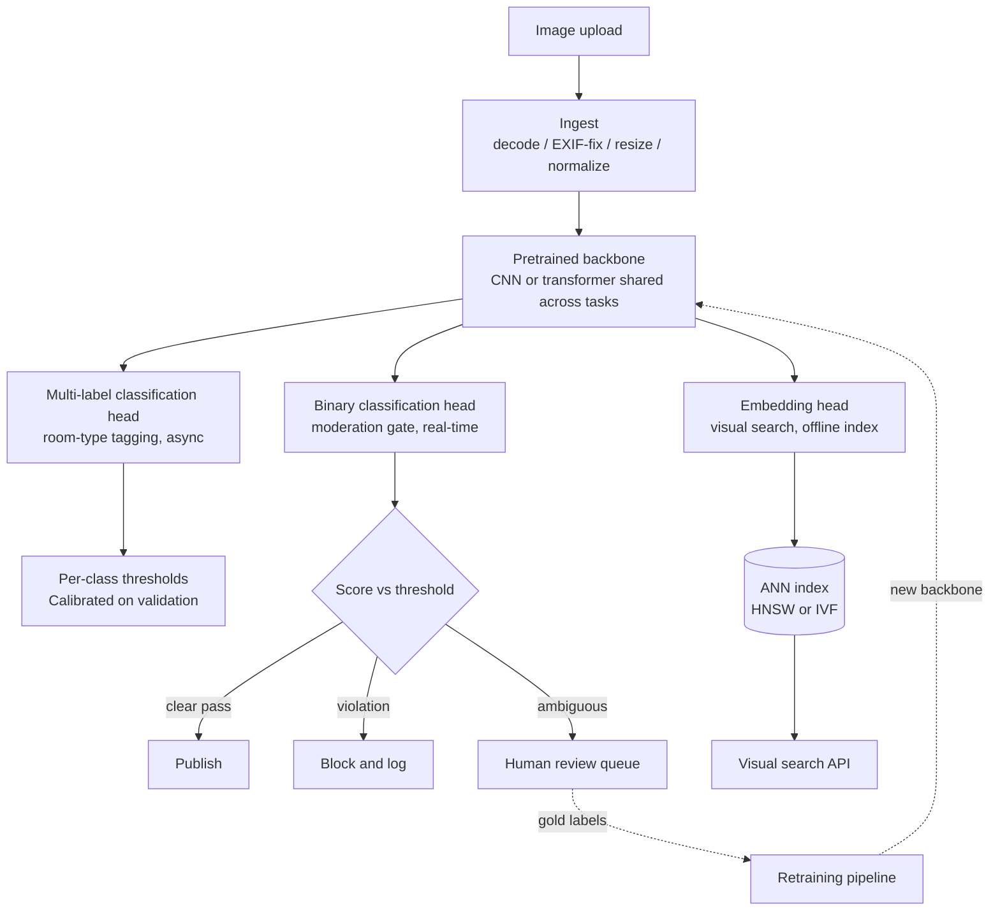

# 9. Summary

## One-page recap

- **Task taxonomy is the first deliverable.** "Tag, moderate, and search" maps to
  at least three distinct ML task types. State which task the head serves before
  choosing a backbone. Using classification for a localization job is the classic
  junior mistake.
- **Labeling cost, not GPU cost, is the early budget line.** Pixel masks cost
  25-30x more than image-level tags. The task-head decision is a labeling-budget
  decision first.
- **Almost no one trains from scratch.** A pretrained backbone carries orders of
  magnitude more labeled-data equivalent than a project's annotation budget.
  Fine-tune the backbone; swap the head.
- **Share one backbone across heads.** One trunk improvement lifts every task at
  once. Pinterest, Airbnb, and Shopify all exploit this.
- **Pick the metric the product actually implies.** Per-class recall at a fixed
  precision floor for a harm gate. mAP at IoU for detection. mIoU for
  segmentation. Recall at k at the serving k for retrieval. Accuracy is almost
  never right.
- **Real-time vs. batch is an infrastructure decision, not a modeling one.**
  Moderation gates sync on the publish path and need distilled or quantized
  models. Tagging and embedding run async on cheaper throughput-optimized
  capacity.
- **Train-serve preprocessing skew is the most common silent killer.** Assert the
  decode-resize-normalize path is byte-identical between training and serving
  before blaming the model.
- **Human review is part of the system.** Overturn rate is live precision signal
  for moderation. Review decisions are the highest-quality labels in the pipeline.

## The whole pipeline

```mermaid
flowchart TD
  UP[Image upload] --> ING[Ingest<br/>decode / EXIF-fix / resize / normalize]
  ING --> BB[Pretrained backbone<br/>CNN or transformer shared across tasks]
  BB --> CLS[Multi-label classification head<br/>room-type tagging, async]
  BB --> MOD[Binary classification head<br/>moderation gate, real-time]
  BB --> EMB[Embedding head<br/>visual search, offline index]
  CLS --> THRESH[Per-class thresholds<br/>Calibrated on validation]
  MOD --> GATE{Score vs threshold}
  GATE -->|clear pass| PUB[Publish]
  GATE -->|violation| BLOCK[Block and log]
  GATE -->|ambiguous| REVIEW[Human review queue]
  EMB --> ANN[(ANN index<br/>HNSW or IVF)]
  ANN --> SEARCH[Visual search API]
  REVIEW -.gold labels.-> RETRAIN[Retraining pipeline]
  RETRAIN -.new backbone.-> BB
```

**How it works.** An uploaded image enters the ingest stage, which decodes it,
fixes EXIF orientation, resizes, and normalizes so every downstream task sees a
consistent tensor. That tensor passes once through the shared pretrained backbone,
whose features fan out to three task heads: a multi-label classification head for
room-type tags (run asynchronously), a binary moderation head (run in real time),
and an embedding head (indexed offline). Each head has its own post-processing:
classification applies per-class calibrated thresholds, moderation compares its
score against a threshold to publish, block, or route ambiguous cases to a human
review queue, and the embedding is written to an ANN index that serves the visual
search API. The human review queue produces gold labels that feed the retraining
pipeline, which periodically ships a new backbone, closing the loop.

## Test yourself

Answers are collapsed. Attempt each question before opening one.

1. A seller uploads a photo. The room-type classifier says "kitchen" with 0.6
   confidence. The moderation classifier says "weapons" with 0.3 confidence.
   What does the system do? What does the answer depend on?

   

Answer

   Nothing publishes or blocks on the raw numbers: each score is compared against
   its own **per-class calibrated threshold**, and only the moderation score can
   gate the publish. Room-type tagging is async and off the critical path, so the
   0.6 kitchen score never delays anything; it is checked against the kitchen
   class's own threshold and either writes a tag or does not. The weapons score
   is the decision that matters, and the answer depends entirely on where 0.3
   sits relative to the weapons operating point, which for a high-harm class is
   deliberately set low because the metric is recall at a fixed precision floor,
   not accuracy. Three outcomes follow from that comparison: a clear pass
   publishes, a hard violation blocks and logs, and the ambiguous band routes to
   the **human review queue**, whose decisions come back as gold labels. It also
   depends on calibration: raw sigmoid outputs are not probabilities until
   temperature-scaled, so 0.3 means nothing until the per-class threshold has
   been fitted on a held-out validation split. Sections
   [5](05-evaluation.md) and [6](06-serving-and-scaling.md) cover the operating
   point and the sync-gate flow.

   

2. You are asked to add "amenity detection" (find the pool, the fireplace) to the
   existing room-type classification pipeline. What changes and what stays the
   same? What is the labeling cost impact?

   

Answer

   The ingest stage and the shared trunk stay; what changes is a new head, a new
   metric, and a new annotation pipeline. **Unchanged:** the single decode /
   EXIF-fix / resize / normalize path, the pretrained backbone every head branches
   from, and the human-review-to-retraining loop. **Changed:** amenity detection
   is a localization task, so it needs a detection head (an FPN with per-anchor
   classification and box regression, or an anchor-free center-and-extent head),
   NMS post-processing with its own IoU threshold tuned separately from the
   evaluation IoU, and a metric shift from per-class precision and recall to mAP
   at IoU. It can stay on the async batch path, since finding a fireplace does not
   gate a publish. The backbone preference may also move: section
   [4](04-model-development.md) puts Swin ahead of a plain ViT here because
   detection heads need hierarchical multi-scale feature maps. The **labeling cost
   is the real impact**: a drawn and verified bounding box costs 5-10x an
   image-level tag (section [3](03-data-preparation.md)), so the same annotation
   budget buys five to ten times fewer examples, which is why this head is
   justified only once small or localized targets are the measured failure mode.
   Airbnb shipped exactly this pair, room-type classification then amenity
   detection, on one trunk (section
   [7](07-how-teams-do-it-in-production.md)).

   

3. Visual search is returning visually similar but wrong-category items. Name two
   root causes and a fix for each.

   

Answer

   Two causes dominate and they need different fixes. First, **the embedding was
   trained on visual similarity rather than intent**: an embedding space encodes
   whatever relation its training pairs supervised, so pairs built from
   augmentations or co-occurring pixels teach it that texture, color, and shape
   are what "near" means, and the neighbors come back as texture matches from the
   wrong category. Fix it by redefining the pairs: fine-tune with
   engagement-derived labels (query, item clicked after that query) using proxy
   metric learning, which is the Pinterest fix, or add a supervised re-ranker over
   the ANN shortlist that sees the query and the candidate together. Second, **the
   query image does not look like the catalog image**: real-world photos carry
   noisy backgrounds while the catalog is clean, so background pixels dominate the
   vector. Fix that upstream of the encoder with background removal, which is
   Zalando's U-Net segmentation step in Shop the Look, at the cost of a second
   model to keep in sync whose errors propagate into retrieval. A third cause
   worth ruling out first is a version mismatch: if the backbone was retrained
   without a coordinated full catalog re-embed, query vectors and index vectors
   are no longer in the same space (sections
   [6](06-serving-and-scaling.md) and [8](08-interview-qa.md)).

   

4. You retrain the shared backbone with a better pretraining recipe. The offline
   mIoU for the segmentation head improves 3 points but recall at k for visual
   search drops 2 points. What do you do?

   

Answer

   Do not ship on the aggregate: the shared trunk is what makes both heads cheap
   and also what couples their regressions, so the 2-point retrieval loss has to
   be explained before the 3-point mIoU gain is banked. First rule out the
   mechanical cause, because **a recall drop right after a backbone swap is
   usually a version mismatch, not a quality loss**: new-trunk query embeddings
   are hitting an index built by the old trunk, so re-embed the full catalog,
   rebuild the index, and re-measure (section
   [6](06-serving-and-scaling.md) lists this as a named bottleneck). If the drop
   survives a coordinated rebuild, measure it honestly: recall at k must be taken
   at the k you actually serve, on a frozen time-based query split, and sliced
   rather than aggregate, per section [5](05-evaluation.md). Then price the trade
   against the online proxies, click or conversion for search versus whatever the
   segmentation feature gates, since 3 offline points and 2 offline points are not
   comparable currency. If the regression is real and search is worth more, the
   options are to keep the old trunk for the embedding head and eat the extra
   serving cost of a second backbone, or to put the retrieval objective back into
   the joint training so trunk gradients stop drifting away from the metric space
   (section [4](04-model-development.md)).

   

5. The moderation team reports a recall regression on the "weapons" class after the
   last retrain. Walk through how you would diagnose it without access to the
   training code.

   

Answer

   Work forward from the pixels and the operating point; the model weights are the
   last thing to suspect. One, **check the threshold before the model**: a retrain
   can deflate confidence scores while preserving ranking, so mAP or AP looks
   unchanged while the fixed cutoff now slices a different point on the
   precision-recall curve. Recalibrate the weapons threshold on validation and
   re-report recall at the fixed precision floor (sections
   [5](05-evaluation.md) and [8](08-interview-qa.md)). Two, **run the paired
   preprocessing probe**: push a fixed set of known-good images through both the
   training and serving pipelines and diff the logits, instrumenting decode,
   resize, normalization constants, channel order, and EXIF correction until any
   divergence is found, since this bug is invisible to offline metrics that only
   ever exercise the training path. Three, read the live signal: per-class
   **overturn rate** in the human review queue is the production precision and
   recall proxy, and slicing by geography and photo quality will show whether the
   loss is one slice or the whole class. Four, check the class mix: weapons is a
   long-tail class, so a change in resampling, class-balanced or focal weighting,
   or what the active-learning queue surfaced can move its recall without any
   architecture change. Five, confirm the non-model fallbacks are still wired,
   because perceptual hashing and ANN-over-embeddings retrieval are what hold the
   floor on a rare harm class (section [6](06-serving-and-scaling.md)).

   

6. Your CLIP-based embedding serving latency at p99 is 180 ms but the SLO is
   50 ms. Name three levers you can pull, and the tradeoff each one makes.

   

Answer

   In section [6](06-serving-and-scaling.md)'s order of impact: **one, shrink the
   model (distill or swap the trunk).** A distilled student runs at 5-10x lower
   latency and swapping ResNet-50 for EfficientNet-B0 cuts FLOPs 50-60% at similar
   accuracy; the tradeoff for an embedding head is severe, because a new trunk
   produces a new metric space and forces a full catalog re-embed and index
   rebuild on top of the accuracy loss. **Two, quantize to INT8 or FP16** with
   TensorRT or ONNX Runtime, which cuts memory bandwidth about 4x and is
   near-lossless for most tasks when properly calibrated; the tradeoff is
   calibration work plus a small recall loss, and if the vectors move at all the
   catalog has to be re-embedded to stay comparable. **Three, add dynamic batching**
   with a short window (1-5 ms) and a fallback to single-image inference; the
   tradeoff is that batching buys throughput and cost per million images more than
   it buys tail latency, and the queueing window itself is added to p99. Before
   pulling any of them, confirm the 180 ms is actually model time: CPU JPEG decode
   is heavy and, if it runs serially, it starves the GPU, in which case the fix is
   dedicated decode workers, prefetch, or GPU decode rather than a smaller model.
   Note also that CLIP carries higher serving latency than a pure image encoder
   (section [4](04-model-development.md)), so if text-to-image query is not a
   product requirement, dropping the joint image-text backbone is the cheapest
   lever of all.

   

## Further reading

- The capstone: [the complete build](10-putting-it-together.md), where every
  choice in this chapter is committed once for the scenario, costed, rebuilt
  under two other constraint sets, and compressed into a runnable one-file NMS.
- Dense reference with all case studies, comparisons, math, and production
  diagrams: [../../topics/12-computer-vision.md](../../topics/12-computer-vision.md).
- Model Zoo (trace ResNet-50, EfficientNet-B0, U-Net, ViT-B/16, Swin-Tiny, CLIP
  ViT-B/32 at real tensor shapes):
  [https://github.com/neurarch-ai/awesome-llm-model-zoo](https://github.com/neurarch-ai/awesome-llm-model-zoo).
