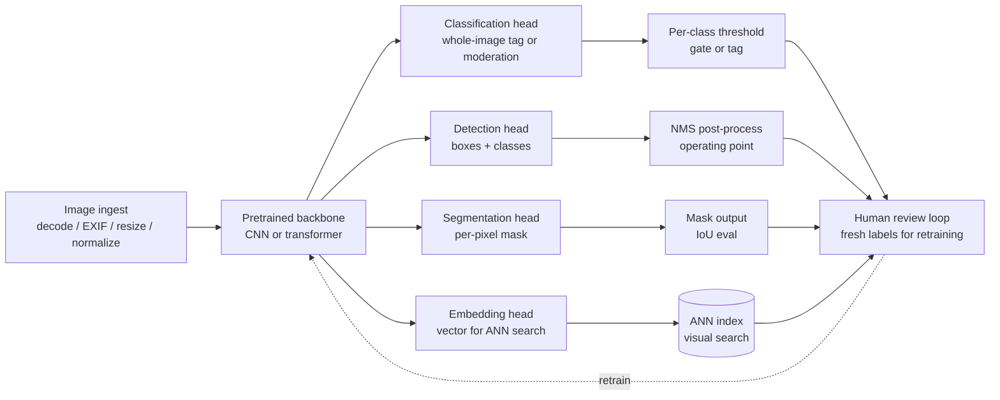

# Computer Vision Systems

> **Style note.** This chapter follows the same teach-first, book-like arc as the
> Candidate Retrieval sample: a Candidate/Interviewer dialogue to gather requirements,
> then a consistent frame-data-model-evaluate-serve structure, one figure per
> idea, real production case studies, "when to use which" tables, and an interview
> Q&A. It borrows the *thinking* of the genre without copying any single source's
> format.

An interviewer rarely says "design a computer vision model." They say **"we
let hosts upload photos and we need them tagged, moderated, and searchable."**
That single sentence hides four distinct ML tasks (classification, detection,
segmentation, embedding) with different label costs, different metrics, and
wildly different failure economics. This chapter builds those systems end to end
and shows how Airbnb, Pinterest, Netflix, Bumble, Google, Dropbox, Zalando, and
others actually ship them.

## Sections

1. [Clarifying the requirements](01-clarifying-requirements.md) - the dialogue
   that surfaces task taxonomy, labeling cost, and GPU serving cost.
2. [Framing it as an ML task](02-frame-as-ml-task.md) - picking
   classification, detection, segmentation, embedding, or OCR; input and output.
3. [Data preparation](03-data-preparation.md) - labeling cost per task,
   augmentation, transfer learning, active learning, class imbalance.
4. [Model development](04-model-development.md) - pretrained backbones, task
   heads, multi-head sharing, and the math behind IoU and mAP.
5. [Evaluation](05-evaluation.md) - accuracy, mAP, mIoU, recall at k, and how
   to pick the right metric for each task.
6. [Serving and scaling](06-serving-and-scaling.md) - GPU cost, distillation,
   quantization, batch vs real-time, ANN index for embeddings, bottlenecks.
7. [How teams do it in production](07-how-teams-do-it-in-production.md) -
   divergence table across companies, first-party links.
8. [Interview Q&A](08-interview-qa.md) - commonly asked, tricky, and commonly
   answered wrong, with clear answers.
9. [Summary](09-summary.md) - one-page recap, mermaid pipeline, test-yourself
   questions, further reading.

## The whole system on one page

**How it works.** An image enters at the left through ingest, which decodes,
orientation-fixes, resizes, and normalizes it into one consistent tensor. That
tensor runs once through the shared pretrained backbone, whose features branch to
four task heads: classification, detection, segmentation, and embedding. Each head
has a matching post-processing step: classification applies per-class thresholds to
gate or tag, detection runs NMS to pick a clean operating point, segmentation emits
a mask evaluated by IoU, and the embedding is written to an ANN index for visual
search. All four output paths converge on a human review loop, whose fresh labels
retrain the backbone, so a single feature extractor amortizes across every task
while each head keeps its own output contract.

Read the sections in order the first time; each opens with the question an
interviewer actually asks, then answers it.
