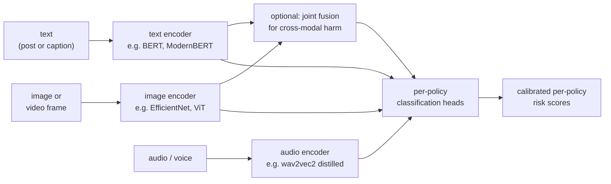

# 2. Framing it as an ML task

## Defining the ML objective

The platform wants to block genuine harm while letting ordinary users post freely.
We translate that into a precise ML objective: **for each piece of content and each
policy class, estimate the probability that the content violates that policy, and
pick the decision threshold that maximizes recall subject to a minimum precision
constraint specific to that policy.**

Framing it as "maximize accuracy" or "minimize loss" misses the structure of the
problem. There is no single correct threshold. The precision floor per policy is set
by the cost asymmetry between a miss and a false block, and that asymmetry varies
by orders of magnitude across harm classes.

## Specifying the input and output

**Input:** A piece of content (text string, image tensor, video file, or audio stream)
plus context (user account age, platform surface, region, language, prior policy
history on the account).

**Output:** A vector of per-policy risk scores, one per harm class in scope. Each
score is a calibrated probability (not a raw logit), because the policy engine needs
to compare it against a fixed threshold that was tuned on calibrated probabilities.

The policy engine, which sits downstream and is not an ML model, converts the score
vector into an enforcement action based on per-policy thresholds and business rules.
The model's job is accurate, calibrated scores. The policy engine's job is decisions.
Conflating the two is a common mistake.

## Why one model for "bad" fails

The junior answer is a single "toxicity" classifier trained on a mix of all harm types.
That fails for three reasons:

1. **Operating points differ by orders of magnitude.** Self-harm content is handled
   gently, routing the user to support resources, while CSAM is reported to authorities
   within hours. You cannot express that with one threshold on one output.

2. **Drift rates differ.** Spam mutates weekly as adversaries find new evasion. Nudity
   is relatively stable. Putting them in one model means the retraining cadence needed
   for spam forces unnecessary retrains of the nudity head, or the stable nudity head
   anchors retraining so slowly that the spam head falls behind the attack.

3. **Accountability is per policy.** Each policy usually has a policy owner who tunes
   its operating point against real appeal and miss data. A shared output collapses
   that accountability.

The right architecture is a **shared backbone with per-policy heads**: one encoder per
modality (text encoder, image backbone, audio encoder) shared across all policies,
followed by independent per-policy classification heads with independent thresholds
and independent calibration.

## Multimodal inputs and the cross-modal failure mode

Content harm often crosses modality boundaries. The canonical hard case is the
"hateful memes" problem: an image is benign, the caption is benign, but the combination
is hateful. A system that runs a text classifier and an image classifier independently
and ORs the results will pass this case. You need a joint vision-language model that
reasons over image and text together.

The joint fusion layer is expensive, so you gate it behind cheaper unimodal pre-filters
and only invoke it when the unimodal signals are ambiguous or conflicting.

## Choosing the right ML category per modality

This is a **supervised multi-label classification** problem at its core: for each
content item and each policy class, output a binary label plus calibrated probability.
But the specifics differ by modality.

| Modality | Model family | Input representation | Key challenge |
|---|---|---|---|
| Text | Fine-tuned transformer encoder (BERT, ModernBERT) | Token sequence | Obfuscation: leetspeak, homoglyphs, zero-width chars |
| Image | CNN or vision transformer (EfficientNet, ResNet, ViT) | Pixel tensor, normalized | Adversarial edits: borders, crops, re-encodes |
| Video | Sampled-frame image model plus audio model | Keyframe tensors + audio track | Cost: full-fidelity is too expensive; sample and escalate |
| Audio / voice | Self-supervised speech model (wav2vec2, distilled WavLM) | Raw waveform or mel spectrogram | Streaming: rolling-window inference, no pre-publish gate |
| Image + text jointly | Dual-encoder fusion or CLIP-style model | Both image tensor and token sequence | The hateful-memes problem: joint meaning not unimodal |

**When to use which framing.**

| Reach for | When | Instead of |
|---|---|---|
| Shared backbone with per-policy heads | you have more than two harm classes and they share modality (all are text, all are image) | one output node per policy with fully separate models, which wastes compute |
| Independent full models per policy | drift rates and data distributions are radically different across classes | a shared backbone that gets retrained too often or not enough |
| Joint vision-language model | harm requires both image and text to be present and neither alone is sufficient | ORing unimodal scores, which passes cross-modal violations |
| Distilled audio model for voice | you need sub-100ms streaming inference on a rolling window | the full large audio model, which cannot meet the latency budget live |
| Hash matching before any classifier | content has been seen before (CSAM, terrorist media, removed items) | running a classifier on known-bad material that a hash catches for free |
