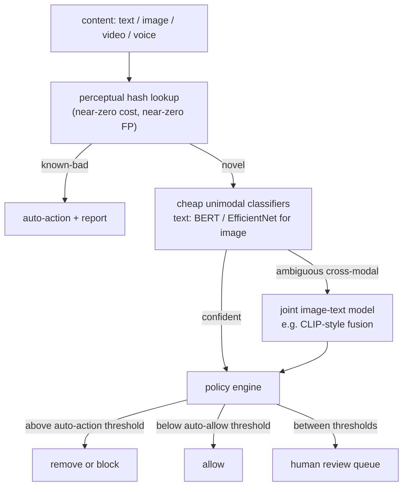
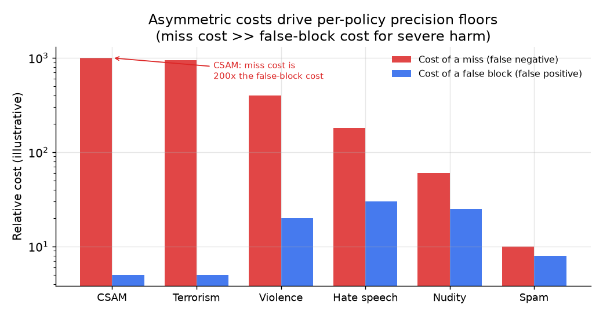
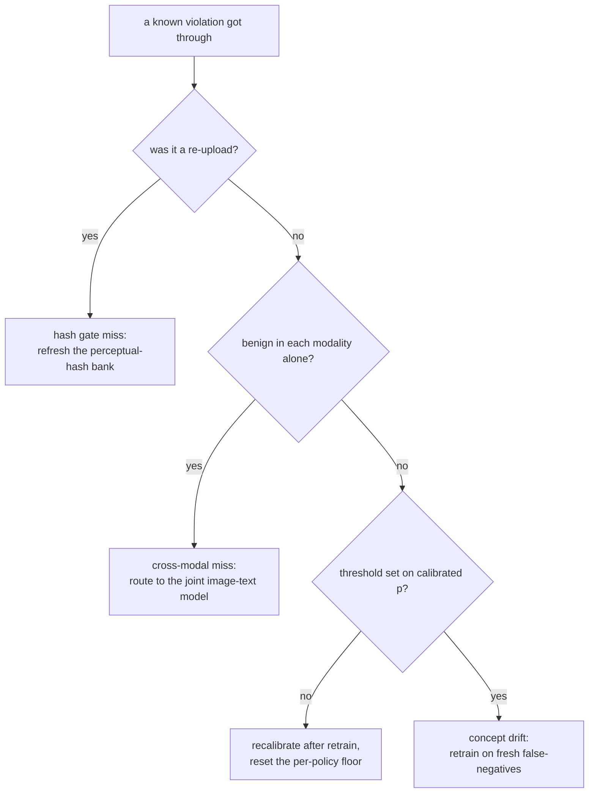

# 4. Model development

## The classifier stack

The system does not run one model. It runs a funnel: nearly-free signal first,
cheap classifiers second, expensive joint models only on the cases that reach them.

**How it works.** Every incoming item (text, image, video, or voice) first hits a perceptual-hash lookup, a near-zero-cost, near-zero-false-positive gate that auto-actions and reports known-bad re-uploads before any model runs. Novel items pass to cheap unimodal classifiers (a fine-tuned text encoder, EfficientNet for images); confident scores go straight to the policy engine, while ambiguous cross-modal cases escalate to the expensive joint image-text model first. The policy engine applies each policy's tuned thresholds and splits the outcome three ways: above the auto-action threshold removes or blocks, below the auto-allow threshold allows, and anything in the borderline band between them routes to the human review queue. Cost rises left to right, so the funnel spends heavy compute only on the small fraction of items that survive the cheaper gates.

### The perceptual-hash gate: match radius and its two failure modes

The hash gate leads the funnel because it is the one component that is near-zero-cost
and near-zero-false-positive at the same time, but both properties hinge on one tunable:
the Hamming-distance match radius $r$ (a candidate matches a bank entry when the two
256-bit PDQ strings differ in at most $r$ bits). That single knob is a precision-recall
dial for the gate itself, and it has an asymmetric cost structure that mirrors the
classifier thresholds downstream. Set $r$ too tight and a re-encode, crop, or logo
overlay pushes the hash just past the radius, so the gate misses a known-bad re-upload
and leaks it to the more expensive (and more fallible) classifiers, which is a recall
loss on the cheapest, most reliable stage. Set $r$ too loose and unrelated benign images
start colliding with bank entries, which auto-actions innocent content: the collision
probability grows sharply with $r$ because the number of 256-bit strings within Hamming
distance $r$ is $\sum_{i=0}^{r}\binom{256}{i}$, so each extra bit of slack enlarges the
match ball combinatorially. The near-zero-false-positive claim is therefore a property
of a conservatively chosen $r$, not an intrinsic guarantee of perceptual hashing.

Two failure modes survive even a well-tuned radius, and both explain why the hash gate
sits *before* the classifiers rather than replacing them. First, the bank only stores
fingerprints of material already known to be bad, so it has zero generalization: a
first-of-its-kind violating image (novel harm, never seen) hashes to something no bank
entry is near and passes untouched. The gate catches re-uploads, not new content, which
is precisely why the classifiers behind it carry the novel-harm recall. Second, the
Hamming threshold is the attack surface: an adversary who possesses the bank (or can
probe the gate) can perturb pixels to move the hash past $r$ while the image stays
perceptually identical to a human, defeating the fingerprint without visibly changing
the content. The mitigation is not a cleverer single hash but defense in depth (multiple
independent hash algorithms, periodic bank refresh from confirmed misses, and the
downstream classifiers as the backstop for anything the bank cannot match).

### Text classifiers

Fine-tuned transformer encoders (BERT-family, ModernBERT) are the workhorse. Each
policy class gets its own fine-tuned head; the encoder may be shared. ModernBERT
handles longer contexts and performs better on obfuscated inputs than the original
BERT because it was pre-trained on more diverse web text including noisy social media.

Text requires a normalization layer before the encoder: Unicode normalization, homoglyph
replacement, zero-width character stripping. An attacker who inserts invisible Unicode
between letters defeats a model that never normalizes.

### Image and video classifiers

CNNs (EfficientNet family) or vision transformers for per-policy image classification.
EfficientNet-B0 is cheap enough for ingest-time filtering at high volume; larger variants
(B3, B5) or ViT-Base add accuracy for the heavier pass. Video is sampled: extract
keyframes (every N seconds or on scene change), run the image models on frames, and
escalate suspicious segments to denser frame analysis. Full-fidelity frame-by-frame
is too expensive at scale.

### Audio and voice classifiers

Self-supervised speech models (wav2vec2, WavLM) either classify audio directly or
transcribe-then-classify. For live voice chat (Roblox's problem), you need a distilled
student model running on a 10-to-15-second rolling window at sub-100ms latency. The
Roblox bootstrap-and-distill chain: use Whisper to transcribe audio at scale, apply
the existing text-filter ensemble to those transcriptions to generate machine labels,
then use those labels to train a small audio student (fine-tuned WavLM, approximately
48M parameters) that infers directly from audio without a transcription step at serve
time, then quantize. The result serves over 2,000 requests per second.

### Joint image-text models

For cross-modal harm (hateful memes, images with captions that are benign alone but
hateful together), you need a model that reasons over both image and text jointly.
CLIP-style dual encoders map both into a shared embedding space. A fusion model
(ViLBERT, VisualBERT, or a cross-attention layer over image patches and text tokens)
adds early interaction between the two modalities. Early fusion consistently wins
on benchmarks but is too expensive to run on everything; gate it behind cheap unimodal
pre-filters.

## The loss and the operating point

The standard loss for binary classification is binary cross-entropy:

$$L = -\frac{1}{N}\sum_{i=1}^{N}\bigl[y_i \log \hat{p}_i + (1-y_i)\log(1-\hat{p}_i)\bigr]$$

With severe class imbalance (harm prevalence below one percent), add a class weight
$w$ to the positive term:

$$L = -\frac{1}{N}\sum_{i=1}^{N}\bigl[w \cdot y_i \log \hat{p}_i + (1-y_i)\log(1-\hat{p}_i)\bigr]$$

The weight $w$ is tuned per policy on a calibration holdout until the precision-recall
curve at the desired recall has the required precision.

After training, the key operation is **finding the operating threshold**. For policy
$k$ with minimum precision $P_{\min}^{(k)}$:

$$\tau^{\star}_k = \arg\max_{\tau}\ \text{Recall}(\tau) \quad \text{subject to} \quad \text{Precision}(\tau) \geq P_{\min}^{(k)}$$

where

$$\text{Precision}(\tau) = \frac{\text{tp}(\tau)}{\text{tp}(\tau)+\text{fp}(\tau)}, \qquad \text{Recall}(\tau) = \frac{\text{tp}(\tau)}{\text{tp}(\tau)+\text{fn}(\tau)}$$

This is a scan over the precision-recall curve, not a gradient step. You plot the
PR curve on the calibration holdout, draw a horizontal line at $P_{\min}^{(k)}$, and
take the rightmost intersection (highest recall that still meets the precision floor).
The threshold at that point is $\tau^{\star}_k$.

*Three policies, three floors. CSAM demands near-perfect precision before any
auto-action; spam can act at a lower floor because a wrong spam removal is cheap.
The operating point for each policy is the rightmost intersection with its precision
floor. Illustrative.*

The cost-weighted view makes the asymmetry explicit:

$$\tau^{\star}_k = \arg\min_{\tau}\ \bigl[c_{\text{fn}}^{(k)} \cdot \text{fn}(\tau) + c_{\text{fp}}^{(k)} \cdot \text{fp}(\tau)\bigr], \qquad \frac{c_{\text{fn}}^{(k)}}{c_{\text{fp}}^{(k)}} \gg 1 \text{ for CSAM and terrorism}$$

*Hypothetical severe-harm example: in a case where the miss cost vastly exceeds the
false-block cost (as with CSAM, where even a single miss has catastrophic
consequences), the precision floor before auto-action is forced extremely high. Spam:
costs are closer to balanced, allowing a lower precision floor and higher recall.
Illustrative log scale; the precise cost ratio varies by platform and policy.*

## Calibration

The policy engine compares the model score against a threshold that was tuned on
calibrated probabilities. If the model outputs uncalibrated logits, the threshold
loses its meaning after a retrain (the new model may have a different logit scale).
Apply Platt scaling or isotonic regression on a held-out calibration set after each
retrain to ensure $\hat{p}_i \approx P(\text{violates} \mid \text{score} = \hat{p}_i)$.

## When to use which classifier

| Reach for | When | Instead of |
|---|---|---|
| Fine-tuned BERT for text | high-volume text with obfuscation when you add a normalization front-end | a raw regex rule list, which adversaries defeat in hours |
| ModernBERT for text | long posts, documents, or obfuscated inputs where original BERT loses context | BERT alone when the input regularly exceeds 512 tokens |
| EfficientNet-B0 for images | ingest-time filtering where you need to classify millions of images per hour cheaply | a large ViT at ingest, which blows the compute budget |
| ViT-Base or larger image model | you have budget and accuracy matters more than cost (review queue pre-ranking, not ingest gate) | EfficientNet-B0 in cases where hard borderline images are the miss path |
| Distilled wav2vec2 / WavLM for voice | live voice chat with a streaming latency budget under 100ms | the full large audio model, which cannot serve streaming at scale |
| CLIP-style joint vision-language model | image and caption together carry harm that neither carries alone | ORing a text and an image model, which passes cross-modal violations |
| Shared backbone with per-policy heads | multiple policies share the same modality and have similar data distributions | fully independent models per policy when the encoder can be shared |
| Per-policy class-weighted BCE | severe imbalance up to roughly 1:10000 | unweighted loss that learns to output near-zero probabilities for everything |

**Provenance.** The fine-tuned text encoder is BERT (Google, 2018); the image
transformer is the Vision Transformer (Google, 2020); the joint vision-language
model is CLIP (OpenAI, 2021); the near-free hash front-end is PDQ (Meta); and
per-policy score calibration uses Platt scaling (Platt, 1999).

**Tools.** Text encoders (BERT, ModernBERT) fine-tune with Hugging Face Transformers; image models (EfficientNet, ViT) come from timm (PyTorch Image Models) or torchvision. Self-supervised speech models (wav2vec2, WavLM) ship in fairseq (Meta) and Hugging Face, and knowledge distillation to a small student is a standard PyTorch (Meta) training loop. Joint vision-language fusion uses OpenCLIP or Hugging Face CLIP checkpoints, and the near-free hash front-end runs on perceptual hashing such as PDQ (Meta) or imagehash. Per-policy threshold scans and Platt or isotonic calibration are one call each in scikit-learn (precision_recall_curve, CalibratedClassifierCV).

**Worked example.** A social app moderating uploads runs a funnel rather than one model. A PDQ perceptual-hash lookup auto-actions known-bad re-uploads at near-zero cost; novel text goes to a fine-tuned ModernBERT (chosen over plain BERT because posts often exceed 512 tokens and arrive obfuscated) behind a Unicode-normalization front-end, and novel images hit EfficientNet-B0 at ingest because a large ViT would blow the per-hour compute budget. Only ambiguous caption-plus-image cases escalate to a CLIP-style joint model, gated so it never runs on everything. Live voice chat gets a distilled WavLM student to fit the sub-100ms streaming budget. Each policy trains with class-weighted BCE and gets its own threshold from a PR-curve scan, with the CSAM floor forced near-perfect while spam sits lower.

## Implementation and training pitfalls

Moderation models fail in ways that map directly to escaped harm or wrongful
removals: a threshold set on the wrong scale, an adversary who evades the encoder,
or a label loop that never sees its own misses.

| Problem | Symptom | Fix |
|---|---|---|
| Threshold set on uncalibrated logits | the precision floor is silently violated after each retrain as the logit scale moves | recalibrate (Platt or isotonic) after every retrain and set thresholds on calibrated probabilities |
| Severe class imbalance | the model outputs near-zero for everything and recall collapses | use class-weighted BCE or focal loss, tune the weight on a calibration holdout, then recalibrate |
| Adversarial obfuscation | homoglyph, zero-width, and Unicode tricks slip past the text model | add a normalization front-end (Unicode NFKC, homoglyph mapping, zero-width stripping) before the encoder |
| Distillation label drift | the audio or student model inherits and amplifies the teacher's errors | validate the student against human labels, refresh teacher labels, and monitor student-teacher agreement |
| Concept drift in harm patterns | recall decays as adversaries evolve and the fixed threshold no longer holds | retrain on fresh appeals and confirmed misses on a schedule, and monitor per-policy PR by cohort |
| Cross-modal harm missed by OR of unimodal | image and text are each benign but harmful together, so both models pass | route ambiguous cases to a joint image-text model instead of OR-ing unimodal scores |
| Human-review label feedback loop | the model only relabels what it already flagged, so blind spots persist | sample below-threshold traffic for review and feed confirmed misses back into training |
| Video keyframe undersampling | harm in unsampled frames is missed, leaving a recall gap on video | sample on scene change and escalate suspicious segments to denser frame analysis |

The through-line: the threshold only means what the calibration and the funnel let
it mean, so verify both before trusting any per-policy operating point.
