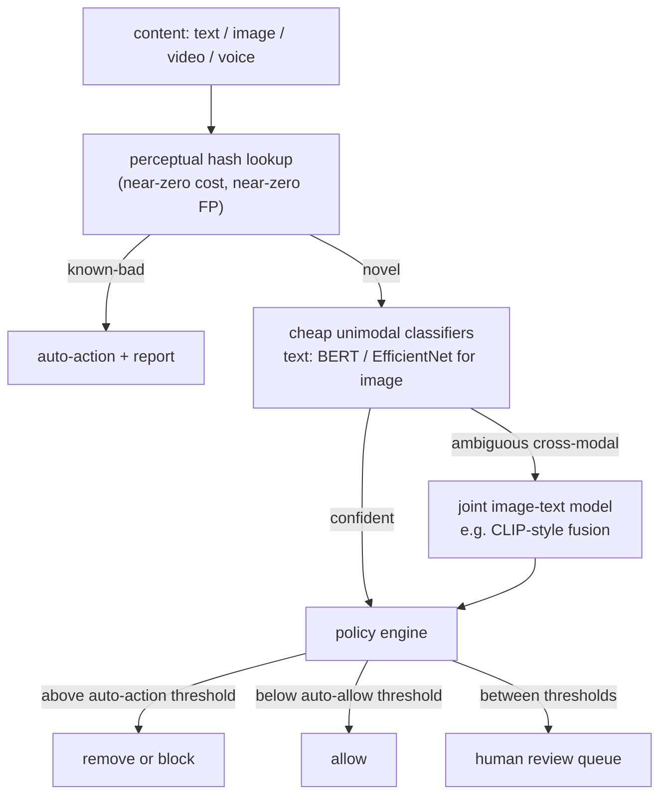

# 4. Model development

## The classifier stack

The system does not run one model. It runs a funnel: nearly-free signal first,
cheap classifiers second, expensive joint models only on the cases that reach them.

### Text classifiers

Fine-tuned transformer encoders (BERT-family, ModernBERT) are the workhorse. Each
policy class gets its own fine-tuned head; the encoder may be shared. ModernBERT
handles longer contexts and performs better on obfuscated inputs than the original
BERT because it was pre-trained on more diverse web text including noisy social media.

Text requires a normalization layer before the encoder: Unicode normalization, homoglyph
replacement, zero-width character stripping. An attacker who inserts invisible Unicode
between letters defeats a model that never normalizes.

### Image and video classifiers

CNNs (EfficientNet family) or vision transformers for per-policy image classification.
EfficientNet-B0 is cheap enough for ingest-time filtering at high volume; larger variants
(B3, B5) or ViT-Base add accuracy for the heavier pass. Video is sampled: extract
keyframes (every N seconds or on scene change), run the image models on frames, and
escalate suspicious segments to denser frame analysis. Full-fidelity frame-by-frame
is too expensive at scale.

### Audio and voice classifiers

Self-supervised speech models (wav2vec2, WavLM) either classify audio directly or
transcribe-then-classify. For live voice chat (Roblox's problem), you need a distilled
student model running on a 10-to-15-second rolling window at sub-100ms latency. The
Roblox bootstrap-and-distill chain: use Whisper to transcribe audio at scale, apply
the existing text-filter ensemble to those transcriptions to generate machine labels,
then use those labels to train a small audio student (fine-tuned WavLM, approximately
48M parameters) that infers directly from audio without a transcription step at serve
time, then quantize. The result serves over 2,000 requests per second.

### Joint image-text models

For cross-modal harm (hateful memes, images with captions that are benign alone but
hateful together), you need a model that reasons over both image and text jointly.
CLIP-style dual encoders map both into a shared embedding space. A fusion model
(ViLBERT, VisualBERT, or a cross-attention layer over image patches and text tokens)
adds early interaction between the two modalities. Early fusion consistently wins
on benchmarks but is too expensive to run on everything; gate it behind cheap unimodal
pre-filters.

## The loss and the operating point

The standard loss for binary classification is binary cross-entropy:

$$L = -\frac{1}{N}\sum_{i=1}^{N}\bigl[y_i \log \hat{p}_i + (1-y_i)\log(1-\hat{p}_i)\bigr]$$

With severe class imbalance (harm prevalence below one percent), add a class weight
$w$ to the positive term:

$$L = -\frac{1}{N}\sum_{i=1}^{N}\bigl[w \cdot y_i \log \hat{p}_i + (1-y_i)\log(1-\hat{p}_i)\bigr]$$

The weight $w$ is tuned per policy on a calibration holdout until the precision-recall
curve at the desired recall has the required precision.

After training, the key operation is **finding the operating threshold**. For policy
$k$ with minimum precision $P_{\min}^{(k)}$:

$$\tau^{\star}_k = \arg\max_{\tau}\ \text{Recall}(\tau) \quad \text{subject to} \quad \text{Precision}(\tau) \geq P_{\min}^{(k)}$$

where

$$\text{Precision}(\tau) = \frac{\text{tp}(\tau)}{\text{tp}(\tau)+\text{fp}(\tau)}, \qquad \text{Recall}(\tau) = \frac{\text{tp}(\tau)}{\text{tp}(\tau)+\text{fn}(\tau)}$$

This is a scan over the precision-recall curve, not a gradient step. You plot the
PR curve on the calibration holdout, draw a horizontal line at $P_{\min}^{(k)}$, and
take the rightmost intersection (highest recall that still meets the precision floor).
The threshold at that point is $\tau^{\star}_k$.

*Three policies, three floors. CSAM demands near-perfect precision before any
auto-action; spam can act at a lower floor because a wrong spam removal is cheap.
The operating point for each policy is the rightmost intersection with its precision
floor. Illustrative.*

The cost-weighted view makes the asymmetry explicit:

$$\tau^{\star}_k = \arg\min_{\tau}\ \bigl[c_{\text{fn}}^{(k)} \cdot \text{fn}(\tau) + c_{\text{fp}}^{(k)} \cdot \text{fp}(\tau)\bigr], \qquad \frac{c_{\text{fn}}^{(k)}}{c_{\text{fp}}^{(k)}} \gg 1 \text{ for CSAM and terrorism}$$

*Hypothetical severe-harm example: in a case where the miss cost vastly exceeds the
false-block cost (as with CSAM, where even a single miss has catastrophic
consequences), the precision floor before auto-action is forced extremely high. Spam:
costs are closer to balanced, allowing a lower precision floor and higher recall.
Illustrative log scale; the precise cost ratio varies by platform and policy.*

## Calibration

The policy engine compares the model score against a threshold that was tuned on
calibrated probabilities. If the model outputs uncalibrated logits, the threshold
loses its meaning after a retrain (the new model may have a different logit scale).
Apply Platt scaling or isotonic regression on a held-out calibration set after each
retrain to ensure $\hat{p}_i \approx P(\text{violates} \mid \text{score} = \hat{p}_i)$.

## When to use which classifier

| Reach for | When | Instead of |
|---|---|---|
| Fine-tuned BERT for text | high-volume text with obfuscation when you add a normalization front-end | a raw regex rule list, which adversaries defeat in hours |
| ModernBERT for text | long posts, documents, or obfuscated inputs where original BERT loses context | BERT alone when the input regularly exceeds 512 tokens |
| EfficientNet-B0 for images | ingest-time filtering where you need to classify millions of images per hour cheaply | a large ViT at ingest, which blows the compute budget |
| ViT-Base or larger image model | you have budget and accuracy matters more than cost (review queue pre-ranking, not ingest gate) | EfficientNet-B0 in cases where hard borderline images are the miss path |
| Distilled wav2vec2 / WavLM for voice | live voice chat with a streaming latency budget under 100ms | the full large audio model, which cannot serve streaming at scale |
| CLIP-style joint vision-language model | image and caption together carry harm that neither carries alone | ORing a text and an image model, which passes cross-modal violations |
| Shared backbone with per-policy heads | multiple policies share the same modality and have similar data distributions | fully independent models per policy when the encoder can be shared |
| Per-policy class-weighted BCE | severe imbalance up to roughly 1:10000 | unweighted loss that learns to output near-zero probabilities for everything |
