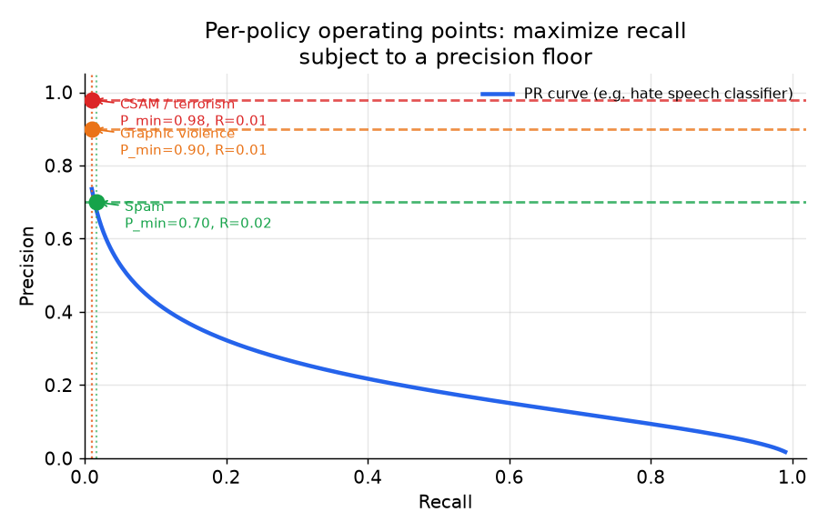
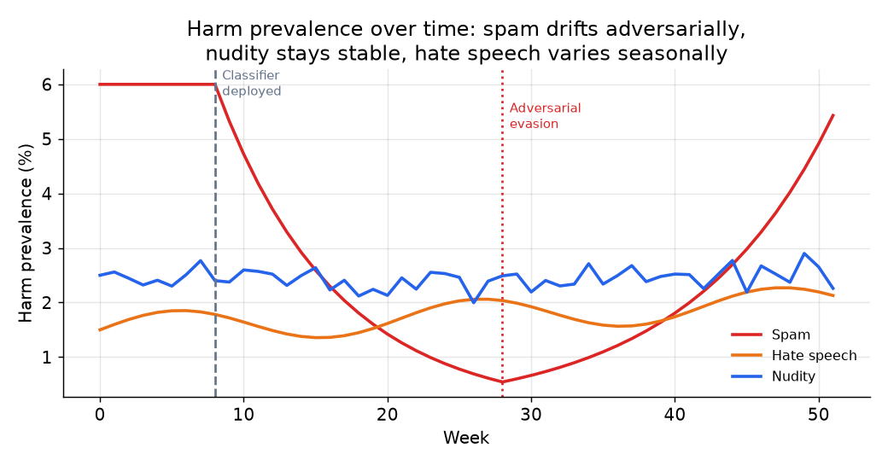
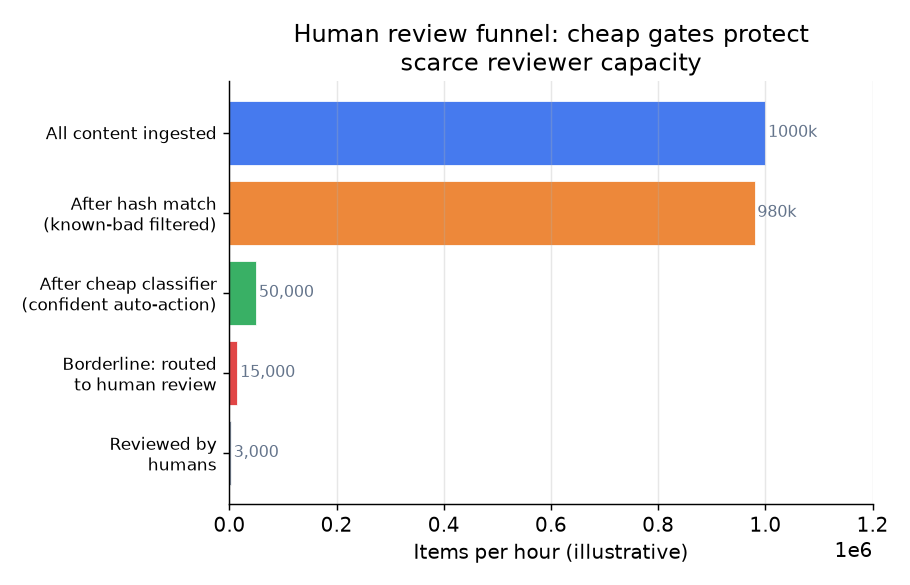

# 5. Evaluation

Reporting a single accuracy number on a content moderation system is the fastest
way to fail the signal check. The baseline "flag nothing" model scores 99.9 percent
accuracy when the positive rate is 0.1 percent. The metrics that matter are all
precision-recall based, measured per policy, and tied to actual cost.

## Primary offline metric: recall at a fixed precision floor

**What it measures.** The classifier takes content (text, image, or video) and
outputs a harm score. Precision $P(\tau) = \text{TP}/(\text{TP}+\text{FP})$ is
the fraction of flagged items that are genuinely harmful; recall
$R(\tau) = \text{TP}/(\text{TP}+\text{FN})$ is the fraction of all genuinely
harmful items that were flagged. For each policy class, fix a precision floor
$P_{\min}^{(k)}$ and find the highest recall the model achieves while keeping
precision at or above that floor. The metric output is a scalar recall in
$[0, 1]$, evaluated on a held-out test set with a time-based
split (hold out future content, not random content). A time-based split is mandatory:
a random split leaks future content into training and flatters recall by 5 to 15
percent on typical moderation tasks.

$$R_{\text{at}\ P_{\min}} = R(\tau^{\star}) \quad \text{where} \quad \tau^{\star} = \arg\max_{\tau}\, R(\tau) \quad \text{s.t.}\ P(\tau) \geq P_{\min}^{(k)}$$

```python
import numpy as np
def recall_at_precision(scores, labels, p_min):
    scores, labels = np.asarray(scores, float), np.asarray(labels, float)
    best = 0.0
    for tau in np.unique(scores):            # every candidate threshold
        pred = scores >= tau                 # flag items scoring at or above tau
        tp = np.sum(pred & (labels == 1))
        fp = np.sum(pred & (labels == 0))
        fn = np.sum(~pred & (labels == 1))
        if tp + fp == 0: continue            # nothing flagged, precision undefined
        prec, rec = tp / (tp + fp), tp / (tp + fn)
        if prec >= p_min and rec > best:     # keep highest recall above the floor
            best = rec
    return best
# recall_at_precision([.9,.8,.4,.3], [1,1,0,0], 0.8) -> 1.0
```



*The PR curve trades recall against precision as the score threshold moves; fix a precision floor per policy (horizontal dashed lines) and read off the highest achievable recall at that floor (dotted vertical lines, filled dots at each operating point). Higher-severity policies demand higher precision floors and therefore accept lower recall. Illustrative.*

Report this per policy, per modality, and per language. A global recall number hides
the gaps where the model is weakest. Roblox explicitly tracks per-policy and
per-language recall because uneven multilingual quality hides behind aggregate metrics.

## Prevalence and the audit sample

Prevalence is the fraction of all content that is genuinely harmful:
$\text{prevalence} = (\text{TP}+\text{FN})/N$ where $N$ is total content
volume. When prevalence is 0.1 percent, a classifier that flags nothing achieves
99.9 percent accuracy; precision-recall metrics are used precisely because they
are not inflated by the large negative mass. Harm prevalence is not constant. Adversarial campaigns, news cycles, and platform
growth all shift the base rate. Track the flag rate per policy over time on a random
audit sample.



*Spam prevalence drops when the classifier deploys (week 8), then rebounds as
adversaries adapt (week 28). Nudity is relatively stable. Hate speech varies with
external events. Monitoring the flag rate in both directions is necessary; a sudden
drop can be a classifier win or a new evasion pattern. Illustrative.*

A sudden drop in a policy's flag rate is as likely to be successful evasion as a
genuine drop in harm. Alert on both directions and investigate. A sudden rise can
indicate a coordinated campaign or a model regression.

## False-block rate and the appeals proxy

The standard $\text{FPR} = \text{FP}/(\text{FP}+\text{TN})$ is not actionable
in isolation on skewed data. The more useful number is the **false-block rate**:
the fraction of removed content that was benign,
$\text{FBR} = \text{FP}/(\text{TP}+\text{FP}) = 1 - \text{precision}$ on the
removed set. It directly measures how often the system harms legitimate users.
You estimate it from two sources:

1. **Appeal-overturn rate.** Of content removed by the automated system that a user
   appealed, what fraction was restored by a reviewer? A restored item is a confirmed
   false positive. Track this per policy. If it rises, either the classifier precision
   has drifted below its floor or the threshold has not been recalibrated after a retrain.

2. **Reviewer overturn rate on human-reviewed items.** The fraction of items a reviewer
   judges benign after the model flagged them for review. This estimates the false-positive
   rate in the borderline band that reaches the queue.

Slack's proxy was simpler: what fraction of blocked invites were eventually accepted
by the recipient? At 3 percent (versus 70 percent under manual rules), the model had
much lower false-block cost than the hand-tuned system.

## Human review queue metrics

Human review is both a safety net and a data pipeline. Its quality metrics matter as
much as the classifier metrics.

| Metric | What it measures | Red flag |
|---|---|---|
| Reviewer agreement rate | inter-rater consistency on the same item | below 80 percent signals policy ambiguity or a new attack pattern |
| Queue SLA: time to review severe items | how fast the highest-priority items are resolved | severe items sitting more than a few hours means the queue is overwhelmed |
| Queue volume by policy | how many items reach human review per policy per hour | a sudden spike means the classifier precision dropped or an attack wave is active |
| Label throughput | reviewer decisions per hour flowing to training | bottleneck here delays retraining and widens the evasion window |
| Golden-set accuracy | reviewer accuracy on items with known ground truth | validates reviewer calibration; stale golden sets go stale as attacks evolve |



*Most content is handled before reaching human review. Hash matching eliminates
re-uploads of known-bad material at near-zero cost. Cheap classifiers handle the
confident tail. The borderline band is what reviewers see. Over-flagging by
classifiers directly overloads the queue; the two are coupled. Illustrative.*

## Online metrics and launch gating

Offline recall at the precision floor is necessary but not sufficient for a launch.
Gate launches on online metrics too:

- **Time-to-action on severe harms:** how many seconds (or minutes) elapsed between
  upload and enforcement action on confirmed violations. Reach-before-action is the
  paired metric: how many feeds did the content appear in before it was removed.
- **Appeal volume and overturn rate as leading indicators:** a rise in the overturn
  rate after a model update signals the new model has drifted below its precision floor.
- **Reviewer queue health:** if a classifier update causes a 50 percent spike in queue
  volume, the update degraded precision in the borderline band, even if offline recall
  looks fine.

## When to use which metric

| Reach for | When | Instead of |
|---|---|---|
| Recall at a fixed precision floor per policy | the primary offline metric for any content moderation classifier | accuracy or blind AUC, which a flag-nothing model games on skewed data |
| Time-based split for eval | any offline content moderation evaluation | random split, which leaks future content and flatters recall |
| Appeal-overturn rate | estimating false-positive cost in production | a false-positive rate computed on a synthetic test set that does not reflect real user content |
| Flag rate over time on an audit sample | detecting adversarial evasion and calibration drift | evaluating only on the training distribution, which misses the attack |
| Per-language and per-policy breakdowns | reporting quality honestly to stakeholders | one global number that hides the weakest language or policy |
| Reach-before-action | measuring the harm impact of a miss, weighted by audience size | counting raw missed items without considering how many users saw them |

**Tools.** Recall at a fixed precision floor is read off scikit-learn's precision_recall_curve (scan the thresholds, take the highest recall above the floor); average_precision_score summarizes the PR area on skewed data where accuracy and ROC-AUC mislead. Time-based splits and per-language, per-policy breakdowns are grouped with pandas, and flag-rate-over-time audit tracking is a simple pandas time-series over a random audit sample. Online launch gating on appeal-overturn and reach-before-action leans on the platform's experiment stack, with statsmodels or SciPy for significance.

**Worked example.** A streaming service evaluating a new hate-speech classifier reports recall at its precision floor per policy, per modality, and per language rather than a single global recall that would hide a weak language, computing each from a scikit-learn PR curve. It uses a time-based split so future content does not leak into training and inflate recall. In production it estimates false-block cost from the appeal-overturn rate rather than a synthetic FPR, and watches the flag rate over time on a random audit sample, alerting in both directions because a sudden drop can be successful evasion rather than a genuine decline in harm. For severe harms it tracks reach-before-action so a miss is weighted by how many feeds saw it, and gates the launch on those online signals rather than offline recall alone.
