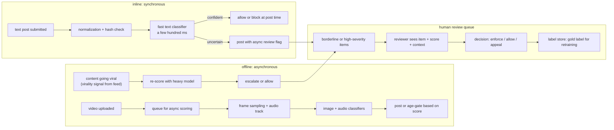

# 6. Serving and scaling

## Inline vs. offline enforcement

Content moderation operates across two enforcement timelines that have very different
design requirements.

**Inline (synchronous) enforcement** runs before or at the moment content reaches
an audience. A text post can block at submit time after a fast classifier pass. A
live voice stream must score rolling audio windows in near real time. The latency
budget is tens to hundreds of milliseconds; you cannot run a heavy multimodal model
inline on every item.

**Offline (asynchronous) enforcement** acts after content is published. Uploaded video
is too large for inline scoring, so it goes into an async processing queue and may
be age-gated or access-restricted until the score arrives. Virality-triggered re-scoring
is also async: a piece of content that starts spreading fast is queued for heavier
classifier analysis even if it passed the cheap inline check.

## Hash matching as the first gate

Before any classifier fires, every incoming item is checked against a known-bad
fingerprint database. For images and video, perceptual hashing (PhotoDNA-style)
creates a compact fingerprint that is robust to re-encoding, resizing, and minor
edits. An exact-hash match on text is fast but brittle; spam systems instead use
cluster membership (LinkedIn's cluster-propagation approach) or feature-based
lookup (Slack's sparse logistic regression against known feature patterns).

Hash matching is nearly free, near-zero false positive, and legally actionable for
known material. It removes the bulk of re-upload campaigns before any classifier
compute is spent.

## The human review queue design

The queue is not a FIFO mailbox. It is a priority-ranked stream, and the priority
formula is:

$$\text{Priority}(x) = \text{Severity}(\text{policy}) \times \text{Reach}(x)$$

A piece of content that is spreading virally and violates a severe policy gets
top priority regardless of when it arrived. A low-reach borderline spam post can
wait. This is how finite reviewer capacity is concentrated where it does the most good.

Queue health is a direct signal of classifier precision. If classifiers over-flag,
the queue volume spikes and review SLA degrades for genuinely severe items. The
coupling is tight: lowering a classifier threshold by one percentage point in precision
can double the queue volume because the false-positive count grows in the dense
borderline region. Calibrate classifiers and monitor queue volume together.

## Bottlenecks

| Bottleneck | First sign | Fix | Tradeoff |
|---|---|---|---|
| Compute cost at ingest | classifier serving costs rising faster than user growth | add a hash-check gate before classifiers; use distilled or quantized models at ingest | small accuracy cost from distillation |
| Human review queue overloaded | review SLA on severe items degrades; time-to-action rises | raise the auto-allow and auto-action thresholds to shrink the borderline band routed to humans; or increase reviewer capacity | narrower borderline band means some edge cases get auto-actioned |
| Live voice latency | audio classifier misses the real-time SLA on rolling windows | distill and quantize the audio model; apply VAD to skip silence; reduce window size | shorter window may miss slowly-unfolding policy violations |
| Label pipeline latency | retraining falls behind the attack; evasion window widens | automate label ingestion from reviewer decisions to the training pipeline; reduce manual steps | automation introduces schema-drift risk if label definitions change |
| Cross-lingual quality gaps | per-language recall reports show gaps in low-resource languages | target labeling effort in low-resource languages; use multilingual encoder transfer | targeted labeling is expensive; transfer quality varies by language distance |
| Calibration drift after retrain | appeal-overturn rate rises; threshold no longer meets precision floor | recalibrate with Platt scaling on a fresh calibration holdout after every retrain | calibration holdout must be recent; a stale holdout fails to correct drift |
| Adversarial evasion | flag rate drops suddenly on a stable harm class; confirmed harms are not dropping | monitor flag rates in both directions; red-team with the new evasion pattern; fast-retrain with augmented positives | fast retraining increases training compute cost |

## Freshness and the retraining loop

Unlike recommendation systems where a stale embedding decays gracefully, a stale
content moderation model decays against an active adversary. The practical cadences
seen in production:

- **Hash databases** grow continuously as confirmed bad items are added. Lookup
  infrastructure must stay fast as the database grows.
- **Spam and scam classifiers** need near-weekly retraining because the attack
  surface mutates fast.
- **Nudity and graphic violence classifiers** are more stable; monthly retraining
  is usually sufficient.
- **Calibration recalibration** should happen after every model retrain, not just
  on a schedule.

The retraining pipeline itself must be fast. A new evasion pattern that appears
on Monday should produce a retrained model by Wednesday at the latest for high-severity
policies. That requires an automated pipeline: label ingestion from the reviewer
platform, automated training job dispatch, automated calibration, staged rollout
with a shadow-scoring canary phase, and automated threshold re-estimation.
