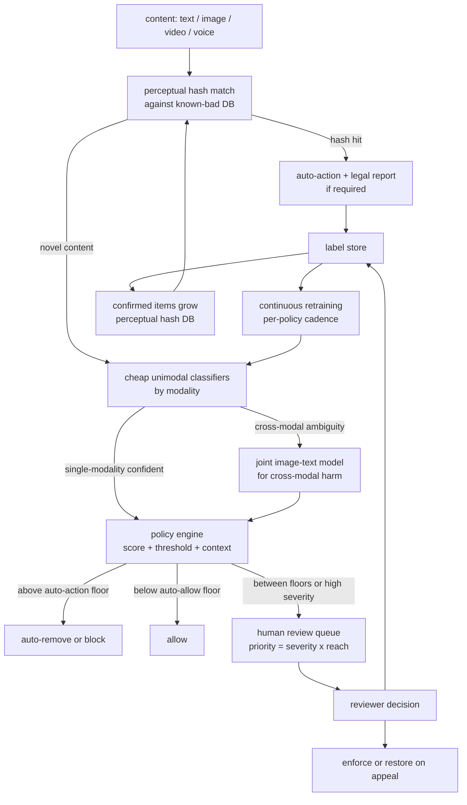

# 9. Summary

## One-page recap

- **Frame the objective correctly or fail the signal check.** The metric is recall
  at a fixed precision floor per policy. Accuracy and F1 are both wrong on skewed
  data with asymmetric costs. State the precision floor before drawing any model.

- **One model per policy, not one model for "bad."** Operating points, drift rates,
  retraining cadences, and legal obligations differ across harm classes by orders of
  magnitude. A shared encoder with per-policy heads is efficient; the calibration and
  thresholds must stay per-policy.

- **Hash matching is the first and cheapest gate.** For content you have already
  judged (known CSAM, terrorist media, removed spam campaigns), perceptual hashing
  catches re-uploads at near-zero cost and near-zero false positive before any
  classifier runs. Classifiers handle the novel tail; hashing handles the known mass.

- **Multimodal harm requires joint models.** Image plus text can produce hateful
  meaning that neither carries alone. OR-ing unimodal classifiers passes
  cross-modal violations. Gate the expensive joint model behind cheap unimodal
  pre-filters and invoke it only on ambiguous cases.

- **The human loop is the core, not a fallback.** Reviewers produce gold labels
  from exactly the distribution the model finds hardest. Reviewer capacity is the
  real ceiling on borderline-case handling. Over-flagging by the model directly
  overloads the queue. Priority-rank by severity times reach.

- **The threat model is adversarial and non-stationary.** A frozen model decays
  against an active adversary. Defenses are process: adversarial augmentation in
  training, continuous retraining on fresh human labels, perceptual hashing for
  known patterns, flag-rate monitoring in both directions, and red-teaming.

- **Evaluate with a random audit stream plus per-policy recall at the precision
  floor.** A time-based split is mandatory. Track the appeal-overturn rate as a
  live false-positive signal. Report per-language and per-policy breakdowns; one
  global number hides the weakest language or harm class.

## The system on one page

## Test yourself

1. Why is the objective "maximize recall subject to a precision floor per policy"
   rather than "maximize F1" or "maximize accuracy"?

2. A new evasion pattern arrives: spammers insert zero-width Unicode characters
   between letters to defeat the text classifier. What immediate and medium-term
   responses would you take?

3. For CSAM, when is it appropriate to auto-action on a classifier score, and when
   not? What is the correct role for the classifier?

4. The human review queue SLA for severe items degrades from 2 hours to 8 hours
   after a classifier update. What likely happened, and how do you diagnose and
   fix it?

5. A joint image-text model catches hateful memes with higher recall than the
   unimodal baseline but is 20 times more expensive to serve. How do you deploy it
   without 20x-ing your serving cost?

6. You want to add a new harm policy for self-harm content. Walk through how you
   would set the precision floor, collect labels, calibrate, and pick the operating
   threshold.

## Further reading

- Dense reference with comparison table, math, and all production case studies:
  [topics/16-content-moderation.md](../../topics/16-content-moderation.md).
- Per-company teardowns (Roblox, Pinterest, LinkedIn, Bumble, Meta, Google,
  Nextdoor, Slack):
  [tools/teardowns/16.md](../../tools/teardowns/16.md).
- Comparison of approaches with the divergence diagram and cost math:
  [tools/comparisons/16.md](../../tools/comparisons/16.md).
