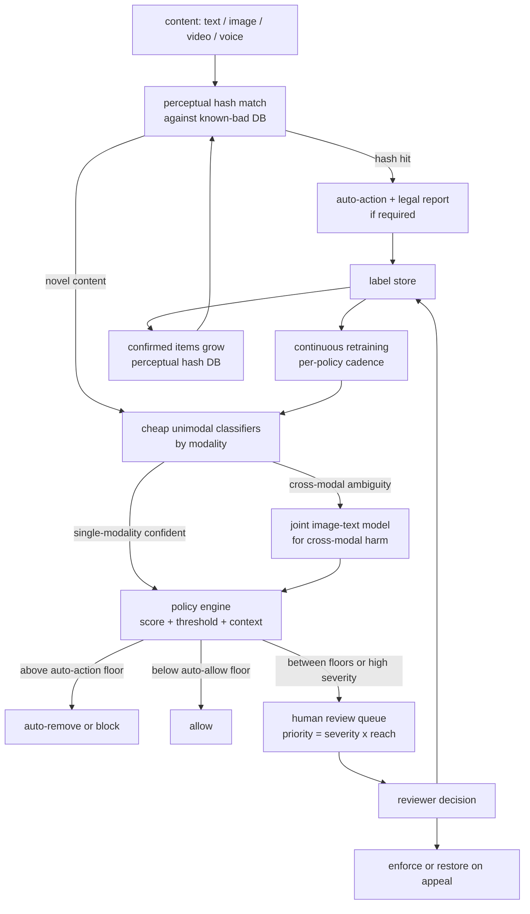

# 9. Summary

## One-page recap

- **Frame the objective correctly or fail the signal check.** The metric is recall
  at a fixed precision floor per policy. Accuracy and F1 are both wrong on skewed
  data with asymmetric costs. State the precision floor before drawing any model.

- **One model per policy, not one model for "bad."** Operating points, drift rates,
  retraining cadences, and legal obligations differ across harm classes by orders of
  magnitude. A shared encoder with per-policy heads is efficient; the calibration and
  thresholds must stay per-policy.

- **Hash matching is the first and cheapest gate.** For content you have already
  judged (known CSAM, terrorist media, removed spam campaigns), perceptual hashing
  catches re-uploads at near-zero cost and near-zero false positive before any
  classifier runs. Classifiers handle the novel tail; hashing handles the known mass.

- **Multimodal harm requires joint models.** Image plus text can produce hateful
  meaning that neither carries alone. OR-ing unimodal classifiers passes
  cross-modal violations. Gate the expensive joint model behind cheap unimodal
  pre-filters and invoke it only on ambiguous cases.

- **The human loop is the core, not a fallback.** Reviewers produce gold labels
  from exactly the distribution the model finds hardest. Reviewer capacity is the
  real ceiling on borderline-case handling. Over-flagging by the model directly
  overloads the queue. Priority-rank by severity times reach.

- **The threat model is adversarial and non-stationary.** A frozen model decays
  against an active adversary. Defenses are process: adversarial augmentation in
  training, continuous retraining on fresh human labels, perceptual hashing for
  known patterns, flag-rate monitoring in both directions, and red-teaming.

- **Evaluate with a random audit stream plus per-policy recall at the precision
  floor.** A time-based split is mandatory. Track the appeal-overturn rate as a
  live false-positive signal. Report per-language and per-policy breakdowns; one
  global number hides the weakest language or harm class.

## The system on one page

```mermaid
flowchart TD
  CONTENT["content: text / image / video / voice"]
  CONTENT --> HASH["perceptual hash match<br/>against known-bad DB"]
  HASH -->|"hash hit"| AUTOACT["auto-action + legal report<br/>if required"]
  HASH -->|"novel content"| CHEAP["cheap unimodal classifiers<br/>by modality"]
  CHEAP -->|"cross-modal ambiguity"| JOINT["joint image-text model<br/>for cross-modal harm"]
  CHEAP -->|"single-modality confident"| POLICY["policy engine<br/>score + threshold + context"]
  JOINT --> POLICY
  POLICY -->|"above auto-action floor"| REMOVE["auto-remove or block"]
  POLICY -->|"below auto-allow floor"| ALLOW["allow"]
  POLICY -->|"between floors or high severity"| QUEUE["human review queue<br/>priority = severity x reach"]
  QUEUE --> DECISION["reviewer decision"]
  DECISION --> ENFORCE["enforce or restore on appeal"]
  DECISION --> LABELS["label store"]
  AUTOACT --> LABELS
  LABELS --> RETRAIN["continuous retraining<br/>per-policy cadence"]
  RETRAIN --> CHEAP
  LABELS --> HASHGROW["confirmed items grow<br/>perceptual hash DB"]
  HASHGROW --> HASH
```

## Test yourself

Answers are collapsed. Attempt each question before opening one.

1. Why is the objective "maximize recall subject to a precision floor per policy"
   rather than "maximize F1" or "maximize accuracy"?

   

Answer

   Because the two failure modes have very different costs and the data is severely
   skewed, so both alternatives optimize the wrong thing. **Accuracy** is gamed by
   the base rate: at a 0.1 percent positive rate, a model that flags nothing scores
   99.9 percent. **F1** is subtler but still wrong, because it weights a false
   positive and a false negative equally, while a miss that lets illegal content
   reach a million feeds and a false block that a reviewer clears in ten seconds are
   not comparable harms. The right formulation puts the asymmetry in a constraint
   rather than in the metric: fix a precision floor $P_{\min}^{(k)}$ per policy from
   the cost of a false positive on that policy, then take
   $\tau^{\star}_k = \arg\max_{\tau} \text{Recall}(\tau)$ subject to
   $\text{Precision}(\tau) \geq P_{\min}^{(k)}$. It must be per policy because the
   floors differ by orders of magnitude: CSAM demands near-perfect precision before
   any auto-action, while spam can act at a much lower floor. Sections
   [2](02-frame-as-ml-task.md) and [5](05-evaluation.md) derive this, and
   [5](05-evaluation.md) adds the reporting rule: break it out per policy, per
   modality, and per language, since one global number hides the weakest slice.

   

2. A new evasion pattern arrives: spammers insert zero-width Unicode characters
   between letters to defeat the text classifier. What immediate and medium-term
   responses would you take?

   

Answer

   Split the response into a same-day mitigation and a durable one. **Immediately**,
   put a normalization front-end ahead of the encoder: Unicode NFKC normalization,
   homoglyph mapping, and zero-width stripping, so the obfuscated string collapses
   back to the form the model was trained on; section
   [4](04-model-development.md) names an unnormalized input as exactly why a text
   model loses to this trick, and adding hash or rule coverage for the instances
   already in traffic buys time while the model catches up. **Medium term**, fold
   the pattern into adversarial augmentation so positives are trained alongside
   leetspeak, homoglyphs, deliberate misspellings, and code-switching, then push it
   through the fast-retrain pipeline that turns a Monday evasion into a Wednesday
   model. Fix the detection side too: alert on flag rate in **both** directions per
   policy, because a sudden drop is as likely to be a successful evasion as a
   genuine drop in harm, and confirm by checking whether human-confirmed violations
   fell proportionally. Red-team the boundary the way the adversary does, and treat
   all of this as process rather than a one-time patch, since a frozen model decays
   continuously against an active adversary. Sections
   [3](03-data-preparation.md), [4](04-model-development.md), and
   [8](08-interview-qa.md).

   

3. For CSAM, when is it appropriate to auto-action on a classifier score, and when
   not? What is the correct role for the classifier?

   

Answer

   Never auto-action on a classifier score alone; auto-action is appropriate only on
   a **hash match against confirmed known material**. Perceptual hashing (PhotoDNA
   class, Google CSAI Match) fingerprints material a human already judged, giving a
   near-zero false-positive signal that is legally actionable, and it is robust to
   re-encoding and mild edits because matching is a Hamming-distance threshold rather
   than exact equality. The classifier's correct role is **queue prioritization**: on
   novel content it assigns a priority score so reviewers work the worst cases first,
   and a human makes the enforcement call. The reason for the split is the
   false-positive cost: an automated removal on a model score means accusing a real
   user of the most serious crime, which is legally unacceptable at any accuracy the
   model can honestly claim. Confirmed novel items are then added to the shared hash
   database, so the next re-upload is caught upstream for free, which is how coverage
   grows without ever loosening the auto-action rule. Sections
   [7](07-how-teams-do-it-in-production.md) and [8](08-interview-qa.md);
   [10](10-putting-it-together.md) keeps this row unchanged even in the startup
   column, because hash matching for CSAM is mandatory at any size.

   

4. The human review queue SLA for severe items degrades from 2 hours to 8 hours
   after a classifier update. What likely happened, and how do you diagnose and
   fix it?

   

Answer

   The update lost precision in the dense borderline band, so queue volume spiked and
   the priority-ranked queue could no longer clear severe items inside their SLA. The
   coupling is sharp: section [6](06-serving-and-scaling.md) puts one percentage
   point of precision as enough to double queue volume, because false positives are
   drawn from a negative pool roughly two hundred times larger than the positive
   pool. Diagnose in this order: queue volume by policy per hour (which policy
   spiked), appeal-overturn and reviewer-overturn rate (confirms these are false
   positives rather than a real harm wave), and whether the old threshold was carried
   across the retrain onto a shifted score scale. That last one is the usual cause,
   and section [5](05-evaluation.md) flags it as the classic month-one failure: a
   threshold set on uncalibrated scores silently violates its precision floor after
   every retrain. The fix is to recalibrate with Platt or isotonic regression on a
   fresh holdout and **re-derive** the threshold from the precision floor instead of
   reusing the number, since the floor is the durable decision and the threshold is a
   disposable artifact. If the volume turns out to be genuine rather than a
   calibration bug, raise the auto-allow and auto-action thresholds to narrow the
   band or add reviewer capacity, accepting the tradeoff that a narrower band
   auto-actions some edge cases. The arithmetic in [10](10-putting-it-together.md) is
   the sanity check: at roughly 500 decisions per reviewer per day, a 75,000-item
   daily band is about 150 reviewers, so threshold tuning is headcount planning.

   

5. A joint image-text model catches hateful memes with higher recall than the
   unimodal baseline but is 20 times more expensive to serve. How do you deploy it
   without 20x-ing your serving cost?

   

Answer

   Do not run it on everything: **gate it behind the cheap unimodal pre-filters** and
   invoke it only when both modalities are present and the unimodal signals are
   ambiguous or conflicting. What you actually pay is per-item cost times the
   fraction of traffic that reaches the tier, so a 20x model firing on well under 1
   percent of items adds a few percent to the bill, not 20x. That is the entire logic
   of the funnel in section [4](04-model-development.md): near-free perceptual
   hashing first, cheap unimodal classifiers second, expensive joint fusion only on
   what survives, with cost per item falling three to four orders of magnitude from
   the fusion tier to the hash tier. Section [10](10-putting-it-together.md) states
   the consequence directly: the funnel ordering, not any single model choice, is the
   scaling decision. Define the gate explicitly so it stays honest, for example both
   the text score and the image score landing in the uncertain middle rather than
   either one being confident. The tradeoff to say out loud is that the gate is
   itself a recall risk: any cross-modal violation the cheap pre-filters score as
   confidently benign never reaches the joint model, so sample below-gate traffic for
   review and feed confirmed misses back into the gating rule.

   

6. You want to add a new harm policy for self-harm content. Walk through how you
   would set the precision floor, collect labels, calibrate, and pick the operating
   threshold.

   

Answer

   Four steps in this order, because each depends on the one before it. **One, set
   the precision floor from the cost of a false positive on this policy**, not from
   any model number: self-harm is handled gently, routing the user to support
   resources rather than reporting to authorities the way CSAM is, so the floor sits
   below the CSAM floor but well above spam, and the enforcement menu leans on
   graduated actions (interstitial, support resources, downrank) rather than silent
   removal. **Two, collect labels**: sample content covering the harm class plus
   realistic negatives, use reviewer decisions as gold with three-grader consensus on
   borderline items and adjudication for anything below the agreement threshold,
   treat user reports as detection triggers rather than gold, and stand up a random
   audit stream, which is the only unbiased way to measure prevalence and true
   recall. **Three, calibrate**: fit Platt scaling or isotonic regression on a
   held-out calibration set so $\hat{p} \approx P(\text{violates} \mid \text{score})$,
   because the threshold is only meaningful on calibrated probabilities. **Four, pick
   the threshold**: plot the precision-recall curve on that holdout using a
   time-based split, draw a horizontal line at the floor, and take the rightmost
   intersection,
   $\tau^{\star} = \arg\max_{\tau} \text{Recall}(\tau)$ subject to
   $\text{Precision}(\tau) \geq P_{\min}$; not 0.5, and not max-F1. Then reserve
   auto-action for the confident tail, route the borderline band to humans, and
   re-run calibration and threshold derivation after every retrain, watching the
   appeal-overturn rate as the live false-positive signal. Sections
   [3](03-data-preparation.md), [4](04-model-development.md),
   [5](05-evaluation.md), and [8](08-interview-qa.md).

   

## Further reading

- The capstone: [the complete build](10-putting-it-together.md), where every
  choice in this chapter is committed once for the scenario, costed, rebuilt
  under two other constraint sets, and compressed into a runnable one-file
  threshold sweep.
- Dense reference with comparison table, math, and all production case studies:
  [topics/16-content-moderation.md](../../topics/16-content-moderation.md).
- Per-company teardowns (Roblox, Pinterest, LinkedIn, Bumble, Meta, Google,
  Nextdoor, Slack):
  [tools/teardowns/16.md](../../tools/teardowns/16.md).
- Comparison of approaches with the divergence diagram and cost math:
  [tools/comparisons/16.md](../../tools/comparisons/16.md).
