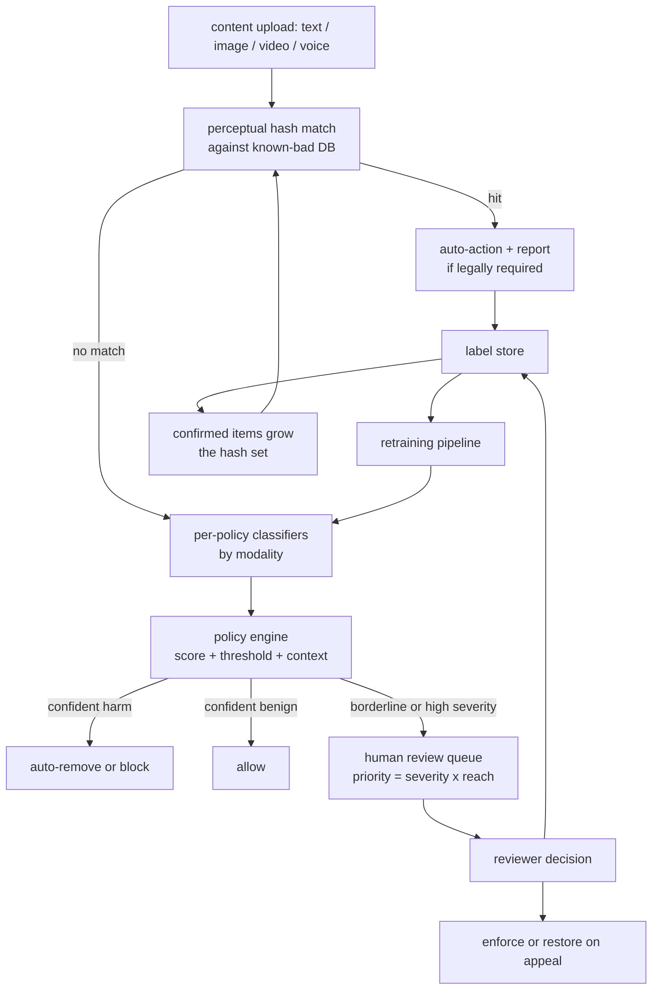

# Content Moderation and Trust & Safety

An interviewer rarely says "build a toxicity classifier." They say **"we have hundreds of
millions of users posting text, images, video, and live voice. Design the system that
moderates all of it, can't over-censor real users, and holds up against adversaries
who are actively trying to slip content past you."**

That framing forces a design that most "accuracy-first" answers miss. The central tension
is not classification accuracy. It is the asymmetry between two failure modes: a miss
that lets illegal content reach a million feeds causes irreversible harm; a false block
that a human clears in ten seconds is a minor annoyance. The right objective is
**high recall at a fixed precision floor, per policy**, with humans in the loop as both
the safety net and the label source. Everything in this chapter is downstream of that.

## Sections

1. [Clarifying the requirements](01-clarifying-requirements.md) - the dialogue that scopes the problem.
2. [Framing it as an ML task](02-frame-as-ml-task.md) - per-policy classification, input/output, and why one model for "bad" fails.
3. [Data preparation](03-data-preparation.md) - labeling, multi-grader consensus, class imbalance, and adversarial drift.
4. [Model development](04-model-development.md) - multimodal classifiers, the loss, the operating-point argmax, and a "when to use which" table.
5. [Evaluation](05-evaluation.md) - recall at a fixed precision floor, prevalence, false-block rate, and human review metrics.
6. [Serving and scaling](06-serving-and-scaling.md) - inline vs. offline enforcement, human review queue, and the bottlenecks table.
7. [How teams do it in production](07-how-teams-do-it-in-production.md) - divergence table of named companies and first-party links.
8. [Interview Q&A](08-interview-qa.md) - commonly asked, tricky, and commonly answered wrong, with clear answers.
9. [Summary](09-summary.md) - one-page recap, mermaid system diagram, test-yourself questions, and further reading.

## The whole system on one page

Read the sections in order the first time; they build on each other. Each opens with
the question an interviewer actually asks, then answers it.
