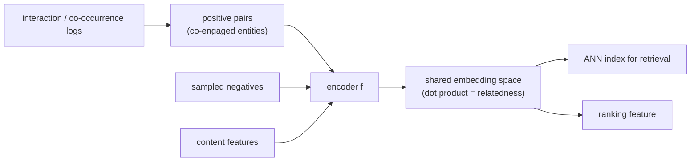

# 2. Framing it as an ML task

## The objective

We want a function $f$ that maps each entity to a point in $\mathbb{R}^d$ such
that entities a user engages with together land near each other, and unrelated
entities land far apart. Stated formally, we are learning a metric on the entity
space from implicit behavioral signal.

The ML framing is **contrastive representation learning**: for each positive pair
$(x, x^{+})$ (two entities that co-occurred or co-engaged), pull $f(x)$ and
$f(x^{+})$ together; for each negative pair $(x, x^{-})$, push them apart. There
are no similarity scores to regress; there is no classification label to predict.
The label is the structure of the positive set, and that structure comes entirely
from behavioral logs.

**How it works.** Behavioral interaction and co-occurrence logs flow in on the left and are joined into positive pairs of entities that were engaged together. Those pairs feed the encoder $f$ alongside two other inputs: sampled negatives (entities assumed unrelated) and content features that describe each entity. The encoder maps every entity into one shared embedding space where the dot product between two vectors reads as relatedness, and the contrastive objective is what pulls positives together and pushes negatives apart in that space. The trained vectors then hand off two ways: loaded into an ANN index for nearest-neighbor retrieval, and reused directly as a ranking feature. The output is that single reusable geometry rather than a score or a class label.

## Input and output

The **input** is an entity and its features (user ID, behavioral history, content
attributes). The **output** is a single $d$-dimensional dense vector. At training
time the encoder sees a batch of positive pairs and a set of negatives; at serving
time it embeds one entity at a time and writes the vector to an index or feature
store.

The key design constraint from the requirements: items are precomputed offline and
served through an ANN index; users are computed online per request. That asymmetry
is what the dual-encoder (two-tower) architecture is built for. Each tower is
separate because the two sides have different features, but they share a common
output space enforced by the contrastive loss.

## Choosing the ML category

This is **metric learning via contrastive objectives**, not classification and not
regression. The embedding is not a class label and not a continuous score; it is a
point in a geometric space. The payoff is that "find the nearest neighbors of this
query" becomes a fast approximate-nearest-neighbor lookup, which is the serving
primitive that turns representation learning into a production system.

**When to use which framing.**

| Reach for | When | Instead of |
|---|---|---|
| Contrastive dual-encoder | separate sides (query vs item, user vs item), one side precomputable, implicit positive signal from co-occurrence | a cross-encoder, which needs both sides at inference and cannot precompute |
| Graph encoder (GraphSAGE-style) | relatedness is a graph edge and entities have content features that let new nodes embed without a retrain | id-bound matrix factorization, when cold start would be a non-event |
| Sequence / skip-gram model (word2vec style) | session or co-purchase order defines related and item IDs repeat enough to learn stable vectors | contrastive dual-encoder, when you have no content features and only id co-occurrence |
| Self-supervised text contrastive (SimCSE) | the entity is a sentence or passage and you need a semantic embedding with no behavioral logs | behavioral dual-encoder, when the input is text and you have no engagement signal |

**Provenance.** The skip-gram framing is word2vec (Google, 2013); the dual-encoder
framing comes from DSSM (Microsoft, 2013); and the text-contrastive row's
sentence-embedding tooling is Sentence-BERT (UKP Darmstadt, 2019).

The next section builds the training data from behavioral logs.
