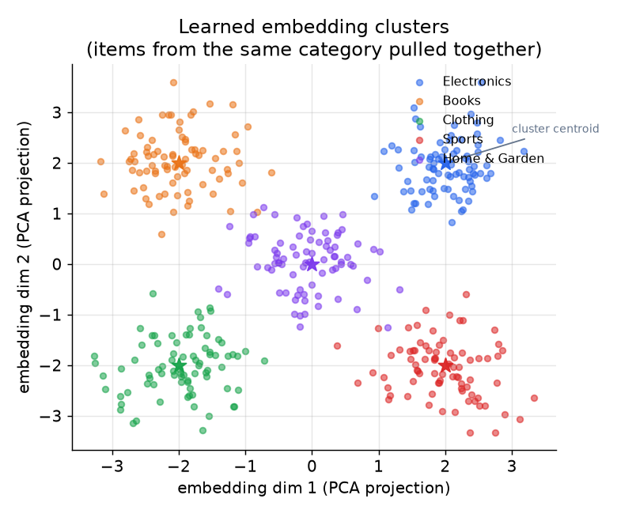
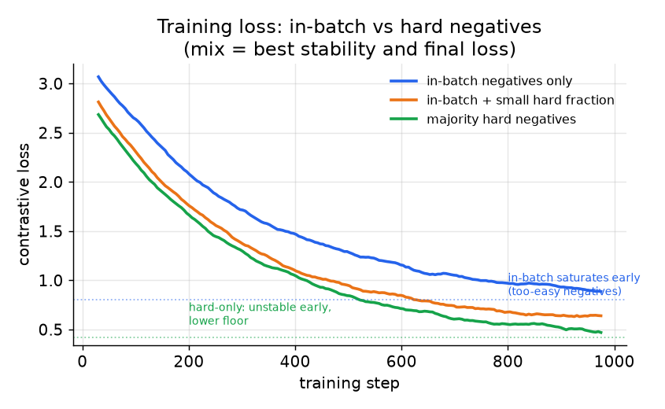
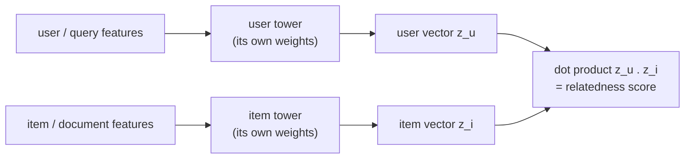
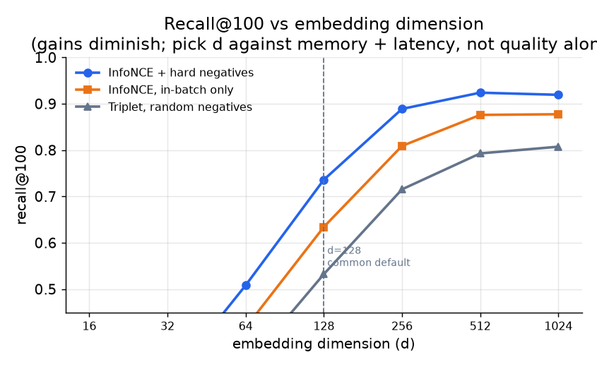

# 4. Model development

The goal of training is a space where entities that co-occur in behavior land near
each other and unrelated entities land far apart. When the encoder is trained well,
this structure emerges geometrically: items from the same category form clusters,
and the distance between clusters reflects behavioral dissimilarity.



*PCA projection of a learned item embedding space. Items from the same behavioral
category pull into a cluster; the cluster centroids (stars) are roughly separated
by category. Schematic illustration; a real space has hundreds of dimensions and
finer-grained clusters by brand, style, and price.*

## Contrastive losses

The two workhorses are InfoNCE and triplet/margin loss. Both pull related entities
together and push unrelated ones apart, but they differ in how they define the
contrast and how sensitive they are to negative quality.

### InfoNCE (softmax contrastive loss)

For an anchor $x_i$ and its positive $x_i^{+}$, treat the positive as the correct
class among a set of $B$ candidates (the positive plus $B - 1$ negatives) and
minimize the cross-entropy (softmax turns the similarity scores into probabilities
that sum to 1, and cross-entropy penalizes putting low probability on the positive):

$$\mathcal{L}_{\text{InfoNCE}} = -\frac{1}{B}\sum_{i=1}^{B} \log \frac{\exp\!\bigl(\text{sim}(z_i,\, z_i^{+}) / \tau\bigr)}{\exp\!\bigl(\text{sim}(z_i,\, z_i^{+}) / \tau\bigr) + \sum_{j \neq i} \exp\!\bigl(\text{sim}(z_i,\, z_j) / \tau\bigr)}$$

where $z_i = f(x_i)$ is the embedding, $\text{sim}$ is dot product or cosine, and
$\tau$ is a temperature hyperparameter (a single number that divides every score
before the softmax, controlling how sharp or flat the resulting distribution is).
Small $\tau$ makes the softmax peaky,
concentrating the loss on the hardest negatives; large $\tau$ spreads the gradient
over all negatives. This is the workhorse loss for dual-encoder retrieval, and it
is exactly the loss two-tower models train under.

```python
import numpy as np
def info_nce(z, zpos, tau=0.1):
    z, zpos = np.asarray(z, float), np.asarray(zpos, float)
    pos = np.sum(z * zpos, axis=1) / tau          # sim(z_i, z_i+), the positive logit
    neg = (z @ z.T) / tau                          # sim(z_i, z_j) for in-batch negatives
    np.fill_diagonal(neg, -np.inf)                 # exclude the anchor's own row (j == i)
    logits = np.concatenate([pos[:, None], neg], axis=1)  # positive sits at column 0
    m = logits.max(axis=1, keepdims=True)
    lse = m[:, 0] + np.log(np.exp(logits - m).sum(axis=1))  # log-sum-exp per anchor
    return float(np.mean(lse - logits[:, 0]))      # cross-entropy: -log softmax at positive
# info_nce(np.eye(3), np.eye(3), tau=1.0) -> 0.551
```

### Triplet / margin loss

For an anchor $a$, a positive $p$, and a negative $n$, require the anchor to be
closer to the positive than to the negative by a margin $m$:

$$\mathcal{L}_{\text{triplet}} = \max\!\bigl(0,\ d(a, p) - d(a, n) + m\bigr)$$

```python
import numpy as np
def triplet_loss(a, p, n, margin=1.0):
    a, p, n = np.asarray(a, float), np.asarray(p, float), np.asarray(n, float)
    dp = np.sqrt(np.sum((a - p)**2, axis=1))   # Euclidean distance anchor to positive
    dn = np.sqrt(np.sum((a - n)**2, axis=1))   # Euclidean distance anchor to negative
    return float(np.maximum(0.0, dp - dn + margin).mean())  # hinge: 0 once the margin is met
# triplet_loss([[0,0]], [[1,0]], [[1.5,0]], margin=1.0) -> 0.5  (margin still violated)
```

where $d(\cdot, \cdot)$ is a distance (e.g., Euclidean or $1 - \text{cosine}$).
The loss is zero when the margin is already satisfied, so only triplets near the
boundary contribute gradients. This makes triplet loss very sensitive to how
triplets are mined; a poor mining strategy means most gradients are zero and
training stalls.

### The logQ popularity correction

In-batch negatives are sampled from the data distribution, so popular items appear
as negatives far more often and the model learns to push them down unfairly. The
fix is to subtract the log sampling probability from each item's logit (the raw
similarity score fed into the softmax, before it becomes a probability) before the
softmax:

$$s'(x, y) = s(x, y) - \log Q(y)$$

where $Q(y)$ is the frequency-based sampling probability of item $y$. This turns
the in-batch softmax into an unbiased estimate of the full-corpus softmax. Mention
this unprompted; it is the single most cited fix in production retrieval writeups
(YouTube, Expedia), and applying it at serving rather than training is one of the
most common wrong answers in interviews.

## Negative sampling in detail: in-batch vs hard negatives



*Training loss under three negative strategies. In-batch negatives alone plateau
early because the negatives are too easy once the space has basic structure. A
mix of in-batch plus a small hard fraction reaches the lowest floor with stable
training. A majority of hard negatives drives the loss lower but introduces
instability from false negatives. Schematic; relative shapes are the point.*

The figure captures the practical recipe: **mostly in-batch negatives, with a
small, carefully tuned fraction of mined hard negatives added once the easy loss
has saturated.** The hard fraction is a dial, not a binary switch, and should be
increased slowly.

## Encoder architectures

**Dual-encoder (two-tower).** Two separate encoders map the two sides (user and
item, query and document) into the same space; the score is their dot product or
cosine. Because the score factorizes into one vector per side, you precompute one
side offline and serve the other against an ANN index. The towers share an output
space but not weights, because the two sides have different features. This is the
canonical architecture for query-item and user-item retrieval.



The two towers never see each other's features until the final dot product, which
is exactly why the item vectors can be computed offline once and reused: nothing
about the score depends on the user until that last step.

> **Open the validated graph.** Trace a two-tower model at real dimensions in the
> live [Model Zoo](https://github.com/neurarch-ai/awesome-llm-model-zoo). Follow
> each tower down to the similarity layer and note that the features never mix
> before it, which is exactly what lets you precompute one side.

**GraphSAGE-style (inductive graph encoder).** Instead of learning a fixed vector
per node, learn aggregation functions that build a node's embedding from its own
features plus a sample of its neighbors' features, stacked over $K$ hops. Because
the embedding is computed from features, a brand-new node gets a vector with zero
history. This is the cold-start-safe approach.

> **Open the validated graph.** Trace a GraphSAGE-style recommender in the live
> [Model Zoo](https://github.com/neurarch-ai/awesome-llm-model-zoo). Notice how
> the neighbor aggregation and the self-feature are concatenated at each hop, and
> how the same aggregation function runs on every new node at serving time.

**LightGCN (transductive graph encoder).** Simplified graph convolution for
collaborative filtering: drop feature transforms and nonlinearities, keep only
linear neighborhood aggregation over the user-item interaction graph, and take a
weighted sum across all propagation layers. Fast and a strong collaborative
filtering baseline, but strictly transductive: a new user or item has no vector
until the next retrain.

## Dimensionality

The dimension $d$ is a three-way tradeoff. Name all three rather than picking a
number:

- **Recall / quality.** More dimensions give the space more capacity to separate
  entities; gains are real but diminish, and very high dimensions can overfit and
  hurt ANN recall.
- **Memory.** Index memory scales roughly as (number of entities) times $d$ times
  bytes per component. At tens of millions of entities, doubling the dimension
  doubles a large bill.
- **Search latency.** Distance computations scale with $d$, so wider vectors make
  every ANN probe slower.



*Recall improves with dimension but saturates; the gains from 128 to 1024 are
real but modest compared to better negatives (blue vs gray). Memory and latency
double with each step. Pick a modest $d$, tune it against the downstream consumer,
and reach for quantization before chasing dimension if memory is the constraint.
Schematic; qualitative trend is the point.*

## When to use which

**Losses and negative strategies.**

| Reach for | When | Instead of |
|---|---|---|
| InfoNCE (softmax contrastive) | default; many candidates per anchor, same loss as two-tower retrieval | triplet, unless you can mine high-quality triplets and want an explicit margin |
| Triplet / margin loss | you have a triplet mining pipeline and want an explicit similarity margin in the geometry | InfoNCE with in-batch negatives, which is simpler when you do not have a miner |
| In-batch negatives | negatives for free; scale with batch size | small batches that starve the loss or a setting where false negatives are prevalent |
| Hard negatives | recall has plateaued and the boundary is fuzzy on look-alike items | more model capacity; the fix is almost always better negatives, not a bigger encoder |
| logQ / sampled-softmax correction | in-batch negatives and the catalog is popularity-skewed | skipping it and accepting head-item bias in the learned space |

**Encoder families.**

| Reach for | When | Instead of |
|---|---|---|
| Dual-encoder (two-tower) | query-vs-item or user-vs-item relatedness; one side precomputable | cross-encoder at retrieval scale, where precompute is impossible |
| GraphSAGE-style (inductive) | rich node features and new entities arrive constantly | id-bound transductive methods when cold start matters |
| LightGCN (transductive) | a fixed user-item interaction graph and you want a cheap, strong collaborative baseline | inductive graph encoder when the graph is sparse or entities arrive frequently |
| SimCSE / text contrastive | the entity is a sentence or passage; semantic text similarity from dropout or NLI pairs | behavioral dual-encoder, when all you have is text with no engagement signal |

**Provenance.** The dual-encoder (two-tower) structure comes from DSSM (Microsoft,
2013) and was popularized for large-corpus retrieval by the YouTube deep
recommender (Google, 2016), which is also where in-batch sampled softmax with logQ
correction entered wide practice. The sentence-embedding tooling for the
text-contrastive row is Sentence-BERT (UKP Darmstadt, 2019).

**Tools.** InfoNCE dual-encoder training is a few lines in PyTorch (Meta) or TensorFlow Recommenders (Google), both of which ship in-batch-negative and sampled-softmax (logQ) helpers; sentence-transformers is the standard for SimCSE and other text contrastive setups. Triplet and margin losses with hard-negative miners come ready-made in pytorch-metric-learning. Graph encoders are implemented in PyTorch Geometric and DGL (GraphSAGE aggregators, LightGCN propagation), and RecBole packages LightGCN as a tuned collaborative-filtering baseline.

**Worked example.** A marketplace building user-to-item retrieval starts with a two-tower dual-encoder trained under InfoNCE in TensorFlow Recommenders, because there are many candidates per anchor and one side (items) precomputes cleanly against an ANN index; it skips triplet loss since it has no triplet miner. It uses in-batch negatives for free, adds the logQ correction at training time because the catalog is popularity-skewed, and layers in a small tuned fraction of mined hard negatives only once the easy loss saturates. Because new items with rich features arrive constantly, the item tower moves to a GraphSAGE-style inductive encoder in PyTorch Geometric rather than a transductive LightGCN that would leave fresh items vectorless until retrain. For a separate text-only surface with no engagement signal, it drops in a sentence-transformers SimCSE encoder.
