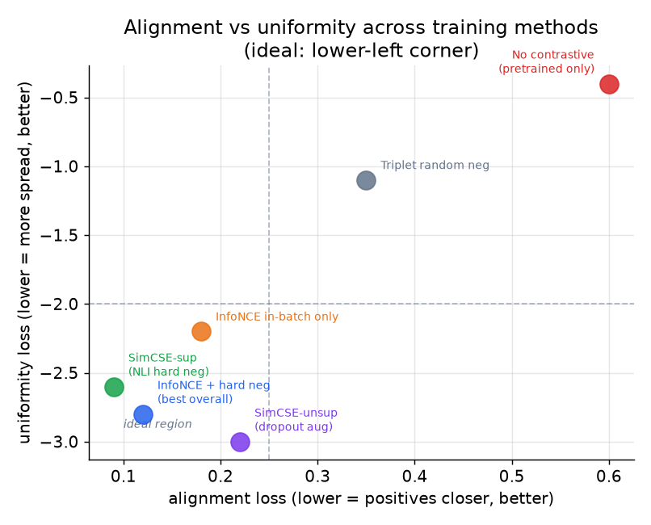

# 5. Evaluation

There is no single accuracy number for an embedding space. The embedding is not
the final product; the retrieval, ranking, or fraud model it powers is. Evaluate
the space by what it enables, and use multiple lenses because each catches a
different failure mode.

## Offline metric: recall@k against held-out future positives

**Input / output.** The model embeds a user query (or user vector) and issues
a nearest-neighbor lookup against the item index; Recall@k counts what fraction
of the user's held-out future positives appear among the $k$ returned items,
averaged over users, and outputs a scalar in $[0, 1]$.

$$\text{Recall@k} = \frac{1}{|U|}\sum_{u \in U} \frac{|\text{retrieved}_k(u) \cap \text{relevant}(u)|}{|\text{relevant}(u)|}$$

Measure this at the $k$ you actually pass to downstream consumers, not at $k = 10$
if you pass 500 candidates to ranking. Use a **time-based split**: hold out future
interactions, not a random sample of existing ones. A random split leaks the future
and flatters the model.

Measure **tail recall separately from head recall**. A space that improves average
recall by pushing head items back into the top-k is a space that has gotten worse
for the long tail; average recall hides that. Report both.

## Alignment and uniformity diagnostics

Two properties define a well-formed embedding space, and a space can look fine on
cosine probes while quietly failing on one of them.

**Alignment** measures how close positive pairs are in the embedding space.
Input: a set of positive pairs $(x, x^+)$ drawn from the training signal (for
example, user-item co-engagements); the metric computes expected squared L2
distance between each pair's embeddings. Output: a non-negative scalar; lower
is better, meaning positive pairs sit near each other:

$$\ell_{\text{align}} = \mathbb{E}_{(x,\, x^{+})} \bigl\lVert f(x) - f(x^{+}) \bigr\rVert^{2}$$

**Uniformity** measures how spread the embeddings are across the unit
hypersphere. Input: uniformly random pairs $(x, y)$ from the corpus; the metric
computes the log of their average Gaussian-kernel similarity. Output: a negative
scalar; more negative is better (the space is well spread and uses its full
capacity rather than collapsing to a tight cluster):

$$\ell_{\text{unif}} = \log \, \mathbb{E}_{x,\, y} \; e^{-2 \lVert f(x) - f(y) \rVert^{2}}$$

These two losses trade off against each other; the ideal space has both small
alignment loss (positives are close) and small uniformity loss (the full space is
spread). A model with poor negatives or a weak loss can collapse to a tight cluster
where all similarities are high and ranking is meaningless. Only the uniformity
diagnostic catches that.

*Each point is a training configuration. The ideal region is the lower-left corner:
positives close (small alignment loss) and space spread (small uniformity loss).
Random-negative triplet loss lands far from the ideal corner; InfoNCE with hard
negatives lands closest. Schematic; relative positions are the point.*

## Downstream task lift

The best offline proxy for production value is whether the embedding improves a
downstream task trained on top of it:

- **Retrieval Recall@k** after loading vectors into a real ANN index (end-to-end,
  not just cosine on a probe set).
- **Ranking NDCG@k or MRR** when the embedding is used as a feature in a ranking
  model trained separately. NDCG@k rewards placing relevant items higher:
  $\text{NDCG@k} = \frac{1}{Z}\sum_{i=1}^{k}\frac{2^{rel_i}-1}{\log_2(i+1)}$
  where $Z = \text{IDCG@k}$ is the ideal DCG and higher is better. MRR averages
  the reciprocal rank of the first relevant result:
  $\text{MRR} = \frac{1}{|Q|}\sum_q \frac{1}{\text{rank}_q}$, with
  $1/\text{rank}_q = 0$ when no relevant result is returned; higher is better.
- **Classification accuracy** on a held-out probe set if you have any labeled
  categories (item category, user segment).
- **Fraud PR-AUC** for systems like Wayfair's Melange, where the whole point is to
  improve a downstream fraud detector with scarce labels. PR-AUC (average
  precision) is the area under the precision-recall curve:
  $\text{AP} = \sum_{k}(R_k - R_{k-1})\cdot P_k$; it is preferred over ROC-AUC
  when fraud events are rare because it focuses entirely on the positive class
  and is not inflated by the large negative mass.

The probe set should not overlap training. If it does, you are measuring
memorization, not generalization.

## Online eval

Offline metrics are necessary but not sufficient. Always gate a launch on an
online A/B experiment measuring:

- **Engagement rate** of the feed or search results the embedding powers (click,
  dwell, purchase).
- **Coverage and diversity**: does the new space surface long-tail items, or does
  it collapse to a head-item echo chamber? A recall win that shrinks catalog
  coverage often loses long-term.
- **New-entity retrievability**: what fraction of fresh items are surfaced within
  the freshness SLA (an hour in our requirements)?

## When to use which metric

| Reach for | When | Instead of |
|---|---|---|
| Recall@k at the downstream k | evaluating the retrieval stage the embedding feeds | recall@10 when you pass 500 candidates, which optimizes the wrong operating point |
| Tail recall separately | checking for popularity collapse | average recall alone, which hides tail starvation |
| Alignment and uniformity | suspecting representation collapse or diagnosing why a space underperforms | cosine probe accuracy alone, which misses silent collapse |
| Downstream task lift (NDCG, MRR, PR-AUC) | the embedding will be reused across tasks | eval on one task, when the whole economic case is multi-task reuse |
| Online A/B engagement | the final launch decision | offline recall alone, which misses the ranking interaction and diversity effects |
| Time-based split | any offline retrieval eval | random split, which leaks the future |

**Tools.** End-to-end Recall@k is measured by loading vectors into a real ANN index such as FAISS (Meta) and querying it, rather than trusting a brute-force cosine probe. TorchMetrics provides RetrievalRecall, RetrievalNormalizedDCG, and RetrievalMRR for the downstream-lift metrics, and scikit-learn covers PR-AUC (average_precision_score) for scarce-label fraud probes. Alignment and uniformity are two short functions from the Wang-and-Isola formulation computed in PyTorch (Meta); the final online A/B leans on a stats library such as statsmodels.

**Worked example.** A streaming service evaluating a new item-embedding space measures Recall@k at the k it actually passes to ranking (not Recall@10 when it forwards 500 candidates), using a time-based split so held-out future interactions are not leaked by a random split. It reports tail recall separately from head recall to catch a space that lifts the average by pushing popular items back into the top-k. When a cosine probe looks healthy but ranking underperforms, it computes alignment and uniformity and finds the space has partly collapsed, a failure the probe missed. It then loads the vectors into FAISS for true end-to-end Recall@k and computes downstream NDCG and MRR with TorchMetrics, since the embedding is reused across tasks. The launch is gated on an online A/B measuring engagement plus catalog coverage, not offline recall alone.
