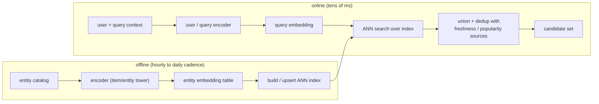

# 6. Serving and scaling

## The two paths: offline embedding and online lookup

The serving architecture splits cleanly into a batch path that produces embeddings
and an online path that answers a query in tens of milliseconds. The split is
what makes retrieval possible at catalog scale.

The encoder runs as a batch job over the whole entity set and writes vectors into
the index. New and changed entities get re-embedded and upserted on the freshness
cadence. The same embedding table that feeds retrieval is reused as features in
ranking, which is the economic justification for learning the space well once.

## The ANN index

At catalog scale you cannot compare a query vector to tens of millions of item
vectors exactly in tens of milliseconds, so you use **approximate nearest-neighbor
(ANN)** search. The index choice is not a default; it is a three-way tradeoff
between recall, latency, and memory.

**HNSW (hierarchical navigable small worlds).** Graph-based index; excellent
recall and latency when the index fits in RAM. Insertions are fast for stable
catalogs but expensive when items churn heavily, because rebalancing the graph is
costly. This is the default when memory is not the binding constraint and the
catalog is relatively stable.

**IVF (inverted file index).** Clusters vectors into buckets at index time; a
query searches only the $k$ nearest cluster centroids. Cheaper to update (a new
vector is assigned to a cluster without rebuilding the graph), which is why Airbnb
chose IVF over HNSW: listing prices and availability churn daily, and IVF absorbs
those updates. Geo filters also become cheap cluster selection rather than graph
traversal.

**IVF-PQ (inverted file plus product quantization).** Compresses each vector into
a short byte code by quantizing subspaces independently. Memory shrinks by an
order of magnitude with some recall loss. The pragmatic choice at very large scale
or tight memory; for example, pairing HNSW with PQ keeps HNSW's recall-per-latency
profile while compressing the index to fit in constrained memory.

**When to use which index.**

| Reach for | When | Instead of |
|---|---|---|
| HNSW | catalog is stable, memory is available, top recall-per-latency matters | IVF, when churn is high or geo/attribute filters are needed |
| IVF | items churn frequently, or you need cheap attribute-filtering (geo, price bucket) | HNSW, when update cost cannot absorb frequent writes |
| IVF-PQ or HNSW+PQ | memory is the binding constraint at tens of millions of vectors | full-precision vectors that blow the memory budget |
| Flat (exact) | small catalog, or as an offline recall ceiling to compare ANN against | ANN, which you only need once the catalog exceeds a few million |

## Dimensionality vs cost

Doubling the embedding dimension roughly doubles both the index memory and the
per-query latency. At tens of millions of entities:

- A 128-dimensional float32 index holds about 500 MB per million entities (128 x 4
  bytes). At 50 million entities that is 25 GB, which fits in RAM.
- A 512-dimensional index at the same scale is 100 GB, likely requiring sharding
  or quantization.

Quantization (int8 or 4-bit PQ) usually buys more memory savings per quality
point than shrinking the dimension, because it operates in the compression step
rather than the training step.

## Freshness and space drift

Two clocks to track, and conflating them is a classic mistake:

**Embedding freshness.** A new entity is invisible until the encoder embeds it and
the index is updated. Inductive encoders (content features, GraphSAGE-style) can
embed a brand-new entity immediately from its features; id-only embeddings cannot
and must wait for a retrain. The freshness cadence (hourly upserts, daily batch)
is a product decision that trades infrastructure cost against how quickly new
entities become retrievable.

**Space drift.** When you retrain the encoder, the axes of the space move. A
vector from the new model is not comparable to one from the old model, so you
cannot upsert new vectors into an index full of old ones. You must full-reindex
the whole entity set against the new encoder, atomically. This is separate from
freshness: it happens on retrain cadence (weekly, monthly), not on upsert cadence.
Missing this distinction leads to silently mixed index versions and degraded recall.

## Bottlenecks

| Bottleneck | First sign | Fix | Tradeoff |
|---|---|---|---|
| Weak negatives | recall plateaus early, loss saturates | add mined hard negatives | training instability, false negatives |
| Popularity bias | head entities mis-ranked, tail unreachable | logQ / sampled-softmax correction at training time | tuning effort |
| Index memory at scale | index does not fit in RAM | IVF-PQ, lower dimension, or quantization | recall loss from compression |
| ANN search latency | p99 retrieval time creeps up | tune probe depth, shard by entity type, replicate | recall vs latency |
| Embedding staleness | new entities never surface, recall decays on new items | inductive encoder + frequent re-embed and upsert | write-path complexity |
| Space drift on retrain | old and new vectors are incomparable | atomic full reindex on every model version | reindex cost and coordinated redeploy |
| Big-batch training cost | in-batch negatives require large $B$ for sufficient diversity | gradient accumulation or more accelerators | compute budget |
| Representation collapse | all similarities look high, ranking is meaningless | stronger negatives, check uniformity loss | see diagnostic section |
