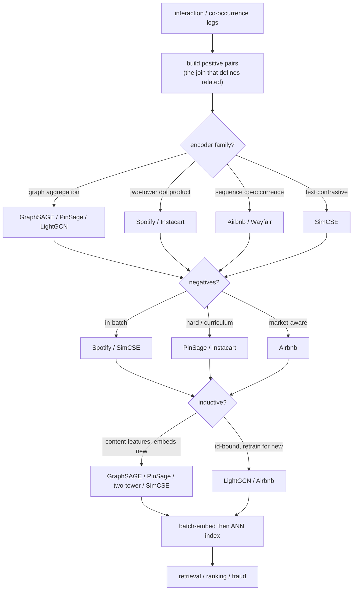

# 7. How teams do it in production

Every production representation learning system runs the same skeleton: mine
positive pairs from behavioral logs, contrast them against negatives to train an
encoder, batch-embed the whole entity set, and load the vectors into an ANN index
that retrieval, ranking, and other tasks share. What actually differs is two
decisions: **how they define "related"** (the join that builds positive pairs), and
**whether the encoder is inductive or transductive**. The store-and-reuse tail is
common, and that reuse is the economic point.

## Where the real designs diverge

| System | Learning method | Entity embedded | Negatives | Index / serving | Cold-start | When it wins |
|---|---|---|---|---|---|---|
| GraphSAGE | Graph aggregation (inductive) | Graph nodes (any type) | Random-walk positives + sampled negatives | ANN lookup | Content features embed new nodes immediately | Rich node features; new nodes arrive constantly; cold start must be a non-event |
| LightGCN | Linear graph propagation (transductive) | Users and items | BPR pairwise ranking | Dot-product retrieval | None: must retrain for new ids | Fixed user-item interaction graph; cheap, strong collaborative baseline |
| SimCSE | Text contrastive, dropout aug (inductive) | Sentences / passages | In-batch (unsup) or NLI contradictions (sup) | ANN lookup | Any new sentence embeds immediately from text | Text relatedness from unlabeled sentences; no behavioral signal needed |
| PinSage | Graph, importance pooling (inductive) | Pins (items) | Curriculum hard negatives | MapReduce batch to nearest-neighbor index | Content features embed new pins immediately | Web-scale graphs (billions of nodes); visual plus graph features |
| Airbnb | Sequence / skip-gram (transductive ids) | Listings | Same-market + in-session negatives | IVF (not HNSW) | Average 3 nearest same-type/price neighbors | Strong session co-occurrence; domain-aware negatives for within-market ranking |
| Spotify | Dual-encoder text (inductive) | Queries and episodes | In-batch (large batch) | ANN (precomputed episodes, online queries) | Episode embeds from text immediately | Free-text query mapped to items; one side precomputed and cached |
| Instacart | Two-tower transformer (inductive) | Queries and products | In-batch + self-adversarial re-weighting | FAISS; FeatureStore query cache | Query and product embed from text features | High-QPS search; query cache serves 95% under 8ms |
| Wayfair | Self-supervised sequence (inductive) | Customer sessions | Next-page pretext task (no explicit negatives) | Feature store (hourly Vertex pipeline) | Session vectors from page-type sequences | Fraud detection with scarce labels; self-supervised from abundant session logs |

The core dividing line: **how the system defines "related"** (graph edge, session
co-occurrence, or query-item contrastive pair) and **whether the encoder is
inductive** (content features let it embed a new entity) or **transductive**
(id-bound, so a new entity has nothing until retrain).

## The shared pipeline and where it branches

## The systems (first-party write-ups)

- **Stanford / Hamilton et al.** [GraphSAGE: Inductive Representation Learning on Large Graphs](https://arxiv.org/abs/1706.02216): inductive node embeddings by aggregating neighbor features; the source of the inductive-vs-transductive framing.
- **He et al.** [LightGCN: Simplifying and Powering Graph Convolution Network for Recommendation](https://arxiv.org/abs/2002.02126): removes feature transforms and nonlinearities; keeps only linear neighborhood aggregation; strong collaborative filtering baseline.
- **Gao et al.** [SimCSE: Simple Contrastive Learning of Sentence Embeddings](https://arxiv.org/abs/2104.08821): dropout as augmentation builds positive pairs from a single sentence; in-batch negatives; NLI contradictions as hard negatives in the supervised variant.
- **Pinterest** [PinSage: Graph Convolutional Neural Networks for Web-Scale Recommender Systems](https://medium.com/pinterest-engineering/pinsage-a-new-graph-convolutional-neural-network-for-web-scale-recommender-systems-88795a107f48): GraphSAGE-style convolutions at billions of nodes; importance-pooling neighborhoods; curriculum hard negatives; MapReduce batch inference.
- **Airbnb** [Listing Embeddings in Search Ranking](https://medium.com/airbnb-engineering/listing-embeddings-for-similar-listing-recommendations-and-real-time-personalization-in-search-601172f7603e): skip-gram over booking sessions; booked listing as global context; same-market negatives; IVF index chosen over HNSW for churn tolerance.
- **Spotify** [Introducing Natural Language Search for Podcast Episodes](https://engineering.atspotify.com/2022/03/introducing-natural-language-search-for-podcast-episodes/): dual-encoder text model; episode vectors precomputed and indexed; query vectors computed online; in-batch negatives; merged with keyword search results and reranked.
- **Instacart** [How Instacart uses embeddings to improve search relevance](https://company.instacart.com/how-its-made/how-instacart-uses-embeddings-to-improve-search-relevance): two-tower transformer (ITEMS); self-adversarial re-weighting on hard examples; cascade training (warmup on noisy, fine-tune on clean); FAISS index; FeatureStore query cache; meaningful gains in cart-adds-per-search.
- **Wayfair** [Melange: a customer-journey embedding system](https://www.aboutwayfair.com/careers/tech-blog/introducing-melange-a-customer-journey-embedding-system-for-improving-fraud-and-scam-detection): self-supervised next-page pretext task over browsing sequences; hourly Vertex pipeline; customer vectors in a feature store; meaningful improvement in fraud detection PR-AUC.

For a broader index of production representation learning case studies, see the
[Evidently AI ML system design database](https://www.evidentlyai.com/ml-system-design)
(800+ case studies, filterable by topic).
