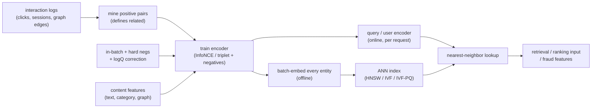

# 9. Summary

## One-page recap

- **Representation learning is contrastive.** There are no similarity labels; there
  is behavioral co-occurrence. The entire training problem is pulling related
  entities together and pushing unrelated ones apart. The encoder architecture
  matters, but the negatives matter more.
- **The hardest design choice is the negatives, not the model.** In-batch negatives
  come for free but are popularity-biased (fix with logQ correction at training
  time) and get too easy as training progresses (fix with a small, tuned hard
  fraction). The boundary-sharpening gain from better negatives almost always beats
  the gain from a bigger encoder.
- **Cold start is structural.** If the encoder consumes content features, a
  brand-new entity maps to a sensible point with zero history (inductive). Id-only
  encoders have no vector for an unseen entity and need a fallback until
  interactions accumulate (transductive). Choose your side in the requirements
  phase, not after.
- **The ANN index is a recall / latency / memory tradeoff.** HNSW for stable
  catalogs when memory permits; IVF for high-churn catalogs or when you need cheap
  attribute filtering; IVF-PQ or HNSW+PQ when the index must fit in constrained
  memory.
- **Two clocks, not one.** Embedding freshness (how fast a new entity gets a
  vector) is an inductive-vs-transductive problem. Space drift (retraining moves
  the axes so old and new vectors are incomparable) forces a full atomic reindex on
  every model version. Conflating them leads to mixed-version indexes.
- **Evaluate by what the embedding powers.** Measure recall@k at the downstream k
  on a time-based split; track tail recall separately from head; check alignment
  and uniformity to catch silent collapse; gate the launch on online A/B engagement
  and catalog coverage.

## The system on one page

## Test yourself

1. Why does the logQ correction belong at training time rather than serving time,
   and what exactly does it subtract?
2. A colleague proposes always using majority hard negatives to get the lowest
   possible training loss. What is the risk, and what is the safer recipe?
3. Your encoder is transductive and the team wants to embed brand-new items within
   minutes of creation. What structural change is required?
4. Recall@k improved in offline evaluation but catalog coverage dropped in the
   online A/B. What most likely happened in the embedding space, and what is the
   diagnostic and fix?
5. When you retrain the encoder, what must happen to the ANN index and why?
6. Alignment is low and uniformity is also low (near-zero): is this a well-formed
   space? What if alignment is low but uniformity is near zero on a linear scale?

## Further reading

- Dense reference (math, all case studies, quadrant plots): [../../topics/07-embeddings-and-representation-learning.md](../../topics/07-embeddings-and-representation-learning.md)
- Per-company teardowns (GraphSAGE, LightGCN, SimCSE, PinSage, Airbnb, Spotify, Instacart, Wayfair): [../../tools/teardowns/07.md](../../tools/teardowns/07.md)
- System comparison and decision table: [../../tools/comparisons/07.md](../../tools/comparisons/07.md)
- Trace a two-tower graph live: [Model Zoo](https://github.com/neurarch-ai/awesome-llm-model-zoo)
