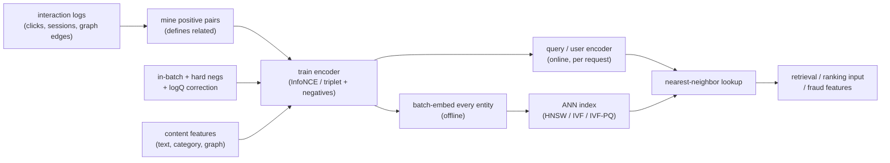

# 9. Summary

## One-page recap

- **Representation learning is contrastive.** There are no similarity labels; there
  is behavioral co-occurrence. The entire training problem is pulling related
  entities together and pushing unrelated ones apart. The encoder architecture
  matters, but the negatives matter more.
- **The hardest design choice is the negatives, not the model.** In-batch negatives
  come for free but are popularity-biased (fix with logQ correction at training
  time) and get too easy as training progresses (fix with a small, tuned hard
  fraction). The boundary-sharpening gain from better negatives almost always beats
  the gain from a bigger encoder.
- **Cold start is structural.** If the encoder consumes content features, a
  brand-new entity maps to a sensible point with zero history (inductive). Id-only
  encoders have no vector for an unseen entity and need a fallback until
  interactions accumulate (transductive). Choose your side in the requirements
  phase, not after.
- **The ANN index is a recall / latency / memory tradeoff.** HNSW for stable
  catalogs when memory permits; IVF for high-churn catalogs or when you need cheap
  attribute filtering; IVF-PQ or HNSW+PQ when the index must fit in constrained
  memory.
- **Two clocks, not one.** Embedding freshness (how fast a new entity gets a
  vector) is an inductive-vs-transductive problem. Space drift (retraining moves
  the axes so old and new vectors are incomparable) forces a full atomic reindex on
  every model version. Conflating them leads to mixed-version indexes.
- **Evaluate by what the embedding powers.** Measure recall@k at the downstream k
  on a time-based split; track tail recall separately from head; check alignment
  and uniformity to catch silent collapse; gate the launch on online A/B engagement
  and catalog coverage.

## The system on one page

```mermaid
flowchart LR
  LOG["interaction logs<br/>(clicks, sessions, graph edges)"] --> PAIRS["mine positive pairs<br/>(defines related)"]
  PAIRS --> TRAIN["train encoder<br/>(InfoNCE / triplet + negatives)"]
  NEGS["in-batch + hard negs<br/>+ logQ correction"] --> TRAIN
  CF["content features<br/>(text, category, graph)"] --> TRAIN
  TRAIN --> EMB["batch-embed every entity<br/>(offline)"]
  EMB --> IDX["ANN index<br/>(HNSW / IVF / IVF-PQ)"]
  TRAIN --> QENC["query / user encoder<br/>(online, per request)"]
  QENC --> ANN["nearest-neighbor lookup"]
  IDX --> ANN
  ANN --> MULTI["retrieval / ranking input<br/>/ fraud features"]
```

## Test yourself

Answers are collapsed. Attempt each question before opening one.

1. Why does the logQ correction belong at training time rather than serving time,
   and what exactly does it subtract?

   

Answer

   It belongs at training time because the bias it corrects exists only inside
   training, and what it subtracts is $\log Q(y)$, the log of the frequency-based
   sampling probability of item $y$, taken off that item's logit before the softmax:
   $s'(x, y) = s(x, y) - \log Q(y)$. In-batch negatives are drawn from the
   interaction distribution, so a popular item shows up as a negative in proportion
   to its popularity and accumulates push-down gradient it never earned. Subtracting
   the log sampling probability cancels exactly that excess and turns the in-batch
   softmax into an unbiased estimate of the full-corpus softmax, which reshapes the
   learned space itself. Serving does no sampling, so there is no over-representation
   left to cancel and a plain dot-product or cosine lookup is the correct query-time
   behavior. Applying logQ at serving is a classic wrong answer: the space is already
   unbiased after the trained correction, so correcting twice re-introduces bias in
   the opposite direction. See sections [4](04-model-development.md) and
   [8](08-interview-qa.md).

   

2. A colleague proposes always using majority hard negatives to get the lowest
   possible training loss. What is the risk, and what is the safer recipe?

   

Answer

   The risk is **false negatives**: some mined "hard negatives" are unlabeled
   positives, items the user would have engaged with if shown, so each one puts a
   wrong-sign gradient on a pair that should have been pulled together. That is why
   a majority hard fraction can drive the loss lower while destabilizing training
   and leaving downstream recall flat or worse: the loss measures progress on an
   objective the mining corrupted, not better retrieval. The safer recipe from
   section [4](04-model-development.md) is **mostly in-batch negatives with a small,
   carefully tuned hard fraction**, added only after the easy loss has saturated and
   ramped up slowly. Treat the hard fraction as a dial, not a binary switch. Clean
   the mined pool as well: exclude known positives, mask same-entity and same-user
   items out of the softmax denominator, and de-duplicate near-identical items inside
   the batch ([section 8](08-interview-qa.md)). Judge the change on retrieval metrics
   rather than the loss curve, because a falling contrastive loss is not evidence of
   a good space.

   

3. Your encoder is transductive and the team wants to embed brand-new items within
   minutes of creation. What structural change is required?

   

Answer

   You have to move to an **inductive encoder** that computes a vector from content
   features instead of looking one up by ID. A transductive encoder (LightGCN,
   classic matrix factorization, id-only skip-gram) has no vector at all for an
   entity it never saw in training, so no serving trick closes the gap and the item
   stays invisible until the next retrain, which is a weekly cadence in this
   chapter's build ([section 10](10-putting-it-together.md)). The structural change
   is to make the precomputed tower consume text titles, category attributes, or
   graph neighbor features in the GraphSAGE style, so a brand-new item maps to a
   sensible point from its attributes alone with zero history
   ([section 3](03-data-preparation.md), [section 4](04-model-development.md)).
   Freshness then becomes a write-path question rather than a model question: embed
   on item creation and upsert on the freshness cadence, which is how the one-hour
   SLA from [section 1](01-clarifying-requirements.md) is met structurally rather
   than by running the batch job faster ([section 6](06-serving-and-scaling.md)).
   Note that this is a requirements-phase decision, not a patch you bolt on later.
   If the encoder truly cannot change, the only options are a content-based fallback
   vector or a separate fresh-entity source until interactions accumulate, which is
   what Airbnb does by averaging the 3 nearest same-type and same-price-range
   listings ([section 7](07-how-teams-do-it-in-production.md)).

   

4. Recall@k improved in offline evaluation but catalog coverage dropped in the
   online A/B. What most likely happened in the embedding space, and what is the
   diagnostic and fix?

   

Answer

   The space most likely drifted toward head items, so average recall rose by
   pushing popular items back into the top-k while the long tail was starved. This
   is **popularity collapse**, and average recall hides it by construction, which is
   why [section 5](05-evaluation.md) says to report tail recall separately from head
   recall and to gate the launch on online engagement plus coverage and diversity,
   not offline recall alone. Three diagnostics, in order: split recall into head and
   tail, compute the uniformity loss $\ell_{\text{unif}}$ to check whether the space
   is still spread or has contracted, and verify the logQ correction is actually
   being applied at training time. The usual cause is popularity bias in the in-batch
   negatives, which [section 6](06-serving-and-scaling.md) lists with exactly this
   signature (head entities mis-ranked, tail unreachable) and fixes with the logQ
   / sampled-softmax correction at training time only. If the boundary is fuzzy on
   look-alike items, add a small tuned fraction of mined hard negatives, and re-check
   the temperature, since too small a $\tau$ concentrates gradient on the single
   hardest negative and scatters related tail items
   ([section 8](08-interview-qa.md)). A recall win that shrinks catalog coverage
   often loses in the long run, so treat coverage as a launch gate rather than a
   secondary metric.

   

5. When you retrain the encoder, what must happen to the ANN index and why?

   

Answer

   The entire entity set must be re-embedded against the new encoder and the index
   rebuilt and swapped **atomically**, never upserted incrementally. The reason is
   **space drift**: the contrastive loss constrains only relative geometry, the
   similarities among vectors trained together, and is indifferent to a global
   rotation or scaling of the whole space, so every retrain lands in an arbitrarily
   rotated version of an equally good space. A dot product between a new-model vector
   and an old-model vector therefore compares coordinates that were never trained to
   mean the same thing, and an incremental upsert leaves a mixed-version index whose
   scores are meaningless across the boundary, surfacing as an unexplained recall
   drop the day after a deploy. [Section 6](06-serving-and-scaling.md) frames this as
   the second of **two clocks**: embedding freshness runs on the upsert cadence
   (hourly), space drift runs on the retrain cadence (weekly to monthly), and
   conflating them is the classic mistake. The online user or query encoder has to
   cut over in the same deploy as the item index, because a new user tower scoring
   against old item vectors is exactly the cross-version dot product that means
   nothing ([section 10](10-putting-it-together.md)). Guard each cutover with a canary
   set of known-neighbor pairs and check their similarities across the swap, since a
   partial swap shifts the whole similarity distribution.

   

6. The log-uniformity metric $\ell_{\text{unif}}$ is near zero when embeddings are
   tightly clustered and becomes very negative as embeddings spread evenly over the
   hypersphere. Alignment is low (good) but log-uniformity is near zero: what does
   this reveal about the space, and why is it a problem despite good alignment?

   

Answer

   It reveals **representation collapse**: the embeddings have contracted into a
   narrow region of the hypersphere instead of using their full capacity, because
   $\ell_{\text{unif}}$ near zero means randomly chosen pairs are close together too,
   not just positives. Low alignment says only that positive pairs sit near each
   other, and in a collapsed space everything sits near everything, so alignment
   alone cannot tell a well-formed space from a degenerate one. That is the problem:
   ranking depends on the gap between a positive's similarity and a negative's
   similarity, and when every cosine sits high (above 0.9) the gap vanishes and the
   ordering carries no signal, while a plain cosine probe still looks healthy because
   related pairs really are close. Mechanically, the spreading force comes entirely
   from the negatives, so when negatives are too easy their repulsion gradients are
   tiny, the pull dominates, and shrinking everything into one region is the cheapest
   way to satisfy the loss. Text encoders have a named version of the same failure,
   **anisotropy**: raw BERT or GPT-2 outputs occupy a narrow cone, so absolute cosine
   values are meaningless there and only the relative ranking of scores matters
   ([section 5](05-evaluation.md)). The fixes are stronger negatives, a re-tuned
   temperature, normalization, and a lower learning rate; for text, post-hoc whitening
   or contrastive fine-tuning such as SimCSE, which optimizes uniformity directly
   (sections [4](04-model-development.md) and [8](08-interview-qa.md)).

   

## Further reading

- The capstone: [the complete build](10-putting-it-together.md), where every
  choice in this chapter is committed once for the scenario, sized, rebuilt
  under two other constraint sets, and compressed into a runnable one-file
  embedding trainer.
- Dense reference (math, all case studies, quadrant plots): [../../topics/07-embeddings-and-representation-learning.md](../../topics/07-embeddings-and-representation-learning.md)
- Per-company teardowns (GraphSAGE, LightGCN, SimCSE, PinSage, Airbnb, Spotify, Instacart, Wayfair): [../../tools/teardowns/07.md](../../tools/teardowns/07.md)
- System comparison and decision table: [../../tools/comparisons/07.md](../../tools/comparisons/07.md)
- Trace a two-tower graph live: [Model Zoo](https://github.com/neurarch-ai/awesome-llm-model-zoo)
