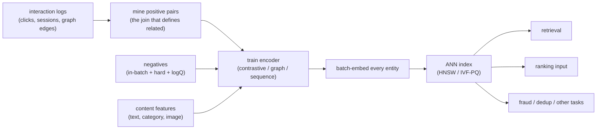

# Embeddings and Representation Learning

> **Style note.** This chapter follows the same teach-first, book-like arc as the
> rest of the series: a candidate/interviewer dialogue to gather requirements, then
> a frame-data-model-evaluate-serve sequence, one figure per idea, real production
> case studies, a "when to use which" table per method group, and an interview Q&A.
> Split into one file per section so no single file becomes unwieldy.

An interviewer rarely says "design a contrastive learning system." They say
**"half the systems on your team need a vector for a user, an item, or an entity.
Design how you actually learn those representations."** That is representation
learning: the problem underneath retrieval, search, ranking, dedup, and fraud. This
chapter builds it end to end, and shows how GraphSAGE, SimCSE, PinSage, Airbnb,
Spotify, and Instacart actually ship it.

## Sections

1. [Clarifying the requirements](01-clarifying-requirements.md) - the dialogue that scopes the problem.
2. [Framing it as an ML task](02-frame-as-ml-task.md) - learn representations; the contrastive objective; input and output.
3. [Data preparation](03-data-preparation.md) - positive pairs, negatives, augmentation, and feature choices.
4. [Model development](04-model-development.md) - InfoNCE and triplet losses; in-batch vs hard negatives; dimensionality; a "when to use which" table.
5. [Evaluation](05-evaluation.md) - recall@k, alignment/uniformity, downstream task lift; a "when to use which" table.
6. [Serving and scaling](06-serving-and-scaling.md) - embedding store, ANN index, dimensionality vs cost, freshness, bottlenecks.
7. [How teams do it in production](07-how-teams-do-it-in-production.md) - GraphSAGE, LightGCN, SimCSE, PinSage, Airbnb, Spotify, Instacart, Wayfair, and where they diverge.
8. [Interview Q&A](08-interview-qa.md) - commonly asked, tricky, and commonly answered wrong, with clear answers.
9. [Summary](09-summary.md) - one-page recap, mermaid, five test-yourself questions, and further reading.

## The whole pipeline on one page

Read the sections in order the first time; each builds on the last. Every section
opens with the question an interviewer actually asks, then answers it.
