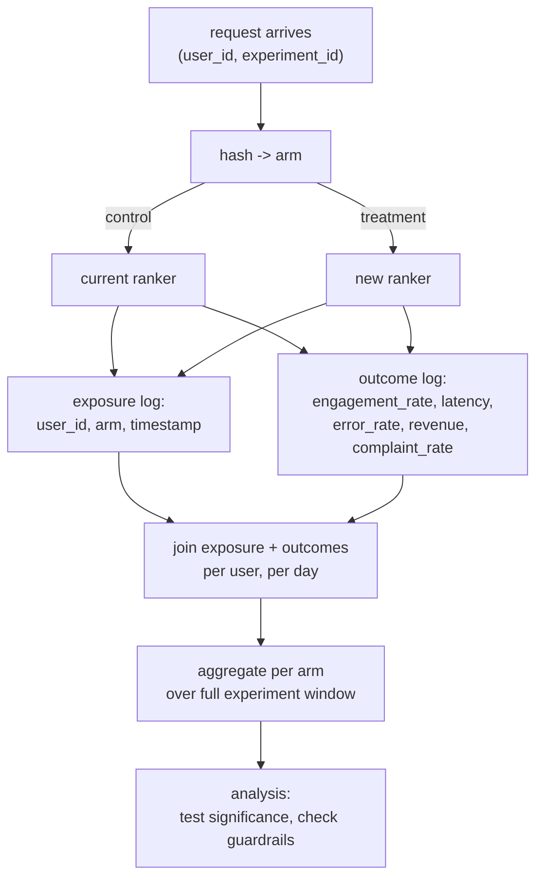

# 2. The Experiment Design

## State the hypothesis first

A well-formed hypothesis has three parts: the change, the mechanism, and the
expected direction. For our ranker:

> "Replacing the current ranker with the new model will improve session
> engagement rate (clicks and dwell time), because the new model's better
> calibration surfaces more relevant content earlier in the feed."

Writing the direction ("improve") and the mechanism ("better calibration, more
relevant content") before you see any data is what separates a hypothesis from a
post-hoc rationalization. It also forces you to think about whether the offline
improvement is actually linked to the online metric you care about.

## Choose the metrics

### The primary metric (Overall Evaluation Criterion)

The OEC is the single number that decides the experiment. Choose it by asking:
"if this metric moves up, is that unambiguously good for the business?" For a
ranker, session engagement rate (weighted clicks plus dwell time, normalized by
session length) is a reasonable OEC. It is sensitive to a ranking change,
measurable in the experiment window, and correlated with the long-term goal
(user retention).

The rule: one metric decides. If you let multiple metrics all vote, you will
always find one that wins and rationalize a ship.

### Guardrail metrics

Guardrail metrics must not regress. For a ranking change, declare these before
launch:

- **p99 ranking latency:** the new model must not add more than a threshold
  (say 10 ms) to the serving path.
- **Error rate:** crashes or failed ranking calls are unacceptable regressions.
- **Revenue per session:** a ranker that lifts engagement by surfacing spam or
  low-value content can depress revenue.
- **Complaint rate (user reports):** the most important long-term signal that
  engagement gains are genuine versus manipulative.

The right frame for guardrails is **non-inferiority**, not "not significant."
A guardrail that does not reach significance may just be underpowered. Airbnb
and Spotify both require the confidence interval of a guardrail to exclude a
meaningful regression before they declare it safe.

### Counter-metrics

For an engagement OEC, also watch dwell time per click and return visit rate.
If engagement lifts but these drop, you are optimizing for clickbait that wins
the metric and loses the user.

## Randomization unit and assignment stability

The randomization unit is the level at which you assign to arms. The rule
from the requirements chapter: **divert at the level at which the effect
operates.** For a ranker, that is the user, not the session or request.

Assignment is implemented as a deterministic hash:

```
arm = hash(user_id || experiment_id) mod 100
control   : arm in [0,  49]
treatment : arm in [50, 99]
```

Using both `user_id` and `experiment_id` in the hash gives every user a
different bucket for each experiment (so concurrently running tests do not
correlate). The hash is deterministic, so the same user always lands in the
same arm on every request, every day, for the life of the experiment.

**Stability matters.** If a user's arm changes mid-experiment (a "flicker"),
they are contaminated by both treatments and should be excluded from the
analysis. Uber flags flicker users explicitly and removes them before reading
results.

## The data flow



The exposure log records every user who was **assigned** to an arm. The outcome
log records every metric event. Joining on exposure is what gives you the correct
denominator: only users who actually experienced the treatment are included. A
common mistake is to analyze all users, including those who never triggered the
ranking path, which dilutes the measured effect.

## What could go wrong in this step

**Sample ratio mismatch (SRM).** Before reading any result, run a chi-squared
test on the observed control/treatment split versus the intended 50/50. If a
50/50 split comes back as 50.8/49.2 at millions of users, randomization or
logging is broken and the whole experiment is invalid, no matter how strong the
primary metric looks.

**Pre-exposure bias.** If the treatment and control arms differ on the primary
metric *before* the experiment starts (measured on pre-experiment history),
the hash is accidentally correlating with something. Always check pre-experiment
balance.
