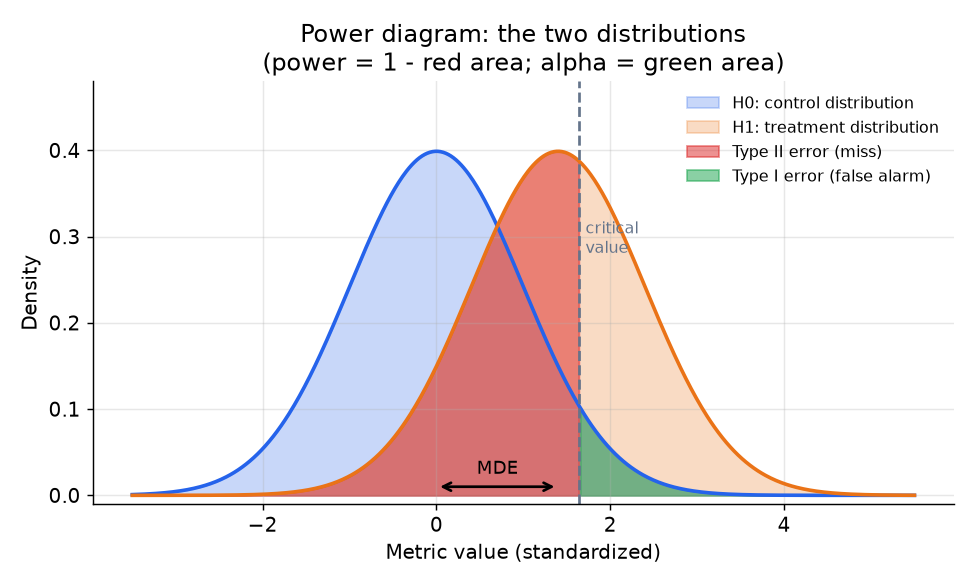
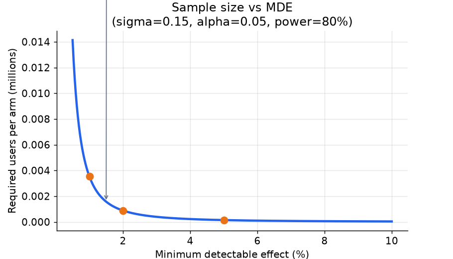

# 3. Sizing and Power

## The two errors you are controlling

Every experiment makes a decision under uncertainty. Two ways to be wrong:

- **Type I error (false positive, alpha):** you ship a change that does nothing.
  Controlled by the significance level, commonly alpha = 0.05.
- **Type II error (false negative, beta):** you miss a real win.
  Controlled by the power, commonly 1 - beta = 0.80.

The **minimum detectable effect (MDE)** connects them both to the sample size:
it is the smallest true effect for which your test will correctly reject the null
with the specified power. Declare the MDE before launching, because it represents
the smallest lift that is worth shipping.

*The control and treatment distributions overlap. The green area is the Type I
error (false alarm rate, alpha): the probability of rejecting the null when the
truth is no effect. The red area is the Type II error (miss rate, beta): the
probability of failing to detect a real effect of size MDE. Power = 1 minus the
red area. A larger MDE or a larger sample pushes the treatment curve further
right, shrinking the red area.*

## The sample-size formula

For a two-sample difference-of-means test, the required sample size **per arm**
is:

$$n \approx \frac{2 \cdot \sigma^{2} \cdot (z_{1-\alpha/2} + z_{1-\beta})^{2}}{\text{MDE}^{2}}$$

where:
- $\sigma^{2}$ is the per-user variance of the primary metric,
- $\text{MDE}$ is the minimum detectable effect (absolute, in the same units as
  the metric),
- $z_{q}$ is the standard-normal quantile at probability $q$ (e.g.
  $z_{0.975} \approx 1.96$ for a two-tailed test at alpha = 0.05, and
  $z_{0.80} \approx 0.84$ for 80% power).

At alpha = 0.05 two-tailed and 80% power, $(z_{0.975} + z_{0.80})^{2} \approx
(1.96 + 0.84)^{2} \approx 7.85$.

### Why sample size scales as $1 / \text{MDE}^{2}$

Because $\text{MDE}$ appears squared in the denominator, halving the effect you
want to detect roughly **quadruples** the required traffic and duration. This is
the single most important intuition to carry into any discussion of experiment
power. Name it explicitly; it is what every sizing conversation hinges on.

*Required users per arm as a function of MDE, at sigma = 0.15, alpha = 0.05,
power = 80%. A 1% MDE needs roughly 4x the traffic of a 2% MDE. Annotated
points are reference markers; numbers are illustrative, not exact baselines.*

## Computing duration from sample size

Once you have $n$ per arm, divide by the daily unique users you can expose (your
traffic share times total daily users) to get the duration in days. Then round up
to the nearest multiple of 7 to absorb weekly seasonality. That number is your
commitment. Do not look for significance before the planned duration expires.

## Variance reduction (CUPED)

If a pre-experiment measurement of the primary metric correlates with the
in-experiment outcome, you can use it to remove predictable variance before the
test runs. The CUPED-adjusted metric is:

$$Y_{\text{cv}} = Y - \theta \cdot (X - \mathbb{E}[X]), \quad \theta = \frac{\text{Cov}(Y, X)}{\text{Var}(X)}$$

The adjusted variance is:

$$\text{Var}(\bar{Y}_{\text{cv}}) = \text{Var}(\bar{Y}) \cdot (1 - \rho^{2})$$

where $\rho$ is the correlation between $X$ and $Y$. A correlation of $\rho =
0.7$ removes roughly half the variance, which is equivalent to doubling the
effective sample size without collecting a single extra user. Use the week before
the experiment as the pre-period covariate; it is almost always available and
typically achieves $\rho$ around 0.6 to 0.8 for engagement metrics.

CUPED is a post-hoc adjustment: compute $\theta$ on the combined data after the
experiment, then analyze the adjusted outcomes.

## When to use which approach

| Reach for | When | Instead of |
|---|---|---|
| Standard t-test sizing | baseline rate, variance, and MDE are known; run the formula before launch | picking a duration by gut feel and peeking for significance |
| CUPED variance reduction | a pre-experiment measurement of the same metric is available (typical correlation 0.6-0.8 removes 35-65% of variance) | running longer; CUPED buys the same power with fewer users |
| Relative MDE (percent lift) | communicating with stakeholders ("we can detect a 1% lift") | absolute MDE alone, which is hard to interpret without the baseline |
| Conservative MDE (small effect) | the change is high-risk, or you care about small improvements | a large MDE that would miss real but modest wins |
| Increase traffic share | CUPED is not available and the metric variance is high | extending the experiment window indefinitely, which risks novelty effects |
| Power at the joint level (beta star = beta / (G + 1) for G guardrails) | you require all G guardrail metrics to pass at power beta (Spotify pattern) | powering only the primary and then being surprised when guardrails are underpowered |

## The Spotify joint-power correction

When you require G guardrail metrics to all pass alongside the primary, the
joint false-negative rate rises. Spotify corrects by targeting tighter power per
metric:

$$\beta^{*} = \frac{\beta}{G + 1}$$

False-positive rates are not adjusted across guardrails, because requiring all
of them to pass does not compound alpha the way independent tests would.
