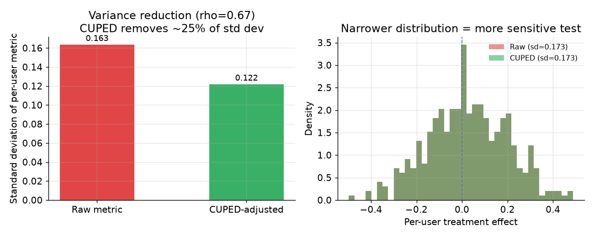

# 4. Analysis

## The basic comparison: two-sample t-test

At the end of the planned window, compute the per-user mean of the primary metric
in each arm and test whether the difference is statistically distinguishable from
zero.

For large samples (thousands of users), the two-sample t-test is equivalent to a
z-test. The test statistic is:

$$t = \frac{\bar{Y}_{\text{treat}} - \bar{Y}_{\text{ctrl}}}{\sqrt{\hat{\sigma}^{2}_{\text{treat}}/n_{\text{treat}} + \hat{\sigma}^{2}_{\text{ctrl}}/n_{\text{ctrl}}}}$$

Report the 95% confidence interval alongside the p-value (the probability of
seeing a difference this large or larger if the change truly did nothing; small
p means the effect is hard to explain by chance alone). A p-value tells you
whether an effect is distinguishable from zero; the confidence interval tells you
whether it is *large enough to matter*. A statistically significant effect that
is below the MDE is not a ship.

### Variance must be clustered at the diversion unit

If you divert by user but the outcome data is at the request or pageview level,
the rows in your table are not independent: many rows share the same user. Naive
standard errors treat them as independent, which makes the intervals too narrow
and manufactures false winners. Aggregate to one row per user before the
t-test, or compute a clustered variance estimator. The rule: **analyze at the
level you divert.**

## CUPED: variance reduction before the t-test

As derived in the sizing chapter, the CUPED adjustment replaces the raw outcome
$Y$ with a residualized version:

$$Y_{\text{cv}} = Y - \theta \cdot (X - \mathbb{E}[X])$$

You then run the t-test on $Y_{\text{cv}}$ instead of $Y$. The estimate of the
treatment effect is unchanged (the adjustment is mean-zero in both arms), but the
variance of $Y_{\text{cv}}$ is smaller, so the confidence interval is tighter.

*Left: standard deviation of the per-user metric before and after CUPED
adjustment. Right: the distribution of per-user treatment-minus-control, raw
versus CUPED. The narrower CUPED distribution means the test needs fewer users
to detect the same effect.*

## The delta method: variance for ratio metrics

Many product metrics are ratios of two sums: click-through rate (total clicks
over total impressions), average session length (total seconds over total
sessions), conversion per visit. When you divert by user but the ratio's
numerator and denominator both aggregate over events, the denominator is itself a
random quantity, and the per-user numerator and denominator are correlated (a
heavy user contributes many clicks and many impressions). A naive standard error
that treats each event row as independent gets this doubly wrong: it ignores the
within-user clustering and it treats the denominator as fixed.

The delta method fixes both by linearizing the ratio. Write the metric as $R =
\bar{Y} / \bar{X}$, the ratio of the per-user mean numerator to the per-user mean
denominator. A first-order Taylor expansion of $R$ around $(\mathbb{E}[Y],
\mathbb{E}[X])$ gives:

$$\text{Var}(R) \approx \frac{1}{n\,\bar{X}^{2}} \left( \hat{\sigma}_{Y}^{2} - 2R\,\hat{\sigma}_{YX} + R^{2}\,\hat{\sigma}_{X}^{2} \right)$$

The cross term $-2R\,\hat{\sigma}_{YX}$ is exactly the numerator-denominator
covariance that the naive estimator drops. Because $Y$ and $X$ are usually
positively correlated across users, that term is negative and pulls the true
variance below a numerator-only calculation, so ignoring it tends to make
intervals too wide on CTR-like metrics, while ignoring the within-user clustering
makes them too narrow. The two errors do not cancel in any reliable way, which is
why you cannot hand-wave the ratio variance. The delta method is the standard
closed-form alternative to bootstrapping the ratio, and it composes with CUPED
(residualize numerator and denominator, then apply the same expansion).

**Provenance.** The delta method applied to large-scale A/B ratio metrics is
documented by Deng, Knoblich, and Lu (Microsoft, 2018).

## Sequential testing: looking without peeking

The standard fixed-horizon test assumes you look exactly once, at the planned
sample size. If you monitor a live dashboard and stop the moment the metric
crosses alpha = 0.05, the actual false-positive rate is far higher than 5%,
because you are implicitly running many tests.

Sequential testing methods (mSPRT, always-valid p-values, group-sequential
boundaries) are built for continuous monitoring. They adjust the threshold
dynamically so that the false-positive rate stays controlled at alpha regardless
of when you stop. Uber uses mSPRT with jackknife variance estimation. The cost
is a slightly wider threshold at any given moment, but you pay it once and you
can look whenever you want.

The practical middle ground: if you do not need continuous monitoring, commit to
the fixed horizon and look once. If you need early looks (for example, to catch
a guardrail breach quickly), switch to a sequential method. The mistake is
combining a fixed-horizon threshold with daily peeking.

## Novelty and primacy effects

**Novelty effect:** users click anything new. The lift in the first few days
after a change can be inflated because users are reacting to the novelty itself.
As the novelty wears off, the effect decays. A test that stops at a novelty
spike ships a feature that will underperform.

**Primacy effect:** the mirror image. Users are anchored on the old experience
and initially resist the new one. An early flat result can hide a real win that
only becomes visible after users adapt.

Both effects are why duration is not just "until significant." The discipline:
plot the **daily treatment effect** (not just the cumulative number) and require
it to stabilize before deciding. A real, shippable effect converges; a novelty
spike decays and a primacy dip recovers. Run at minimum one to two full weeks.

## When to use which analysis method

| Reach for | When | Instead of |
|---|---|---|
| t-test on per-user aggregates | default analysis for a fixed-horizon test at scale | analyzing request rows as independent, which manufactures false winners |
| CUPED adjustment | a correlated pre-experiment covariate is available (typically correlation above 0.5 meaningfully reduces variance) | running longer to compensate for high variance |
| Sequential / mSPRT | you need continuous early looks without peeking inflation (Uber) | checking daily and using a fixed-horizon threshold, which inflates the false-positive rate |
| Fixed horizon (commit and look once) | you can pre-register duration and remove the temptation to peek (Booking.com) | ad-hoc stopping at the first significant reading |
| Non-inferiority test for guardrails | you must prove a guardrail is not meaningfully harmed (Airbnb, Spotify) | reading "guardrail not significant" as "guardrail safe," which is only true if the test is powered |
| Daily effect curve visualization | before any final decision, to check for novelty or primacy | reading only the final cumulative number, which averages over any decay or recovery |
| Bonferroni or FDR correction | you are genuinely testing multiple hypotheses (multiple variants, multiple subgroups) | applying no correction and accepting the first significant secondary metric |

**Provenance.** The CUPED variance-reduction adjustment (controlled experiment
using pre-experiment data) comes from Microsoft (2013).

**Tools.** The two-sample t-test and its confidence interval are one call in SciPy (scipy.stats.ttest_ind) or statsmodels; clustering to the diversion unit is a groupby aggregation in pandas before the test. CUPED is a short hand-rolled regression adjustment (estimate theta by ordinary least squares in statsmodels, then residualize), and Bonferroni or FDR correction is one call in statsmodels (multipletests). For heterogeneous treatment effects beyond the average, EconML (Microsoft) and CausalML (Uber) fit uplift models; sequential and always-valid p-value methods (mSPRT, group-sequential boundaries) come from dedicated confidence-sequence libraries.

**Worked example.** A fintech testing a new onboarding flow diverts by user but logs events per request, so it first aggregates to one row per user in pandas and runs the t-test in SciPy, avoiding the false winners that request-level rows manufacture. A prior-week covariate correlates around 0.7 with the outcome, so it applies CUPED to tighten the interval rather than running the experiment longer. Because it wants to catch a guardrail breach early, it analyzes the guardrail with a sequential mSPRT method while keeping the primary metric on a committed fixed horizon looked at once, never mixing daily peeking with a fixed threshold. It plots the daily treatment-effect curve and waits for it to stabilize over one to two weeks to rule out a novelty spike, and applies an FDR correction from statsmodels before trusting any secondary metric.

## Implementation and training pitfalls

Beyond the conceptual traps, most wrong readings come from how the analysis
pipeline is built: the variance estimator, the covariate, the filters, and the
window. These are the implementation details that silently bias a clean design.

| Problem | Symptom | Fix |
|---|---|---|
| Variance not clustered at the diversion unit | request-level rows treated as independent, so intervals are too narrow and false winners appear | aggregate to one row per diversion unit, or use a clustered or delta-method variance estimator |
| Ratio-metric variance computed naively | the CI is wrong for metrics like clicks over impressions, so the test is over- or under-powered | use the delta method (or bootstrap) for the variance of a ratio of per-user sums |
| CUPED covariate from the experiment period | a covariate contaminated by treatment biases the effect estimate | use strictly pre-experiment covariates and verify the adjustment is mean-zero in both arms |
| Triggered vs intent-to-treat confusion | the effect is diluted by users who never hit the change, or biased if triggering happens after randomization | define the trigger before randomization and analyze the triggered population consistently across arms |
| Asymmetric bot or outlier filtering | a filter removes more rows from one arm and biases the difference | apply identical filtering rules to both arms and set winsorization thresholds before unblinding |
| Day-of-week and seasonality truncation | the effect is read mid-week without covering a full cycle, so the estimate is unstable | run whole-week multiples and plot the daily effect curve for stability |
| Significant but below the MDE | a statistically distinguishable effect is too small to matter yet gets shipped | compare the confidence interval against the MDE, not just against zero |
| Missing-data imputation differs across arms | asymmetric handling of nulls shifts the arm means | impute with one rule applied identically, or analyze completers under a pre-declared policy |

The through-line: a trustworthy design can still produce a wrong answer if the
estimator, the covariate, and the filters are not identical and honest across arms.
