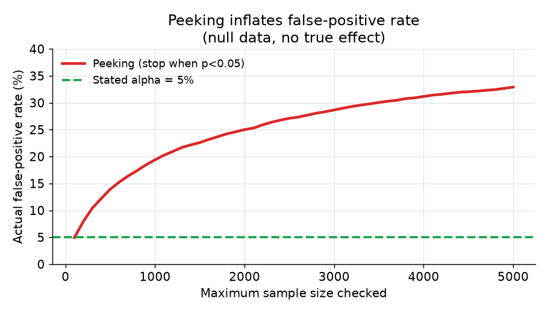

# 5. Pitfalls

These are the ways experiments produce wrong answers. Each one is common enough
to name explicitly; knowing them is more than half the work of running trustworthy
tests.

## Peeking

Checking a running experiment and stopping as soon as the primary metric crosses
alpha = 0.05 is the most common way teams ship noise. The fixed-horizon test
assumes a single look at the planned sample size. Every additional look is an
additional chance to observe a false positive by chance. A team that checks a
dashboard daily and stops on the first crossing runs the false-positive rate well
above the stated 5%.

*Cumulative false-positive rate as a function of how many intermediate checks
are allowed, on null data where there is no true effect. The stated alpha = 5%
(green dashed line) is the rate you get if you look exactly once. Peeking
repeatedly inflates the actual rate well above that.*

Fixes: (1) commit to the planned duration and look once, or (2) use a method
built for continuous monitoring (mSPRT, always-valid p-values, group-sequential
boundaries) that keeps the false-positive rate controlled regardless of when
you stop.

The discipline to state out loud: "I compute the sample size before launching
and I do not read results until the window closes."

## Multiple comparisons

Testing 20 metrics at alpha = 0.05 each expects roughly one false positive by
chance, even if the change does nothing. Testing 20 variants at once compounds
the problem further.

The primary-metric discipline exists precisely to avoid this: one pre-declared
metric decides, the rest are guardrails that are read with that context.

When you genuinely need to test multiple hypotheses (several variants,
pre-specified subgroup analyses), correct for it:

- **Bonferroni:** divide alpha by the number of tests. Conservative; good when
  tests are independent or when you want to control the family-wise error rate.
- **Benjamini-Hochberg FDR:** controls the expected fraction of false positives
  among all rejections. Less conservative than Bonferroni; preferred when tests
  are correlated or when you have many hypotheses.

The rule: declare all hypotheses before seeing data, then correct.

## Interference (SUTVA violation)

The stable unit treatment value assumption (SUTVA) says one unit's outcome does
not depend on another unit's assignment. It breaks whenever arms interact:

- **Marketplaces and shared inventory:** the treatment ranker surfaces item X
  more frequently. Item X sells out or hits a rate limit. Now the control arm
  has less item X available than it would if the treatment did not exist. The
  measured difference is biased because the arms are competing for the same
  supply.
- **Social graphs:** treating one user changes what their connections see, do,
  and post. Treatment leaks into the control arm via the social network.
- **Logistics and pricing:** a ride-share platform that prices more aggressively
  in the treatment arm changes driver availability for the control arm.

Recognizing interference is what interviewers test. The naive user split is
biased in all of these cases. The fixes are cluster randomization (randomize
whole social communities or geographic regions), switchback experiments
(alternate the whole system between arms over time windows), or two-sided
designs. LinkedIn runs the treatment alongside a cluster design and compares
the two estimates; a gap between them reveals leakage.

## Simpson's paradox

An aggregate result can reverse when you look inside subgroups. A ranker that
appears to lift engagement overall can be losing engagement on mobile (the
majority of users) while winning on desktop, simply because desktop users have
higher baseline engagement and are weighted more heavily in the aggregate.

The fix is to **slice the primary metric by key segments** before deciding:
platform, user cohort (new vs. returning), region, and any segment you expect
the change to affect differently. A win that reverses inside every important
segment is not a win. Name your segments before launching (otherwise you will
slice until you find one that looks good).

## Sample ratio mismatch

SRM is the one check that must pass before reading any result at all. It is
covered in the design chapter but worth repeating here as a pitfall: if the
observed control/treatment split differs from the intended split at the scale of
millions of users (chi-squared p below a threshold), randomization or logging is
broken. A common cause is a cache or CDN that serves stale responses to a subset
of treatment users, effectively un-assigning them. Another is a logging bug that
drops events asymmetrically. Both invalidate the entire result.

## Summary: the pitfall checklist

Before reading any experiment result, verify:

1. SRM passes: observed split matches intended split.
2. Pre-exposure balance: arms look the same on the primary metric in the
   pre-experiment period.
3. No peeking: you are reading at the planned sample size, not before.
4. One primary metric declared in advance; guardrails read with non-inferiority.
5. No SUTVA violation: the product does not have network or marketplace
   interference that would bias a user-level split.
6. Segment slices checked: the aggregate result does not reverse in key
   subgroups.
