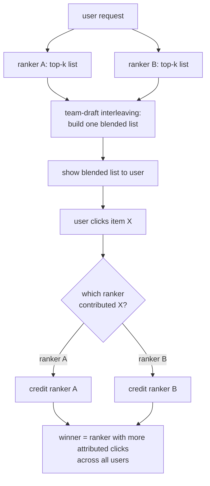

# 6. Interleaving and Alternatives

Standard A/B testing is not always the right tool. For ranking systems
specifically, there is a more sensitive method. For two-sided marketplaces,
a different randomization scheme is necessary to contain interference.

## Interleaving for ranking

In a standard A/B test for a ranker, user A sees the control list and user B
sees the treatment list. To detect a difference, you need enough users that
the aggregate engagement in the two arms is distinguishable.

Interleaving does something different: it **blends both rankers' results into
one list for the same user**. Using team-draft interleaving, the lists are
assembled by alternating picks: ranker A picks its top item, ranker B picks its
top item not already in the list, then A again, and so on. When the user clicks
on an item, the click is attributed to whichever ranker contributed that item.

Because every user sees both rankers simultaneously, the comparison is
**within-user**: you cancel out per-user variance entirely. Netflix estimates
that interleaving can detect a ranking difference with roughly 100 times fewer
users than an A/B test.

### The interleaving workflow

**How it works.** A single user request flows into both candidate rankers, A and B, each producing its own top-k list. The team-draft interleaving stage consumes those two lists and assembles one blended list by alternating picks, tracking which ranker contributed each item so credit can be assigned later. That blended list is shown to the user, and when the user clicks an item, the attribution branch looks up the contributing ranker and credits A or B accordingly. Accumulating those per-click credits across all users produces the output: the winner is the ranker with more attributed clicks. Because every user sees both rankers in one list, the comparison is within-user, which is why it needs far less traffic than a per-arm A/B test.

### What interleaving measures and what it does not

Interleaving measures **within-list ranking preference**: which ranker's items
users clicked more often when they saw both. It does not measure the full
business metric (session length, revenue) or guardrail metrics (latency, error
rate), because the user sees a blended experience, not one arm's pure
experience.

The standard production pattern is therefore two-stage:

1. **Interleaving as a fast screen:** rapidly prune a pool of candidate rankers
   to the few worth a full test. One to two orders of magnitude less traffic.
2. **A/B test for the final decision:** measure the actual business metric and
   guardrails on a clean per-arm experience before shipping.

Naming both is what shows you know ranking-specific tooling, not just generic
statistics.

### Compare and contrast: A/B test vs interleaving

Because both are live, randomized comparisons of two rankers driven by real
user clicks, the two methods get conflated; the table separates what they
genuinely share from where they diverge.

| Dimension | A/B test | Interleaving |
|---|---|---|
| Randomized online comparison on real traffic | Yes, with real users and real clicks | Same |
| Needs correct assignment, logging, and validity checks | Yes (SRM, exposure logging) | Same, plus per-item attribution logging |
| What each user experiences | One arm's pure, coherent experience | A blended list containing both rankers' items |
| Unit of comparison | Between users: arm aggregates are compared across different people | Within user: the same person supplies evidence on both rankers at once |
| What it estimates | The absolute effect on any business or guardrail metric (sessions, revenue, latency) | Only a relative preference: which ranker's items win clicks head-to-head |
| Traffic required | Enough users to overcome between-user variance in baseline behavior | Orders of magnitude less, because each user's baseline cancels in the paired comparison |
| Can it clear a launch? | Yes: it is the ship decision | No: no guardrails, no absolute magnitude, no pure-arm experience |

The difference matters at the moment of decision: interleaving can tell you
which of ten candidate rankers users prefer with a fraction of the traffic, but
it cannot tell you whether the winner moves revenue or breaks latency, so it
picks the finalists while the A/B test remains the only instrument that can
authorize a ship.

## Switchback experiments for marketplaces

In a ridesharing or food-delivery marketplace, a user-level split is biased by
interference (drivers or inventory shift between arms). Cluster randomization by
geography reduces leakage but still has residual cross-boundary effects, and it
drastically cuts the number of effective units.

A switchback experiment solves this differently: the **whole system alternates
between control and treatment over time windows** (for example, every 30
minutes or every hour). At any given moment, every user is in the same arm.
Lyft uses switchbacks to measure marketplace-level changes where shared supply
makes user-level splits unreliable.

The tradeoff: time windows add temporal variance (a busy Monday lunch hour and
a quiet Monday dinner hour are now your "units"), and the effective sample size
is the number of windows, not the number of users. Switchbacks need careful
window-size calibration and longer runs to compensate.

## Cluster randomization for social products

LinkedIn's interference detection chapter showed the two-design approach:
run an individual-level A/B alongside a cluster-level A/B and compare the
estimates. A gap reveals interference. When interference is detected, the
cluster-level estimate is the less-biased one, at the cost of fewer effective
units and higher variance.

## Bottlenecks and tradeoffs

| Scenario | Problem with naive user split | Preferred method | Cost |
|---|---|---|---|
| Ranking comparison, scarce traffic | A/B test too slow to detect small ranking wins | Interleaving as a fast screen, then A/B for business metric | Interleaving measures preference only; A/B still needed for guardrails |
| Two-sided marketplace (shared inventory) | Treatment depletes shared supply; control arm is harmed | Switchback (time-based alternation) | Temporal variance; effective units = time windows, not users |
| Social graph leakage | Treating one user changes connected users' behavior | Cluster randomization by community or geography | Fewer effective units; needs CUPED or stratification to recover power |
| Marketplaces with geographic clusters | Cross-boundary interference even with geo clusters | Geo switchback or budget-split design | Hard to parallelize; longer calendar time |
| Concurrent experiments (many tests at once) | Tests share users; assignments correlate | Orthogonal layered hashing (independent experiment_id per test) | Platform complexity; must audit for residual correlation |

**Details.** On the ranking-comparison row, interleaving wins its sensitivity by
turning a between-subjects comparison into a within-subjects one: each user sees a
single merged list drawn from both rankers (team-draft or balanced interleaving),
so user-to-user variance cancels and a preference signal emerges from far less
traffic than a parallel A/B. On the social-graph and geo-cluster rows, the power
lost to fewer effective units is partly recovered with CUPED (Microsoft, 2013),
which residualizes each cluster's outcome against its pre-period value before the
test, shrinking variance without biasing the effect.
