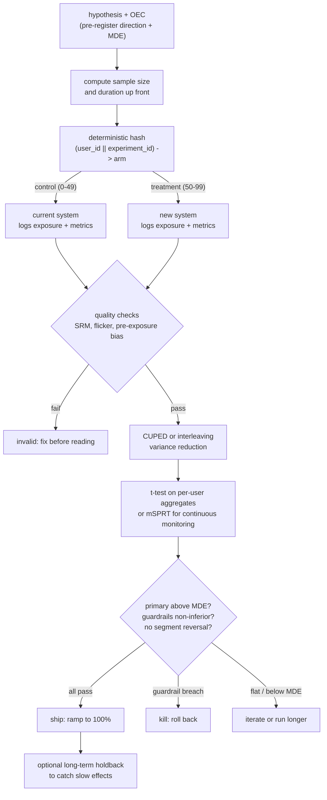

# 9. Summary

## One-page recap

- **The offline win is not the decision.** Offline metrics are proxies measured
  on the old model's data (counterfactual bias). The A/B test is the decision
  because it measures the real metric on the real distribution under the real
  feedback loop.
- **Divert and analyze at the level the effect operates.** For a ranker, that is
  per user. Per-request diversion contaminates the same user with both arms;
  request-level analysis makes confidence intervals too narrow.
- **Pre-register everything before launch.** One primary metric, the MDE, the
  guardrail margins, the sample size, and the stopping rule. Changes made after
  seeing data are rationalization, not analysis.
- **Sample size scales as $1 / \text{MDE}^{2}$.** Halving the effect you want
  to detect roughly quadruples traffic and duration. Fix the MDE, compute the
  sample size, commit to the duration.
- **Variance reduction buys sensitivity for free.** CUPED with a correlated
  pre-period covariate removes 35 to 65% of variance without collecting extra
  users. Use it when available.
- **Duration is not just until significant.** Run at least one to two full weeks
  to absorb novelty effects and weekly seasonality. Plot the daily effect curve
  and require it to stabilize.
- **SRM voids the result.** Check the observed split against the intended split
  on every readout; a broken hash or logging bug makes the whole experiment
  invalid before you read a single metric.
- **Guardrails need non-inferiority, not silence.** "Not significant" is not
  "safe." Require the confidence interval to exclude a meaningful regression.
- **Interference breaks the user split.** In marketplaces and social products,
  use cluster, switchback, or geo randomization. For ranking, interleaving
  screens rankers with 100x less traffic before the A/B confirms the business
  metric.
- **A significant result below the MDE is not a ship.** Require effect above
  the MDE, guardrails safe, and the interval to exclude trivial effects.

## The experiment pipeline on one page

## Test yourself

1. Why does an offline win not guarantee an online win? Name three distinct
   reasons specific to ML ranking systems.
2. You plan to test a ranker change. Your primary metric has per-user standard
   deviation of 0.20. You want to detect a 2% absolute lift at alpha = 0.05,
   80% power. Estimate the required sample size per arm.
3. The experiment ran for 10 days and the primary metric is significant. The
   observed split is 50.3/49.7. The intended split was 50/50. What do you do?
4. A guardrail metric (revenue per session) shows a point estimate of minus 0.3%
   with a 95% confidence interval of [minus 0.8%, plus 0.2%]. The non-inferiority
   margin is minus 0.5%. Do you ship? Why or why not?
5. You want to test a change that affects pricing in a ridesharing marketplace.
   Why is a user-level A/B split wrong, and what do you use instead?
6. What is CUPED, what does it require, and when does it fail to help?

## Further reading

- Dense reference (comparison tables, math, all case studies):
  [../../topics/06-online-experimentation-and-ab-testing.md](../../topics/06-online-experimentation-and-ab-testing.md)
- Kohavi, Tang, Xu: *Trustworthy Online Controlled Experiments* -- the
  book-length reference on everything in this chapter.
- Production teardowns for Uber, Airbnb, Booking.com, Spotify, LinkedIn, Lyft,
  Netflix: [../../tools/teardowns/06.md](../../tools/teardowns/06.md)
- Method comparisons and quadrant chart:
  [../../tools/comparisons/06.md](../../tools/comparisons/06.md)
