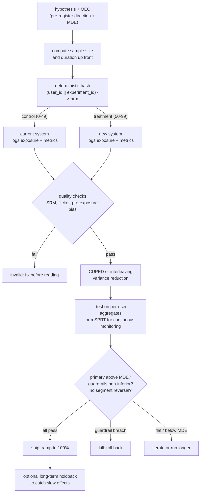

# 9. Summary

## One-page recap

- **The offline win is not the decision.** Offline metrics are proxies measured
  on the old model's data (counterfactual bias). The A/B test is the decision
  because it measures the real metric on the real distribution under the real
  feedback loop.
- **Divert and analyze at the level the effect operates.** For a ranker, that is
  per user. Per-request diversion contaminates the same user with both arms;
  request-level analysis makes confidence intervals too narrow.
- **Pre-register everything before launch.** One primary metric, the MDE, the
  guardrail margins, the sample size, and the stopping rule. Changes made after
  seeing data are rationalization, not analysis.
- **Sample size scales as $1 / \text{MDE}^{2}$.** Halving the effect you want
  to detect roughly quadruples traffic and duration. Fix the MDE, compute the
  sample size, commit to the duration.
- **Variance reduction buys sensitivity for free.** CUPED with a correlated
  pre-period covariate removes 35 to 65% of variance without collecting extra
  users. Use it when available.
- **Duration is not just until significant.** Run at least one to two full weeks
  to absorb novelty effects and weekly seasonality. Plot the daily effect curve
  and require it to stabilize.
- **SRM voids the result.** Check the observed split against the intended split
  on every readout; a broken hash or logging bug makes the whole experiment
  invalid before you read a single metric.
- **Guardrails need non-inferiority, not silence.** "Not significant" is not
  "safe." Require the confidence interval to exclude a meaningful regression.
- **Interference breaks the user split.** In marketplaces and social products,
  use cluster, switchback, or geo randomization. For ranking, interleaving
  screens rankers with 100x less traffic before the A/B confirms the business
  metric.
- **A significant result below the MDE is not a ship.** Require effect above
  the MDE, guardrails safe, and the interval to exclude trivial effects.

## The experiment pipeline on one page

```mermaid
flowchart TD
  H["hypothesis + OEC<br/>(pre-register direction + MDE)"] --> SZ["compute sample size<br/>and duration up front"]
  SZ --> HASH["deterministic hash<br/>(user_id || experiment_id) -> arm"]
  HASH -->|"control (0-49)"| C["current system<br/>logs exposure + metrics"]
  HASH -->|"treatment (50-99)"| T["new system<br/>logs exposure + metrics"]
  C --> QC{"quality checks<br/>SRM, flicker, pre-exposure bias"}
  T --> QC
  QC -->|"fail"| VOID["invalid: fix before reading"]
  QC -->|"pass"| VR["CUPED or interleaving<br/>variance reduction"]
  VR --> ANAL["t-test on per-user aggregates<br/>or mSPRT for continuous monitoring"]
  ANAL --> DEC{"primary above MDE?<br/>guardrails non-inferior?<br/>no segment reversal?"}
  DEC -->|"all pass"| RAMP["ship: ramp to 100%"]
  DEC -->|"guardrail breach"| KILL["kill: roll back"]
  DEC -->|"flat / below MDE"| ITER["iterate or run longer"]
  RAMP --> HB["optional long-term holdback<br/>to catch slow effects"]
```

## Test yourself

Answers are collapsed. Attempt each question before opening one.

1. Why does an offline win not guarantee an online win? Name three distinct
   reasons specific to ML ranking systems.

   

Answer

   Because the offline number and the online decision measure different things
   on different data. **One, the offline metric is a proxy.** AUC and NDCG score
   ranking quality on a logged list; they are not session engagement rate,
   revenue, or complaint rate, which are what actually decide the ship.
   **Two, counterfactual bias.** The logs are the *old* model's data: they
   reflect what the current ranker chose to show, so the new model is graded on a
   distribution it would never have produced, and the offline numbers come out
   optimistic. **Three, training-serving skew.** If any feature is computed
   differently at serve time than in training, the model that looked strong
   offline meets a different distribution in production. This is why the A/B test
   is the decision rather than a confirmation: it measures the real metric on the
   real distribution under the real feedback loop
   ([1](01-clarifying-requirements.md), [8](08-interview-qa.md)).

   

2. You plan to test a ranker change. Your primary metric has per-user standard
   deviation of 0.20. You want to detect a 2% absolute lift at alpha = 0.05,
   80% power. Estimate the required sample size per arm.

   

Answer

   Roughly **1,570 users per arm**. Use the two-sample difference-of-means
   formula from section [3](03-sizing-and-power.md):
   $n \approx 2 \sigma^{2} (z_{1-\alpha/2} + z_{1-\beta})^{2} / \text{MDE}^{2}$.
   At alpha = 0.05 two-tailed and 80% power the z-sum factor is
   $(1.96 + 0.84)^{2} \approx 7.85$, so
   $n \approx 2 \times 0.20^{2} \times 7.85 / 0.02^{2} = 0.628 / 0.0004 \approx
   1570$. Say the scaling out loud while you compute it: $n$ goes as
   $1 / \text{MDE}^{2}$, so tightening the MDE to a 1% absolute lift quadruples
   this to about 6,280 per arm. Two caveats keep the estimate honest. This powers
   the primary metric alone, so if the ship rule requires G guardrails to pass
   jointly you tighten to $\beta^{\ast} = \beta / (G + 1)$ and re-solve, which
   raises n; conversely a pre-period covariate correlated around 0.7 buys roughly
   half of it back through CUPED. Then divide n by daily exposed users per arm
   and round the duration up to a whole number of weeks.

   

3. The experiment ran for 10 days and the primary metric is significant. The
   observed split is 50.3/49.7. The intended split was 50/50. What do you do?

   

Answer

   Do not read the primary metric yet: run the **sample ratio mismatch** check
   first, as a chi-squared goodness-of-fit test on the raw assignment counts
   against the intended 50/50, because whether 50.3/49.7 is fine or fatal depends
   entirely on n. At the scale of millions of users a 0.6 point gap produces a
   vanishingly small p-value, which means randomization or logging is broken and
   the whole experiment is invalid no matter how strong the primary metric looks.
   The usual causes are a cache or CDN serving stale responses that bypass the
   assignment layer, a logging bug that drops events asymmetrically, or a bot
   filter applied to only one arm; the correct response is to stop, diagnose the
   assignment and exposure pipeline, and rerun. Two more things are wrong with
   this readout even if SRM passes. Ten days is not a whole-week multiple, so the
   estimate is truncated mid-cycle and carries day-of-week seasonality; and if
   the pre-registered window was longer, reading at day 10 because the metric
   went significant is peeking, which inflates the false-positive rate well above
   the stated 5% (sections [2](02-the-experiment-design.md),
   [5](05-pitfalls.md), [4](04-analysis.md)).

   

4. A guardrail metric (revenue per session) shows a point estimate of minus 0.3%
   with a 95% confidence interval of [minus 0.8%, plus 0.2%]. The non-inferiority
   margin is minus 0.5%. Do you ship? Why or why not?

   

Answer

   No. The **non-inferiority** rule is that the confidence interval must exclude
   the declared margin, and here the lower bound of minus 0.8% sits below the
   minus 0.5% margin, so a regression larger than you agreed to tolerate is still
   consistent with the data. The tempting wrong answer is that the interval
   contains zero and the guardrail is therefore "not significant," but "not
   significant" is not "proven safe": an underpowered guardrail returns a flat
   result even when a real regression exists, so reading silence as safety
   rewards collecting less data exactly where safety matters. The fix is to buy
   resolution until the interval fits inside the margin: run to a larger n, apply
   CUPED to tighten the interval on the same users, or power the guardrails at
   the joint level $\beta^{\ast} = \beta / (G + 1)$ from the start so this does
   not happen at readout. Airbnb and Spotify both gate on exactly this
   construction (sections [2](02-the-experiment-design.md), [4](04-analysis.md),
   [8](08-interview-qa.md)).

   

5. You want to test a change that affects pricing in a ridesharing marketplace.
   Why is a user-level A/B split wrong, and what do you use instead?

   

Answer

   A user-level split is wrong because it violates **SUTVA**: one unit's outcome
   must not depend on another unit's assignment, and pricing moves shared supply.
   Pricing more aggressively in the treatment arm repositions drivers and changes
   availability for control riders, so the control arm is harmed by the treatment
   arm's behavior rather than by its own experience, and the measured difference
   between arms is biased by an amount you cannot see or bound from inside the
   test. The fix is to redraw the arm boundary around the interfering resource:
   a **switchback**, where the whole system alternates between control and
   treatment over time windows (for example every 30 to 60 minutes) per city, so
   that at any moment every user is in the same arm. Lyft uses exactly this for
   marketplace-level changes; a geo split is the spatial alternative when regions
   are naturally isolated. The cost is real and you should name it: the effective
   sample size is the number of windows rather than the number of users, temporal
   variance enters (a busy lunch hour and a quiet dinner hour are now your units),
   and carryover between adjacent windows needs burn-in gaps and careful window
   sizing, so the run is longer. Analyze on window-level aggregates and check
   carryover by comparing early against late windows (sections
   [5](05-pitfalls.md), [6](06-interleaving-and-alternatives.md),
   [10](10-putting-it-together.md)).

   

6. What is CUPED, what does it require, and when does it fail to help?

   

Answer

   CUPED is **variance reduction using pre-experiment data**: replace the raw
   outcome with $Y_{\text{cv}} = Y - \theta (X - \mathbb{E}[X])$, where $X$ is a
   pre-period measurement per user and $\theta = \text{Cov}(Y, X)/\text{Var}(X)$,
   then run the ordinary t-test on the adjusted outcome. The variance shrinks to
   $\text{Var}(\bar{Y}) (1 - \rho^{2})$ while the treatment-effect estimate is
   unchanged, because the adjustment is built from a quantity measured before
   assignment and subtracted identically in both arms. It requires exactly that:
   a per-unit covariate from strictly before the experiment that correlates with
   the in-experiment outcome, typically the same metric measured over the prior
   week, which usually reaches a correlation of 0.6 to 0.8 and removes 35 to 65%
   of variance. At a correlation of 0.7 it removes roughly half the variance,
   which is equivalent to doubling the effective sample size without collecting a
   single extra user. It fails to help when the covariate does not exist or does
   not correlate: new users with no history, a brand-new metric or surface, or a
   noisy outcome whose prior-period value predicts nothing, since a correlation
   near zero leaves $1 - \rho^{2}$ near one. It is actively harmful when the
   covariate is drawn from the experiment period, because a treatment-contaminated
   covariate biases the effect estimate rather than just failing to shrink it
   (sections [3](03-sizing-and-power.md), [4](04-analysis.md)).

   

## Further reading

- The capstone: [the complete build](10-putting-it-together.md), where every
  choice in this chapter is committed once for the scenario, sized, rebuilt
  under two other constraint sets, and compressed into a runnable A/A peeking
  simulation.
- Dense reference (comparison tables, math, all case studies):
  [../../topics/06-online-experimentation-and-ab-testing.md](../../topics/06-online-experimentation-and-ab-testing.md)
- Kohavi, Tang, Xu: *Trustworthy Online Controlled Experiments* -- the
  book-length reference on everything in this chapter.
- Production teardowns for Uber, Airbnb, Booking.com, Spotify, LinkedIn, Lyft,
  Netflix: [../../tools/teardowns/06.md](../../tools/teardowns/06.md)
- Method comparisons and quadrant chart:
  [../../tools/comparisons/06.md](../../tools/comparisons/06.md)
