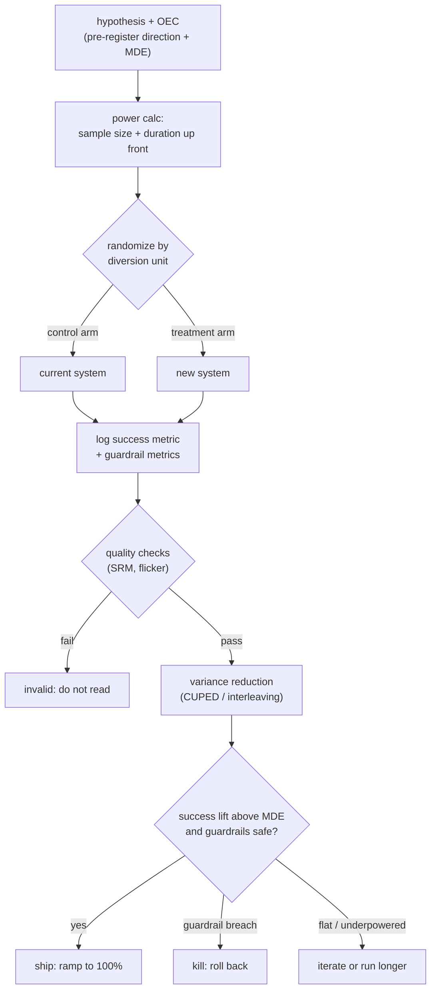

# Online Experimentation and A/B Testing

> **Style note.** This chapter is a teach-first, book-like treatment of online
> controlled experiments for ML systems. It borrows the *thinking* of Aminian
> and Xu's *Machine Learning System Design Interview* (a Candidate/Interviewer
> dialogue to gather requirements, then a consistent arc) without copying its
> format. On top of that it keeps what this repo adds: real production case
> studies, a "when to use which" table per decision group, worked figures
> (mermaid and matplotlib), and an interview Q&A. Split into one file per
> section so no single file gets long.

An interviewer rarely says "run an A/B test." They say **"you trained a new
model and it wins on every offline metric. Design how you decide whether it
actually ships."** That question is about online experimentation: the controlled
comparison that converts an offline win into a decision a team can trust, and
this chapter builds it end to end, then shows how Uber, Airbnb, Netflix, LinkedIn,
Lyft, Booking.com, and Spotify actually run theirs.

## Sections

1. [Clarifying the requirements](01-clarifying-requirements.md) -- the dialogue
   that scopes the problem and surfaces the traps.
2. [The experiment design](02-the-experiment-design.md) -- hypothesis, metrics,
   randomization unit, and why each choice changes the whole design.
3. [Sizing and power](03-sizing-and-power.md) -- sample-size formula, MDE,
   power, and when to trust the calculation.
4. [Analysis](04-analysis.md) -- t-test vs CUPED variance reduction, sequential
   testing, novelty effects, and a "when to use which" table.
5. [Pitfalls](05-pitfalls.md) -- peeking, multiple comparisons, interference,
   and Simpson's paradox.
6. [Interleaving and alternatives](06-interleaving-and-alternatives.md) --
   ranking-specific methods, switchback for marketplaces, and a bottlenecks
   table.
7. [How teams do it in production](07-how-teams-do-it-in-production.md) --
   divergence table of named companies and first-party links.
8. [Interview Q&A](08-interview-qa.md) -- commonly asked, tricky, and
   commonly-answered-wrong questions with clear answers.
9. [Summary](09-summary.md) -- one-page recap, mermaid, and test-yourself
   questions.

## The whole process on one page

Read the sections in order the first time; they build on each other. Each opens
with the question an interviewer actually asks, then answers it.
