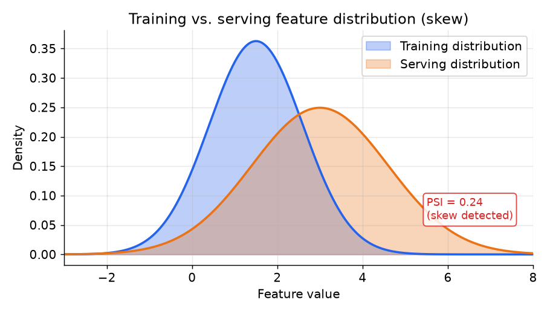

# 2. The core problem: training-serving skew

## What skew is

Training-serving skew is the gap between the feature values a model sees during
training and the feature values it sees during serving. It is the reason a model
that looks excellent offline degrades in production the moment it ships. It is
silent: no error is thrown, training loss goes down, offline evaluation looks
fine, and then the model quietly misbehaves on live traffic.

There are three causes. Every production skew problem is one of these, or a mix.

**Code skew.** The training pipeline and the serving path compute the same feature
with different code. A data scientist writes SQL to compute "user purchase count in
last 30 days" for training. An engineer writes a different function in the serving
layer. Even with the same intent, small discrepancies compound: different null
handling, different rounding, different time-zone interpretation. The model learns
from one distribution, scores on another.

**Time skew (label leakage).** Training joins features to labels using the current
(latest) feature value, not the value that existed when the labeled event actually
occurred. A model predicting whether a user will click trains with a feature "number
of purchases this week" that includes purchases made *after* the click. The feature
leaks information from the future. Offline metrics inflate. Online they collapse,
because future information is not available at serving time.

**Data skew.** The offline training pipeline and the online serving path pull from
different data sources that have diverged: different freshness, different aggregation
windows, or one updated and the other not. This is the hardest to detect because
neither path is wrong in isolation; they just no longer agree.

## Why it kills models silently

The distribution of training features and the distribution of serving features
drift apart. The Population Stability Index (PSI) measures this:

$$\text{PSI} = \sum_{b} \left(p_b - q_b\right) \ln\!\left(\frac{p_b}{q_b}\right)$$

where $p_b$ is the fraction of training samples in bucket $b$ and $q_b$ is the
fraction of serving samples in bucket $b$. PSI above 0.1 is a warning; above 0.2
is a signal that the model is operating out of distribution.

```python
import numpy as np

def psi(p, q):                          # p, q: bucket fractions, each sums to 1
    p, q = np.asarray(p, float), np.asarray(q, float)
    return float(np.sum((p - q) * np.log(p / q)))
# psi([0.40, 0.35, 0.25], [0.25, 0.35, 0.40]) -> 0.141 (mass shifted between fixed buckets)
```



*The two distributions share the same feature but diverge because training used a
stale or differently computed value. PSI = 0.24 here. A model trained on the blue
distribution scores live traffic from the orange distribution and performs worse
than its offline metrics predicted. Illustrative.*

The fix for code skew is a single shared definition: one piece of logic that
compiles to both the batch training path and the online serving path, so the
aggregate is physically the same computation on both sides. The Uber Michelangelo
DSL and LinkedIn Feathr's unified transformation API are both examples of this
fix. Without it, any team growing beyond two or three models will develop skew
silently.

## Online/offline parity as the key metric

The metric that measures whether skew has been fixed is served-vs-computed parity:

$$\text{parity} = \frac{1}{N} \sum_{i=1}^{N} \mathbf{1}\!\left[\,\left|\hat{x}^{\text{serve}}_i - \hat{x}^{\text{train}}_i\right| \leq \varepsilon \right]$$

This is the fraction of entities for which the value retrieved from the online
store matches the value a fresh offline computation would produce, within a small
tolerance. A well-run feature platform targets parity above 0.999.

```python
import numpy as np

def parity(serve, train, eps):          # fraction of entities agreeing within tolerance eps
    s, t = np.asarray(serve, float), np.asarray(train, float)
    return float(np.mean(np.abs(s - t) <= eps))
# parity([1.0, 2.0, 3.0], [1.0, 2.05, 3.5], 0.1) -> 2 of 3 within 0.1 = 0.667
``` When it drops,
skew has entered the system through one of the three causes above.

Monitoring parity on a schedule, per feature, is the earliest warning system for
model degradation that does not require waiting for an A/B result.

## The signal to send in an interview

Two things separate candidates here. First, naming all three causes of skew
(code, time, data) instead of just "the data is different." Second, proposing the
fix for each: a shared definition for code skew, a point-in-time join for time
skew (section 3), and a single materialization path for data skew (section 4).
The dual-store architecture in section 4 is the infrastructure that enforces all
three fixes at once.
