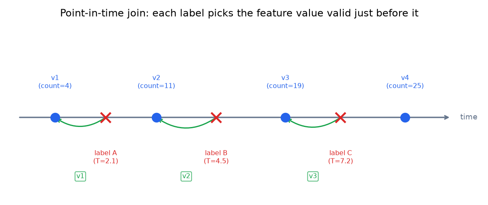

# 3. Point-in-time correctness

## The join-on-latest bug

Most teams building their first training dataset make the same mistake: they join
the label table to the feature table on entity ID, picking the most recent feature
value as of when the join runs. This is wrong.

Labels arrive late. A user clicks an item at time $T_i$; the label might not be
recorded until seconds, minutes, or even hours later. If features have been updated
in the meantime, the join picks up future information, and the model trains on a
feature value that did not exist at the time of the event. This is the time-skew
form of label leakage from section 2, and it is the most common cause of the
"great offline, bad online" pattern.

The diagram below shows what happens concretely.



*Blue dots are feature write events (v1 through v4); red crosses are labeled events.
Each label must pick the most-recent feature version that existed strictly before
its timestamp (green arrows). Label A at T=2.1 picks v1, not v2. Joining on "latest
value" would give all three labels v4, leaking future counts into their features.
Illustrative.*

## The as-of join

The correct operation is an **as-of join**: for each labeled event $e_i$ with
timestamp $T_i$, retrieve the feature value valid at the latest write time that
does not exceed $T_i$:

$$\hat{x}_i = x \left(e_i, \max\bigl\lbrace t : t \leq T_i \bigr\rbrace \right)$$

This requires the offline store to keep **timestamped history** for each entity,
not just the latest value. A table holding only `(entity_id, feature_value)` cannot
support an as-of join. The table must hold `(entity_id, event_time, feature_value)`,
with all historical rows preserved.

```python
def asof(feature_events, query_time):
    # keep only writes at or before query_time (t <= T_i), never future writes
    past = [(t, v) for t, v in feature_events if t <= query_time]
    if not past:
        return None                              # no feature value existed yet
    return max(past, key=lambda tv: tv[0])[1]    # value at the latest such write time
# asof([(0, 'v1'), (2, 'v2'), (5, 'v3')], 3) -> 'v2'  (t=5 write is in the future, excluded)
```

Both Feast and LinkedIn Feathr expose as-of join APIs directly (`get_historical_features`
in Feast). Uber Michelangelo runs the same DSL logic at both training and serving
time, logging the streaming feature values back to HDFS so point-in-time
reconstruction does not require recomputing them. All three approaches enforce the
same invariant: **the feature value paired with a label is the value the model
would have seen had it been scoring that event live.**

## The three-way relationship

Every training row has three timestamps, and confusing them is where skew enters:

| Timestamp | Meaning |
|---|---|
| Event time | when the user action occurred (what the as-of join anchors on) |
| Feature time | when the feature value was computed and written |
| Label time | when the label was recorded (often later than event time) |

The as-of join anchors on **event time**, not label time. Using label time is
subtler but still wrong: if a label is recorded at $T_i + \Delta$, joining on
$T_i + \Delta$ could pick up feature writes that happened after the event. The
correct anchor is always event time.

## Sliding-window aggregates

Streaming features computed over a sliding window (for example, "count of clicks
in the past hour") require extra care. Point-in-time correctness on a sliding
window means storing the feature value at every computation tick, not just the
latest. Without that history, the as-of join has nothing to look up. LinkedIn
Feathr's sliding-window APIs handle this by storing full timestamped history for
each window definition. The common mistake is writing only the current window
value, then finding no historical rows to join against.

## When to use which approach

| Reach for | When | Instead of |
|---|---|---|
| As-of join on event time | labels arrive late and features update between event and label | joining on label time, which still leaks post-event writes |
| Timestamped history in offline store | any feature that changes over time | storing only the latest value, which makes point-in-time impossible |
| Log-and-replay (Uber style) | streaming features are expensive to recompute; log them at compute time | recomputing from raw events, which may not reconstruct the exact aggregate |
| Out-of-fold target encoding with smoothing | encoding a high-cardinality categorical in training | computing the encoding over the whole training split, which leaks |

**Provenance.** Point-in-time correctness (the as-of join on event time) is an
industry-standard requirement for training/serving parity, exposed as a first-class
API by Feast (Gojek, 2019) via `get_historical_features`. The log-and-replay pattern
for streaming aggregates traces to Michelangelo (Uber).

The out-of-fold smoothed encoding deserves a note. When a feature is a
target-encoded category (for example, "mean CTR for this item category"), computing
it over the whole training split leaks the label. The standard fix is out-of-fold
encoding with Laplace smoothing:

$$\tilde{y}_c = \frac{n_c \bar{y}_c + m \bar{y}}{n_c + m}$$

where $n_c$ is the count of samples in category $c$, $\bar{y}_c$ is their mean
label, $\bar{y}$ is the global mean, and $m$ is a smoothing constant. This is a
data-preparation concern, not a feature-store concern, but it appears in the same
conversation because both are forms of label leakage.

**Tools.** As-of joins are exposed directly by Feast (`get_historical_features`) and
Feathr (LinkedIn); the underlying bulk scan runs over a columnar offline store
(BigQuery, Snowflake, or Parquet / Delta Lake) with Spark or the warehouse engine.
Timestamped history is just keeping `(entity_id, event_time, value)` rows in that
store rather than one row per entity. Log-and-replay writes each computed streaming
feature value at compute time (to object storage or a Kafka topic) so it can be
replayed rather than recomputed. Out-of-fold smoothed target encoding is a
scikit-learn or category_encoders step in the training pipeline, not a store feature.

**Worked example.** A marketplace builds a training set for a ranking model where
clicks are labeled minutes after the event while item-popularity features update
continuously. Joining on the latest value would leak future counts, so it uses an
as-of join anchored on event time (Feast `get_historical_features`), which requires
the offline store to keep full timestamped history instead of one row per entity. Its
hourly-click aggregate is expensive to reconstruct exactly, so it logs each computed
window value at compute time and replays it rather than recomputing from raw events.
For a high-cardinality "item category CTR" feature it uses out-of-fold smoothed target
encoding so the label does not leak through the encoding itself.
