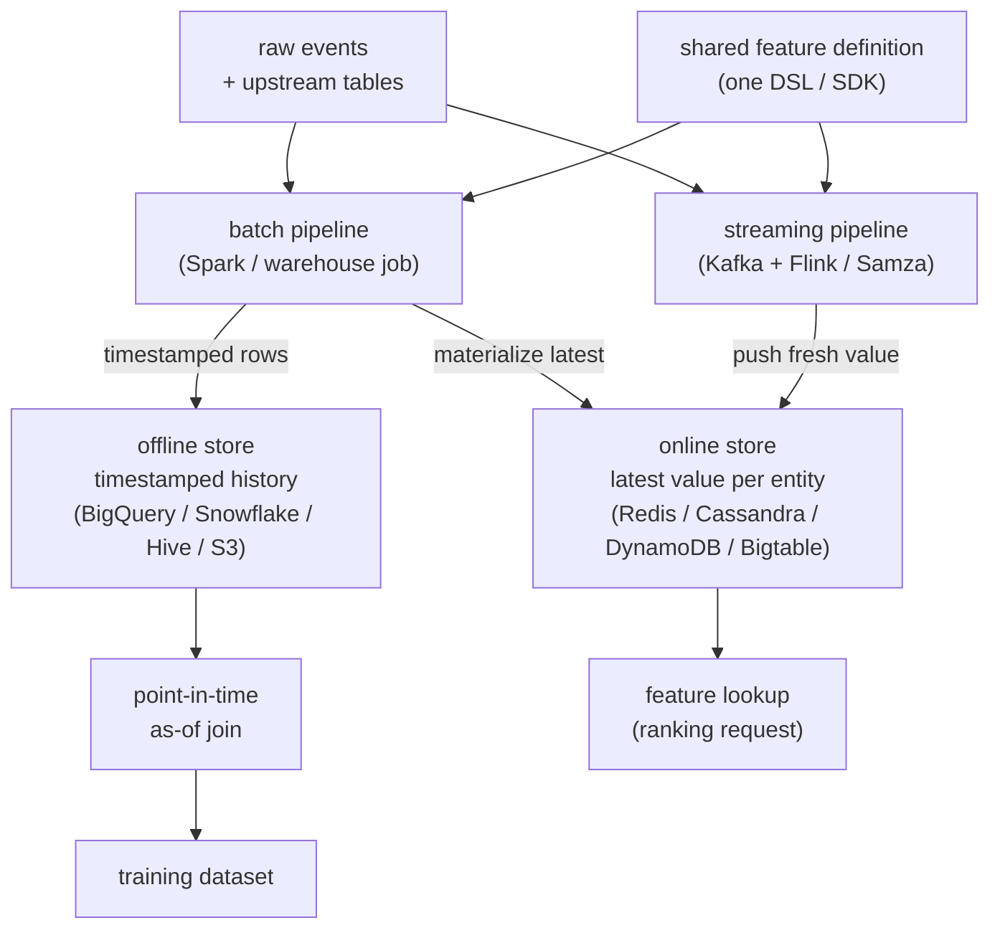
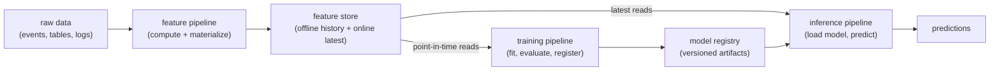

# 4. Architecture: offline store, online store, read and write paths

## The dual-store architecture

One feature definition drives two stores. That is the whole design in one
sentence. The offline store holds full timestamped history and is optimized for
bulk scans; the online store holds the latest (or recent-window) value per entity
and is optimized for single-entity point reads at millisecond latency. Both are
populated by the same shared definition, so code skew is structurally impossible.

**How it works.** Raw events and upstream tables flow in on the left, and a single shared feature definition fans out to two compute paths that apply identical logic. The batch pipeline (Spark or a warehouse job) writes timestamped rows to the offline store for full history and materializes the latest value per entity into the online store, while the streaming pipeline (Kafka plus Flink or Samza) pushes fresh values into the online store within seconds. On the read side, the offline store feeds the point-in-time as-of join that produces the training dataset, and the online store answers single-entity feature lookups for ranking requests. Because both stores derive from the same definition, the offline history used for training and the online latest value used for serving cannot drift apart into code skew.

## The FTI pattern: the store is the seam between three pipelines

Zoom out and the feature store is one node in a pattern worth naming explicitly,
the **FTI decomposition** (feature / training / inference), popularized by the
*LLM Engineer's Handbook*. Almost every production ML system, classical or LLM, is
three long-lived pipelines that communicate only through two artifacts, the
**feature store** and the **model registry**:

The value of naming it in an interview is that it explains *why* the dual store
exists. The three pipelines run on **different cadences, hardware, and owners**: the
feature pipeline is a scheduled or streaming data job, the training pipeline is a
bursty GPU job on a trigger, the inference pipeline is an always-on low-latency
service. They must not be coupled into one process, or you cannot scale, deploy, or
reason about them independently. The store and registry are the *only* interfaces.
This is also the structural reason train/serve skew is designable away: the
training and inference pipelines read features from the **same** definitions, so
there is no second code path to drift.

| Pipeline | Trigger / cadence | Reads | Writes | Compute profile |
|---|---|---|---|---|
| Feature | schedule or stream | raw sources | feature store (both tiers) | data-parallel, CPU |
| Training | manual / drift / CT trigger | offline store (point-in-time) | model registry | bursty GPU |
| Inference | per request | online store + registry | predictions | always-on, latency-bound |

## The write path

**Batch pipeline.** A scheduled job (daily, hourly, or finer) reads from the data
warehouse or object store, applies the shared feature definition, and writes two
things: (1) timestamped rows to the offline store for full history, and (2) the
latest value per entity to the online store via a materialization step. Spark is
the standard compute engine; the offline store is typically a columnar warehouse
(BigQuery, Snowflake) or partitioned Parquet on object storage.

**Streaming pipeline.** An event bus (Kafka, Kinesis) feeds a stream processor
(Flink, Samza, Spark Streaming) that applies the same shared definition to compute
the real-time aggregate, then pushes the result to the online store within seconds.
The hardest constraint here is that the streaming aggregate must be numerically
identical to what the batch backfill would compute for the same window over the
same data. This is the seam where data skew most often enters. Uber's DSL runs the
same code in both contexts. Feathr compiles the same transformation API to both
Spark batch and Spark Streaming.

## The read path

**Training read.** The model-training job reads from the offline store and executes
an as-of join (section 3) against the label table. The result is a training dataset
where each row carries the feature value as it existed just before the labeled event.
This is a bulk scan over potentially billions of rows; columnar formats and
predicate pushdown matter here.

**Serving read.** At request time, the ranking service issues a batch key lookup to
the online store: one entity key per feature, typically batched as "fetch all
features for user U and items I1, I2, I3 in a single round-trip." The result is
returned in a few milliseconds and injected into the model's feature vector. This
is a pure point-read workload; columnar formats are wrong here. Redis or Cassandra
are right.

## What lives in each store

| | Offline store | Online store |
|---|---|---|
| Data model | timestamped rows: (entity\_id, feature\_time, value) | latest row per entity: (entity\_id, value) |
| Access pattern | bulk scan with time filter (as-of join) | single-entity point read |
| Retention | full history (months to years) | latest value or recent window |
| Technology | BigQuery, Snowflake, Hive, Delta Lake, Parquet | Redis, Cassandra, DynamoDB, Bigtable |
| Latency | seconds to minutes | single-digit milliseconds |
| Cost driver | storage + scan compute | memory + IOPS |

## When to use which store design

| Reach for | When | Instead of |
|---|---|---|
| Redis as online store | sub-2ms p99 required, entity count fits in memory budget | Cassandra, whose disk-backed reads add latency under memory pressure |
| Cassandra as online store | entity count is large (tens of billions), disk-backed is acceptable at P95 \lt 10ms | Redis, whose memory cost grows linearly with entity count |
| DynamoDB as online store | team runs on AWS, no on-call appetite for operating Redis/Cassandra, cost over latency acceptable | self-managed stores, when managed is the constraint |
| Bigtable as online store | team runs on GCP, sub-10ms acceptable, very wide rows (many features per entity) | Redis, for very large wide-row feature sets that blow memory budget |
| Single shared DSL / unified API | multiple models, multiple teams, skew is already a problem | separate SQL and service code, which guarantees code skew at scale |
| Pluggable backends (Feast) | no single technology mandate, different models need different stores | a fixed-backend platform, when the team cannot commit to one online store |

**Tools.** Redis is the in-memory point-read online store; Cassandra (and ScyllaDB)
are disk-backed wide-column stores for very large entity counts; DynamoDB on AWS and
Bigtable on GCP are the managed cloud key-value options for teams that would rather
not operate a cluster. The shared-definition layer is Feast (pluggable backends),
Tecton, or Feathr (LinkedIn); the batch write path runs on Spark against a columnar
offline store (BigQuery, Snowflake, Delta Lake), and the streaming write path on
Kafka plus Flink.

**Worked example.** A payments company scores fraud at checkout and needs a sub-2ms
p99 lookup, and its active entity set (cards seen in a recent window) fits a memory
budget, so it picks Redis over Cassandra for that online store. It runs on AWS with a
small platform team and no appetite to operate a cluster, so for a second, larger,
latency-tolerant feature set it uses DynamoDB rather than self-managed Cassandra.
Because several models and teams now read the same features, it adopts one shared DSL
(Feast) so the batch and streaming paths compile from a single definition and cannot
drift, and Feast's pluggable backends let the Redis and DynamoDB stores coexist under
one API rather than forcing a single-technology mandate.

## The feature registry

The registry is the catalog layer above the stores. It records: feature name,
owner, description, schema, freshness SLA, which models consume it, and lineage
(what upstream tables and transformations produced it). Without a registry, the
feature store becomes a dumping ground: 10,000 features at Uber with no metadata
is the canonical cautionary tale. A registry does not need to be a separate
service; it can be a versioned YAML or JSON schema checked into the same repository
as the feature definitions. Azure Purview (Feathr), Amundsen, and DataHub are the
common external choices.
