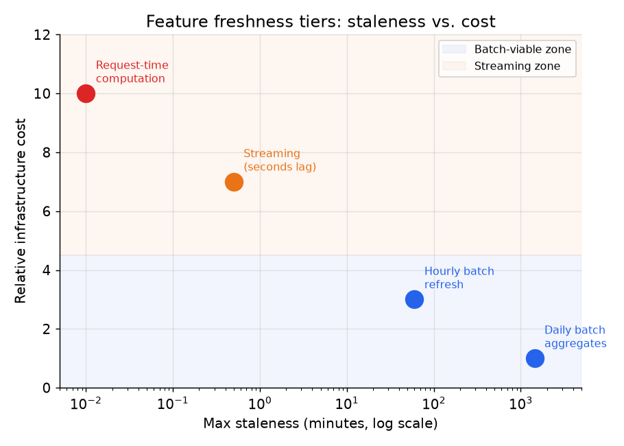

# 5. Freshness and backfills

## Freshness tiers

Not every feature needs to be fresh within seconds. Freshness and infrastructure
cost are in direct tension. A user's 30-day purchase count changes slowly; a
daily batch job is more than adequate and costs almost nothing. "Items clicked in
the current session" changes continuously; streaming is required. Choosing a
freshness tier that is stricter than the feature actually needs wastes infrastructure
and increases on-call burden with no benefit.

The four practical tiers, from cheapest to most expensive:

| Tier | Staleness | Infrastructure | Typical features |
|---|---|---|---|
| Daily batch | up to 24 hours | warehouse job + materialization | 30-day purchase count, lifetime user attributes |
| Hourly batch | up to 1 hour | more frequent scheduled job | rolling-7-day engagement score, item freshness rank |
| Streaming (near-real-time) | seconds to minutes | event bus + stream processor (Flink/Samza) | session-level click count, trending scores |
| Request-time computation | milliseconds | computed inline on the serving path | request context (device, time of day, query text) |



*Moving right on the x-axis (fresher) costs roughly an order of magnitude more in
infrastructure per tier. Daily batch features cost 1x; streaming costs roughly 7x.
Request-time computation (rightmost) can cost more than all stores combined if the
computation is non-trivial. Assign each feature to the least-strict tier it can
tolerate. Illustrative.*

## When to use which tier

| Reach for | When | Instead of |
|---|---|---|
| Daily batch | the feature changes slowly and modeling accuracy does not depend on intra-day variance | streaming, which adds cost without accuracy gain |
| Hourly batch | the feature must reflect recent-but-not-real-time state (trending over the last few hours) | daily batch, if the recommendation would degrade with 24-hour staleness |
| Streaming | session signals where a 1-minute lag would meaningfully change the prediction | batch, when the feature is slow-moving and batch is sufficient |
| Request-time computation | features that depend on the request itself (query, device, time) and cannot be precomputed | precomputing for all possible request contexts, which is combinatorially infeasible |

**Provenance.** The multi-tier freshness model (batch plus streaming plus
request-time) and the discipline of logging each computed value with a timestamp so
point-in-time correctness (industry standard) holds across tiers were codified by
platforms like Michelangelo (Uber) and the open-source Feast (Gojek, 2019).

The time-decayed streaming aggregate is the canonical streaming feature. For an
entity $i$ at time $T$, with events $y_t$:

$$a_i(T) = \sum_{t \leq T} y_t \cdot e^{-\lambda(T - t)}$$

The decay rate $\lambda$ controls how quickly old events lose weight. This gives
a "recent activity" signal that emphasizes the most recent events without hard
window cutoffs.

```python
import math

def decayed_sum(events, T, lam):        # events: list of (t, y); weight fades with age
    return sum(y * math.exp(-lam * (T - t)) for t, y in events if t <= T)
# decayed_sum([(0, 1.0), (1, 1.0), (2, 1.0)], 2, 1.0) -> e^-2 + e^-1 + 1 = 1.503
``` To support point-in-time training, the value $a_i(T)$ must be
logged at the time it is computed and stored with a timestamp; recomputing it from
raw events requires replaying the full event history with the correct decay.

**Tools.** Daily and hourly batch tiers are warehouse or Spark jobs on a scheduler
(Airflow or Dagster) that write timestamped rows to the offline store and
materialize the latest value to the online store. The streaming near-real-time tier
uses an event bus (Kafka or Kinesis) plus a stream processor (Flink, Samza, or Spark
Streaming) to push fresh values within seconds. Request-time computation is plain
code on the serving path with no store involved.

**Worked example.** A marketplace assigns each feature to the least-strict tier it
can tolerate. A user's 30-day purchase count barely moves within a day, so it lives
on a daily batch job and costs almost nothing. A "trending over the last few hours"
rank would degrade with 24-hour staleness, so it moves up to an hourly batch. The
current-session click count would change meaningfully with even a minute of lag, so
it runs on a streaming pipeline (Kafka plus Flink). Device and time-of-day depend on
the request itself and cannot be precomputed for every context, so they are computed
request-time on the serving path.

## Freshness SLA monitoring

Each feature should have a declared freshness SLA, and the platform should monitor
it. The staleness of feature $i$ at time $T$ is:

$$s_i(T) = T - \max\bigl\lbrace t : \text{materialized}(e_i, t) \bigr\rbrace$$

```python
def staleness(T, materialized_times):   # age of the freshest materialized value
    return T - max(materialized_times)
# staleness(100, [40, 70, 95]) -> 100 - 95 = 5 (5 time units behind now)
```

If $s_i(T)$ exceeds the declared SLA, the feature is stale and downstream models
may be silently degraded. An alerting rule on this metric per feature is the
minimum viable freshness governance.

## Backfills

A **backfill** is a re-computation of a feature definition over historical data,
typically when a new feature is introduced and must be populated for past events to
enable training.

The backfill trap is subtle and easy to fall into: **if you run today's feature
definition over historical raw data but join it to labels at the label's event
time without also preserving historical timestamps, you have reintroduced time skew.**
Specifically, if the feature definition changed (a bug was fixed, a window was
corrected), the backfill produces values that reflect the new logic even for events
that occurred under the old logic. The model then trains on a feature distribution
that never existed in production.

The correct backfill guarantees:
1. Apply the feature definition as it was at the time of each historical event, or
   at minimum apply the current definition but store results with proper timestamps.
2. The resulting rows must be indistinguishable from rows that would have been
   written by the live pipeline at the time of each event.
3. After the backfill, validate using the parity metric from section 2: compare
   backfilled values to any retained serve-time logs for the same entities.

The cheapest discipline that prevents backfill skew is to log feature values at
serving time (Google's approach). If you have logs of exactly what the model saw,
you can reconstruct training data from logs rather than recomputing from raw events.
The recomputation path is error-prone; the log-replay path is not.

## When to use which backfill approach

| Reach for | When | Instead of |
|---|---|---|
| Full historical recompute | introducing a new feature that was never in production; no serve-time logs exist | incremental backfill, which only goes back as far as stored incremental snapshots |
| Log-replay (train on serve-time logs) | the platform logs exact feature values at serving time; this is the most reliable training source | recomputing features offline and hoping they match serve-time values |
| Incremental backfill | the new feature is a minor variant of an existing one; only a recent window is needed | full recompute, which is expensive when history is years deep |
| Validate with parity after any backfill | always | skipping validation, which is how backfill skew goes undetected until online degradation |

**Provenance.** Log-replay (training on the exact feature values logged at serving
time) is Google's serve-time logging discipline noted above; it is the most reliable
way to preserve point-in-time correctness (industry standard) during a backfill,
because it removes the recompute step where old and new feature logic can diverge.

**Tools.** A full historical recompute runs the feature definition over all past raw
data with Spark or the warehouse engine and writes timestamped rows to the offline
store. Log-replay reads serve-time feature logs (persisted to object storage or a
Kafka topic) and rebuilds training data from exactly what the model saw. An
incremental backfill reuses stored snapshots and only recomputes a recent window. The
parity check is a Spark or SQL diff between backfilled values and the retained
serve-time logs.

**Worked example.** A bank introduces a feature that was never in production and has
no serve-time logs for it, so it has no choice but a full historical recompute,
applying the definition with proper event timestamps so the backfilled rows match
what the live pipeline would have written. For an existing feature that already logs
exact values at serving time, it prefers log-replay and trains directly on those logs
rather than recomputing offline and hoping the numbers match. When a later change is
only a minor variant over a recent window, an incremental backfill is cheaper than
recomputing years of history. Whichever path it takes, it validates with the parity
metric afterward, since that is how backfill skew is caught before it surfaces as
online degradation.
