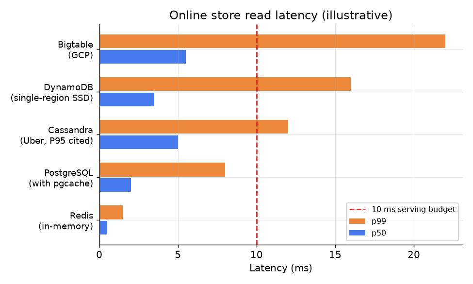

# 6. Serving and scaling

## The online store is on the critical path

Feature retrieval at request time is not a background operation. It sits on the
critical path of every ranking request: the model cannot score items until it has
the feature vector, so the online store's latency directly adds to end-user
latency. A ranking system with a 50ms overall budget typically allocates 5-10ms
for feature fetch, leaving the rest for model inference. That budget is strict.

The standard pattern is a batch key-value lookup: the ranking service collects
all the entity IDs it needs (one user ID, dozens or hundreds of item IDs), issues
a single batch get to the online store, and receives all feature values in one
round-trip. Issuing one request per entity would multiply latency by the number
of entities and immediately blow the budget.

## Online store latency by technology

*Redis consistently hits sub-2ms p99 for in-memory key lookups. Cassandra, as used
by Uber (P95 \lt 10ms cited), is disk-backed and pays a higher tail latency but scales
to entity counts that would not fit Redis memory. DynamoDB and Bigtable are managed
services that trade operational simplicity for 5-20ms p99. PostgreSQL with an
explicit cache layer can compete with managed services for smaller entity counts.
Illustrative.*

## When to use which online store

| Reach for | When | Instead of |
|---|---|---|
| Redis | p99 must be below 2ms; entity count fits in cluster memory (typically up to a few hundred GB) | Cassandra, which is slower under memory pressure |
| Cassandra | tens to hundreds of billions of entities; P95 \lt 10ms acceptable; disk-backed is fine | Redis, whose memory cost scales linearly and becomes prohibitive at very large entity counts |
| DynamoDB | AWS shop; no appetite to operate a cluster; cost over latency acceptable | self-managed Redis/Cassandra, when the ops burden is the real constraint |
| Bigtable | GCP shop; wide rows (many features per entity); p99 of 5-10ms acceptable | Redis for very large wide-row feature sets where memory cost dominates |
| Pluggable (Feast) | team has mixed infrastructure or wants to swap backends as scale grows | committing to one backend early and re-architecting later |

## Cost and size

The cost of the online store has two primary drivers:

**Entity count times feature count.** Each entity-feature pair needs to be
materialized and held in the store. For 50 million users, 100 features, and 4 bytes
per feature value, the raw storage is 50M x 100 x 4 = 20GB, which fits comfortably
in a Redis cluster. At 500 million users or 1000 features, the math changes; at
that point Cassandra's disk-backed approach is often cheaper.

**Write rate.** The online store receives writes from two sources: the batch
materialization job (a burst every hour or day) and the streaming pipeline (a
continuous high-rate stream). The batch burst can overwhelm an undersized online
store if the materialization is not rate-limited or pipelined. A common mistake is
running a full-catalog materialization without rate limiting, causing latency spikes
for live traffic while the write burst proceeds.

## Bottlenecks

| Bottleneck | First sign | Fix | Tradeoff |
|---|---|---|---|
| Online store p99 too high | ranking latency spikes; feature fetch dominates the budget | move to Redis; increase cluster memory; reduce features per request | higher cost |
| Batch materialization burst | online store latency spikes during and after the materialization job | rate-limit or pipeline the materialization write; stagger per feature group | longer total materialization time |
| Streaming lag exceeds SLA | parity metric shows staleness above declared SLA | increase stream processor parallelism; reduce window computation cost | higher streaming infra cost |
| Feature staleness silent | model accuracy degrades without alerts | add per-feature freshness monitoring; alert on SLA breach | additional observability infra |
| Feature sprawl | 10,000+ features, most unused; store grows unbounded | governance: deprecate unused features; enforce ownership in registry | migration effort |
| Cold-start (new entity) | new users / items not in the online store | initialize with a global default or a cold-start feature vector; write to online store on first event | models see default values briefly for new entities |
