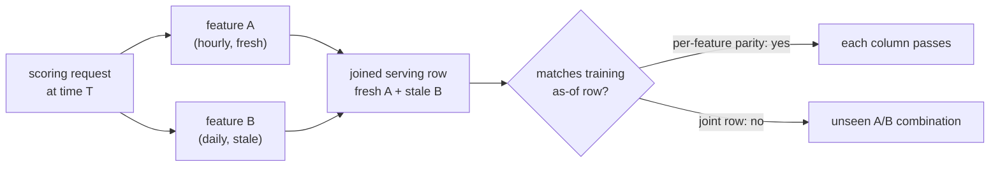

# 8. Interview Q&A

The questions an interviewer actually asks about feature stores and training-serving
skew, grouped by how they are used. The commonly-missed ones are where interviews
are won or lost.

## Commonly asked

**Q: What is training-serving skew, and what causes it?**

A: It is the gap between the feature values the model saw during training and the
values it sees at serving time. Three causes. Code skew: separate code for
training (SQL) and serving (service function) that drifts apart. Time skew:
training joins on the latest feature value instead of the value at the time of
the event, leaking future information. Data skew: offline and online pipelines pull
from sources that have diverged in freshness or logic. Name all three. Interviewers
are listening for the distinction.

**Q: Why do you need two stores (offline and online)? Why not one?**

A: Different access patterns. The offline store must support bulk scans over billions
of timestamped rows for an as-of join; columnar warehouses do this well. The online
store must return a single entity's features in milliseconds; column-oriented storage
does this poorly. Trying to serve ranking requests from BigQuery will blow the
latency budget. Trying to do point-in-time historical joins from Redis without
historical rows is impossible. Two stores with different technologies solve two
genuinely different problems.

**Q: What is an as-of join and why does training require it?**

A: For each labeled event with timestamp $T_i$, the as-of join retrieves the feature
value valid at $\max\{t : t \leq T_i\}$: the most recent write no later than $T_i$. It prevents time leakage by ensuring the model is trained only on information
that would have been available at scoring time. "Join on latest" is not the same
thing; it picks up feature writes that happened after the event.

**Q: What freshness tier do you assign a feature?**

A: The least-strict tier that the model accuracy can tolerate. A 30-day purchase
count changes slowly; daily batch is correct and cheap. Session click count changes
per event; streaming is required. Assigning streaming freshness to a slow feature
wastes infrastructure with no accuracy benefit.

**Q: How do you detect that skew has entered the system?**

A: Served-vs-computed parity: for a sample of entities, compare the value in the
online store to what a fresh offline computation produces. Target parity above 0.999
per feature. Also monitor PSI between the training feature distribution and the
serving feature distribution; PSI above 0.1 is a warning. Both metrics should run
on a schedule and alert before model quality degrades.

## Tricky (the follow-ups that separate people)

**Q: Your model looked great offline, but engagement dropped the day after launch.
What do you look for first?**

A: Training-serving skew. Check served-vs-computed parity for each feature the model
uses. If parity is fine, check PSI of the training distribution versus what the
online store is returning. Then look at whether the offline evaluation used a
random split instead of a time-based split (which leaks future data and flatters
offline metrics). The pattern "great offline, bad online immediately after launch"
is almost always skew or an evaluation bug, not a model bug.

**Why:** the model weights are identical offline and online, so anything that changes
at the offline-to-online boundary must come from the inputs, not the model. Offline
evaluation replays features reconstructed by the offline pipeline; live serving reads
whatever the online path computes. If those two computations disagree, the model is
scoring on a distribution it never trained on, and quality drops on day one rather
than decaying gradually the way genuine drift does.

**Q: When is logging features at serving time better than recomputing them offline?**

A: Always, when you have it. Recomputing features offline to match serving requires
exact reproducibility of the computation: same null handling, same aggregation, same
time-zone assumptions. Logging the exact values at serving time bypasses that
fragility entirely. The model then trains on literally what it saw in production.
Google's Rules of ML prioritizes this approach precisely because recomputation is
where code skew silently enters. The cost is storage; the benefit is perfect parity
by construction.

**Q: How do you handle a backfill that covers a period when the feature definition
was different?**

A: You have two options. Apply the current definition uniformly and accept that the
backfilled values do not match what the old pipeline would have produced; train only
on data after the definition change. Or version the feature definition and apply
the version that was active at each point in time. Most teams choose the first
option; it is simpler and avoids versioned backfill complexity. The key constraint
is: do not mix training data from before and after a definition change without
explicitly flagging the discontinuity.

**Why:** a model fits one mapping from feature value to label. If the same column
means a 30-day count before the change and a 7-day count after it, identical numeric
values carry different information in different eras, and the model averages two
different relationships into a single fit that is wrong for both. Truncating or
flagging restores one consistent meaning per column.

**Q: Uber logged 10,000 features and governance became the critical challenge. What would
you do differently?**

A: Governance from the start: every feature must have a declared owner, a description,
a freshness SLA, and at least one consumer in the registry. Enforce deprecation:
a feature with no consumer for 90 days is automatically sunset. Enforce naming
conventions and feature groups so related features are discovered together. Without
governance, a feature store is a write-only system: features accumulate, ownership
erodes, and nobody dares delete them.

**Why:** without a declared owner and consumer list, deleting or changing a feature
has unknown blast radius, so the rational move for every individual engineer is to
never touch existing features and add new ones instead. Each locally sensible
decision compounds into a store that only grows. Registry metadata is what turns
deletion from a gamble into a routine operation, which is why it must exist before
the feature count explodes, not after.

**Q: Each feature passes served-vs-computed parity individually, yet the model still
degraded after a store migration. What could cause that?**

A: Parity is checked per feature, but the point-in-time join stitches many features
together at one anchor timestamp. If two features were materialized on different
schedules (one hourly, one daily) and the migration changed their relative lag, each
one can still match its own offline recomputation while the joined row now pairs a
fresh value of feature A with a stale value of feature B, a combination the model
never saw in training. The mechanism is correlated staleness across features, not a
single-feature bug, so the diagnostic is to compare the joint (multi-feature) row the
model receives at serving time against the as-of joined training row for the same
entity and timestamp, not just each column in isolation.

*Each feature can pass its own parity check while the jointly-served row is a fresh-plus-stale combination the model never saw in training.*

**Q: The offline feature store and the data warehouse look similar; when does the
difference actually matter?**

A: They look identical on the surface: both are columnar, timestamped, bulk-scan
systems, and the offline store is often physically built on the warehouse. The
difference matters the moment you generate training data. Warehouse tables carry
whatever timestamp semantics each table's author chose (event time, load time,
updated-at), with no shared convention, so every training join reinvents
point-in-time logic by hand and one wrong timestamp column silently leaks the
future. The offline store enforces one contract: every row records when the value
became knowable, and the as-of join is keyed on that. It matters again at
materialization: the offline store's rows are the same definitions synced into the
online store, so training rows and served values come from a single source, which
ad-hoc warehouse tables cannot guarantee.

## Commonly answered wrong (the traps)

**Q: Can you compute heavy features (neural embeddings, expensive aggregates) on
the serving path to keep the online store small?**

A: Only if the latency budget allows it, which it usually does not. Serving budgets
are 5-10ms. A neural embedding forward pass is 10-100ms on CPU. The online store
exists precisely to move that computation offline. The right answer is: precompute
offline, materialize to the online store, serve a lookup. Reserve request-time
computation for features that literally depend on the request (device, query text).
**Why:** precomputation moves the expensive work off the critical path and amortizes
it across every request for that entity, so the serving path degenerates to a single
key-value read whose latency is independent of how heavy the feature is to compute.
Request-dependent features are the exception only because their inputs do not exist
until the request arrives, so there is nothing to precompute.

**Q: Should training always use the latest feature value from the online store?**

A: No. The online store holds only the latest value; it has no historical rows. For
training, you need the value as of the event time, which requires the offline store's
timestamped history and an as-of join. Using the online store for training is the
join-on-latest bug: it will pass offline evaluation (the latest value is often
close to correct) while introducing subtle time leakage that inflates offline metrics.
**Why:** the latest value can already reflect the outcome you are predicting; a
purchase-count feature incremented by the very purchase that serves as the label
partially encodes the label itself, so offline metrics inflate. At serving time the
outcome has not happened yet, so the model underperforms exactly where the leak
helped it offline.

**Q: Is PSI measured between training and serving distributions, or between training
and holdout?**

A: Between training and serving (live traffic). PSI between training and a holdout
split tells you about train-test distribution shift, which is a different problem.
PSI between training and serving tells you whether the feature values arriving at
the model in production match what it was trained on. That is the skew signal. Both
are useful; they measure different things. Mechanically, PSI (Population Stability
Index, from credit-risk practice) fixes bins from the reference (training)
distribution, then sums $(p_i - q_i)\ln(p_i / q_i)$ over bins, where $p_i$ and $q_i$
are the training and serving proportions in bin $i$; because the bin edges are frozen
on training, a shift shows up as mass moving between fixed buckets rather than the
bins themselves moving. That is why using serving-derived bins would hide exactly the
drift you are trying to catch.

**Q: Can you just retrain more frequently to fix skew?**

A: No. Frequent retraining reduces distributional shift between training data and
the current world, but it does not fix code skew, time skew, or materialization
bugs. A model retrained daily on features computed with the wrong logic will still
have skew; it just trains on a fresher version of the wrong distribution. The fix
is correct infrastructure, not retraining cadence.
**Why:** skew is a gap between two computation paths at the same moment in time,
not a gap between two points in time. Retraining moves the training snapshot forward,
but the offline and online paths still disagree at every snapshot, so the gap
reappears intact after each retrain.
