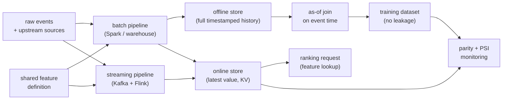

# 9. Summary

## One-page recap

- **Training-serving skew has three causes.** Code skew (different logic on each
  path), time skew (joining on latest value instead of event-time value), and data
  skew (offline and online sources diverged). Name all three. The fix for code skew
  is a shared definition. The fix for time skew is an as-of join. The fix for data
  skew is one materialization path feeding both stores.
- **One definition drives two stores.** The offline store holds full timestamped
  history for bulk as-of joins; the online store holds the latest value per entity
  for single-digit-millisecond point reads at serving time. Both are populated from
  the same definition, so code skew is structurally impossible.
- **Point-in-time correctness is not optional.** For each labeled event at time
  $T_i$, the training feature is $\hat{x}_i = x(e_i, \max\{t : t \leq T_i\})$:
  the most-recent feature write before the event. "Join on latest" leaks the future,
  inflates offline metrics, and collapses online.
- **Freshness is a tier decision, not a default.** Daily batch for slow features;
  streaming for session signals. Assigning streaming freshness to a slow feature
  wastes infrastructure with no accuracy gain.
- **Backfills reintroduce skew if done wrong.** Run today's logic over historical
  timestamps without preserving event-time alignment, and you get a training dataset
  that never matched production. Log-replay (training from serve-time logs) is
  more reliable than recomputation.
- **Detect skew with parity and PSI.** Served-vs-computed parity above 0.999 per
  feature; PSI below 0.1 between training and serving distributions. Both run on a
  schedule and alert before model quality degrades.

## The system on one page

## Test yourself

1. Name the three causes of training-serving skew and the infrastructure fix for
   each. Which one is the hardest to detect?
2. Why does the offline store need to keep timestamped history, and what breaks
   if it stores only the latest value per entity?
3. A backfill re-runs the current feature definition over two years of raw events.
   In what scenario does this reintroduce time skew, and how do you avoid it?
4. A new streaming feature is introduced. What must be true of the streaming
   aggregate and its batch backfill for point-in-time correctness to hold?
5. You observe PSI = 0.18 between the training distribution and live traffic for
   a feature. What are the three most likely causes to investigate?
6. When would you choose Cassandra over Redis as the online store? When is
   Feast's pluggable backend the right answer?

## Further reading

- Dense reference (comparison, math, all case studies):
  [topics/04-feature-store-and-training-serving-skew.md](../../topics/04-feature-store-and-training-serving-skew.md)
- Tool comparisons (Uber vs. LinkedIn vs. Feast vs. Tecton vs. Google):
  [tools/comparisons/04.md](../../tools/comparisons/04.md)
- Per-company teardowns:
  [tools/teardowns/04.md](../../tools/teardowns/04.md)
