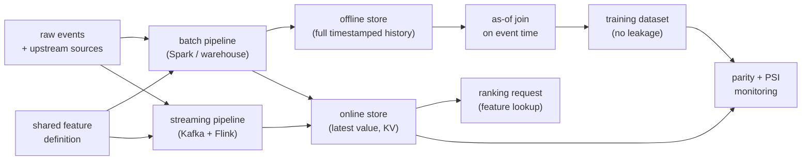

# 9. Summary

## One-page recap

- **Training-serving skew has three causes.** Code skew (different logic on each
  path), time skew (joining on latest value instead of event-time value), and data
  skew (offline and online sources diverged). Name all three. The fix for code skew
  is a shared definition. The fix for time skew is an as-of join. The fix for data
  skew is one materialization path feeding both stores.
- **One definition drives two stores.** The offline store holds full timestamped
  history for bulk as-of joins; the online store holds the latest value per entity
  for single-digit-millisecond point reads at serving time. Both are populated from
  the same definition, so code skew is structurally impossible.
- **Point-in-time correctness is not optional.** For each labeled event at time
  $T_i$, the training feature is $\hat{x}_i = x(e_i, \max\{t : t \leq T_i\})$:
  the most-recent feature write before the event. "Join on latest" leaks the future,
  inflates offline metrics, and collapses online.
- **Freshness is a tier decision, not a default.** Daily batch for slow features;
  streaming for session signals. Assigning streaming freshness to a slow feature
  wastes infrastructure with no accuracy gain.
- **Backfills reintroduce skew if done wrong.** Run today's logic over historical
  timestamps without preserving event-time alignment, and you get a training dataset
  that never matched production. Log-replay (training from serve-time logs) is
  more reliable than recomputation.
- **Detect skew with parity and PSI.** Served-vs-computed parity above 0.999 per
  feature; PSI below 0.1 between training and serving distributions. Both run on a
  schedule and alert before model quality degrades.

## The system on one page

```mermaid
flowchart LR
  SRC["raw events<br/>+ upstream sources"]
  DEF["shared feature<br/>definition"]
  BATCH["batch pipeline<br/>(Spark / warehouse)"]
  STREAM["streaming pipeline<br/>(Kafka + Flink)"]
  OFF["offline store<br/>(full timestamped history)"]
  ON["online store<br/>(latest value, KV)"]
  PTJOIN["as-of join<br/>on event time"]
  TRAIN["training dataset<br/>(no leakage)"]
  RANK["ranking request<br/>(feature lookup)"]
  MON["parity + PSI<br/>monitoring"]

  SRC --> BATCH
  SRC --> STREAM
  DEF --> BATCH
  DEF --> STREAM
  BATCH --> OFF
  BATCH --> ON
  STREAM --> ON
  OFF --> PTJOIN
  PTJOIN --> TRAIN
  ON --> RANK
  ON --> MON
  TRAIN --> MON
```

## Test yourself

Answers are collapsed. Attempt each question before opening one.

1. Name the three causes of training-serving skew and the infrastructure fix for
   each. Which one is the hardest to detect?

   

Answer

   The three are code skew, time skew, and data skew, and each has its own
   infrastructure fix. **Code skew** is the training path and the serving path
   computing the same feature with different code (SQL for training, a service
   function for scoring), where different null handling, rounding, or time-zone
   interpretation compound; the fix is a **single shared definition** that
   compiles to both paths, as Uber's Michelangelo DSL and LinkedIn Feathr's
   unified transformation API do. **Time skew** is joining labels to the latest
   feature value rather than the value that existed at the event, which leaks the
   future; the fix is an **as-of join on event time**. **Data skew** is the
   offline and online paths pulling from sources that have diverged in freshness
   or aggregation window; the fix is **one materialization path** so both stores
   are populated from the same computation. Data skew is the hardest to detect,
   because neither path is wrong in isolation, they simply no longer agree, so
   nothing on either side fails a test. See sections
   [2](02-the-core-problem.md) and [4](04-architecture.md).

   

2. Why does the offline store need to keep timestamped history, and what breaks
   if it stores only the latest value per entity?

   

Answer

   Because the as-of join has to reconstruct the value that existed just before
   each labeled event, and that is only answerable if every row carries its own
   time: $\hat{x}_i = x(e_i, \max\{t : t \leq T_i\})$. A table holding only
   `(entity_id, feature_value)` cannot support that query; the offline data model
   must be `(entity_id, event_time, value)` with all historical rows preserved.
   Store only the latest value and every training row silently picks up whatever
   the feature became *after* the event, which is the **join-on-latest bug**:
   labels arrive seconds to hours late, features update in the meantime, and the
   feature ends up partially encoding the label it is supposed to predict.
   Offline metrics inflate and the model collapses online, because at serving
   time the future has not happened yet. The runnable example in
   [10](10-putting-it-together.md) shows the size of it: the naive join trains at
   0.945 accuracy and serves at 0.555, while the point-in-time join trains at
   0.645 and holds 0.640 in serving. Sliding-window aggregates need the same
   treatment, storing the value at every computation tick rather than only the
   current window, or the as-of join has nothing to look up
   ([3](03-point-in-time-correctness.md), [4](04-architecture.md)).

   

3. A backfill re-runs the current feature definition over two years of raw events.
   In what scenario does this reintroduce time skew, and how do you avoid it?

   

Answer

   It reintroduces time skew whenever the **feature definition changed** during
   those two years: a bug fix, a corrected window, a different null rule. The
   backfill then stamps values computed with today's logic onto events that
   occurred under the old logic, so the model trains on a feature distribution
   that never existed in production, and it will not match what the live pipeline
   writes today either. The same failure appears if the recompute drops event-time
   alignment and writes rows the live pipeline would never have produced at those
   timestamps. Avoid it by making the backfilled rows **indistinguishable from
   rows the live pipeline would have written at each event**: apply the definition
   that was active at the time, or at minimum apply the current definition and
   store results with proper event timestamps, then validate with the parity
   metric from [2](02-the-core-problem.md) against retained serve-time logs.
   Better still, skip the recompute: if serve-time feature logs exist, **log-replay**
   trains on exactly what the model saw and parity holds by construction, which is
   why Google's serve-time logging discipline is the cheapest protection here. When
   the definition genuinely changed, do not silently mix eras: either train only on
   data after the change or version the definition and flag the discontinuity
   ([5](05-freshness-and-backfills.md), [8](08-interview-qa.md)).

   

4. A new streaming feature is introduced. What must be true of the streaming
   aggregate and its batch backfill for point-in-time correctness to hold?

   

Answer

   Two things. First, the streaming aggregate must be **numerically identical to
   what the batch backfill computes for the same window over the same data**,
   which is why both must be compiled from one shared definition; this seam is
   where data skew most often enters. Second, the streaming value must be **logged
   with a timestamp at every computation tick**, not just written as the current
   value, because point-in-time correctness on a sliding window means the as-of
   join needs a historical row to land on. This matters most for decayed
   aggregates such as $a_i(T) = \sum_{t \leq T} y_t \cdot e^{-\lambda(T - t)}$,
   which cannot be reconstructed later without replaying the full event history at
   the correct decay rate, so Uber logs the computed value and replays it instead
   of recomputing. Two supporting conditions: bound the offline lookback with a
   `ttl` that matches the online store's expiry, so the join does not surface a
   months-old value the online store would have dropped, and freeze rows at a
   completeness watermark so late-arriving events do not keep mutating a
   backfilled aggregate. Then validate the whole thing with served-vs-computed
   parity above 0.999 before trusting the training set
   ([3](03-point-in-time-correctness.md), [4](04-architecture.md),
   [5](05-freshness-and-backfills.md)).

   

5. You observe PSI = 0.18 between the training distribution and live traffic for
   a feature. What are the three most likely causes to investigate?

   

Answer

   0.18 is past the 0.1 warning line and approaching the 0.2 out-of-distribution
   signal, so treat it as skew until proven otherwise, and investigate the three
   causes in this order. **One, code skew**: the offline computation and the
   online computation of that feature have drifted apart in null handling,
   rounding, aggregation window, or time zone. **Two, time skew in how the
   training set was built**: a join-on-latest, or a backfill that applied today's
   definition to old events, produces a training distribution that production
   never emitted. **Three, staleness or data divergence on the serving side**: the
   online store is returning values the batch job never refreshed, or TTL expiry
   is replacing real values with defaults, which shifts mass without any error
   being raised. The discriminator is cheap: run served-vs-computed **parity** per
   feature (target above 0.999) and check staleness
   $s_i(T)$ against the declared SLA. If parity is clean and staleness is inside
   the SLA, the shift is genuine population drift rather than skew, which is a
   retraining problem instead of an infrastructure one
   ([2](02-the-core-problem.md), [5](05-freshness-and-backfills.md),
   [8](08-interview-qa.md)).

   

6. When would you choose Cassandra over Redis as the online store? When is
   Feast's pluggable backend the right answer?

   

Answer

   Choose **Cassandra** when the entity-feature working set no longer fits cluster
   memory and a P95 under 10ms is acceptable, because Redis memory cost grows
   linearly with entity count and becomes prohibitive at tens to hundreds of
   billions of entity-feature pairs. The decision comes out of a multiplication,
   not a benchmark: 50 million users at 100 features and 4 bytes per value is 20
   GB, comfortable in Redis, while 500 million users or 1,000 features per entity
   crosses into hundreds of gigabytes, the point where disk-backed storage is
   cheaper than RAM. That is Uber's position, running Cassandra at P95 under 10ms.
   Keep **Redis** when p99 must be below 2ms and the working set fits, which is the
   default for a ranking path with 5 to 10ms allocated to feature fetch inside a
   50ms budget. **Feast's pluggable backend** is the right answer when there is no
   single technology mandate: mixed infrastructure, different models needing
   different stores, or wanting to swap backends as scale grows instead of
   re-architecting later, and it lets a Redis store and a DynamoDB store coexist
   under one API. The caveat is that Feast is a framework rather than a full
   pipeline, so the team still supplies compute and orchestration, and its simple
   materialization path drops the point-in-time guarantee unless you use
   `get_historical_features` ([4](04-architecture.md),
   [6](06-serving-and-scaling.md), [7](07-how-teams-do-it-in-production.md)).

   

## Further reading

- The capstone: [the complete build](10-putting-it-together.md), where every
  choice in this chapter is committed once for the scenario, sized, rebuilt
  under two other constraint sets, and compressed into a runnable one-file
  point-in-time join.
- Dense reference (comparison, math, all case studies):
  [topics/04-feature-store-and-training-serving-skew.md](../../topics/04-feature-store-and-training-serving-skew.md)
- Tool comparisons (Uber vs. LinkedIn vs. Feast vs. Tecton vs. Google):
  [tools/comparisons/04.md](../../tools/comparisons/04.md)
- Per-company teardowns:
  [tools/teardowns/04.md](../../tools/teardowns/04.md)
