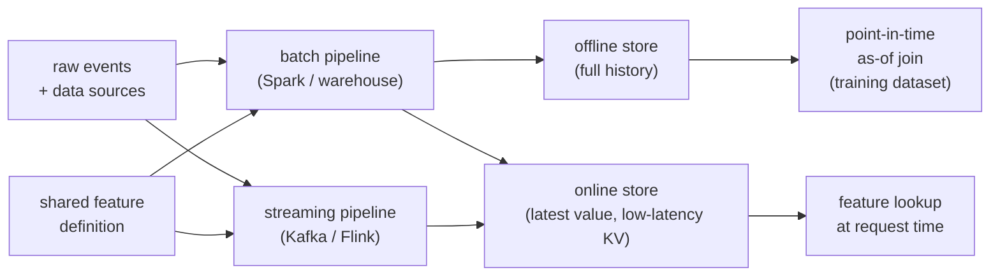

# Feature Stores and Training-Serving Skew

> **Style note.** This chapter follows the same teach-first, book-like arc as the
> candidate-retrieval chapter: a Candidate/Interviewer dialogue to gather
> requirements, one-figure-per-idea, production case studies, "when to use which"
> tables, and an interview Q&A. The topic is infrastructure, not modeling, so the
> arc is adapted: requirements, the core skew problem, point-in-time correctness,
> architecture, freshness, serving, and production teardowns.

An interviewer rarely says "design a feature store." They say **"your models look
great offline but degrade in production; every team recomputes the same features
differently; labels join the wrong feature values. Fix it."** That is the feature
store problem: building a platform where features are defined once, computed the
same way for training and serving, and joined to labels at the correct point in
time. This chapter builds it end to end and shows how Uber, LinkedIn, Feast,
Tecton, and Google actually ship it.

## Sections

1. [Clarifying the requirements](01-clarifying-requirements.md) -- the dialogue that scopes the problem.
2. [The core problem](02-the-core-problem.md) -- what training-serving skew is and why it silently kills models.
3. [Point-in-time correctness](03-point-in-time-correctness.md) -- how to build features without label leakage.
4. [Architecture](04-architecture.md) -- offline store, online store, write and read paths.
5. [Freshness and backfills](05-freshness-and-backfills.md) -- freshness tiers, backfill discipline.
6. [Serving and scaling](06-serving-and-scaling.md) -- online store latency, cost, bottlenecks.
7. [How teams do it in production](07-how-teams-do-it-in-production.md) -- Uber, LinkedIn, Feast, Tecton, Google.
8. [Interview Q&A](08-interview-qa.md) -- commonly asked, tricky, and commonly-answered-wrong.
9. [Summary](09-summary.md) -- the one-page recap and self-test.

## The whole system on one page

Read the sections in order the first time. They build on each other. Each opens
with the question an interviewer actually asks, then answers it.
