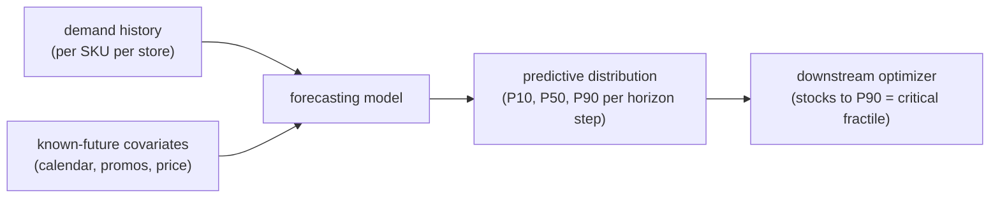
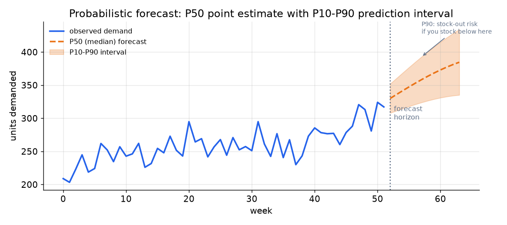

# 2. Framing it as an ML task

## The core choice: point vs probabilistic forecast

Most forecasting textbooks frame the problem as: given a history of observations, predict the next value. That framing produces a **point forecast**, a single number per horizon step, and it is the wrong frame for the design we scoped.

The right frame: given a history plus covariates, predict a **probability distribution over future demand**. The decision layer (replenishment optimizer, driver dispatch policy, ETA quote) consumes a quantile or sample from that distribution, not the mean. Collapsing to a mean before the optimizer is the most common design mistake in this space.

**How it works.** Two inputs flow in: the demand history per SKU per store and the known-future covariates (calendar, promotions, price). The forecasting model consumes both and, instead of collapsing them to a single number, emits a predictive distribution summarized as a few quantiles (P10, P50, P90) for each horizon step. That distribution hands off to the downstream optimizer, which reads the operating point its decision needs rather than the mean. For replenishment, the optimizer stocks to the P90 (the critical fractile) so it does not stock out roughly half the time. The load-bearing idea is that the distribution, not a point estimate, is what crosses the boundary into the decision layer.

*A demand series (blue) with a 12-week probabilistic forecast: P50 median (orange dashed) and P10-P90 interval (shaded). The interval widens with horizon distance. A replenishment optimizer stocks to the P90, not the mean, because stocking to the mean stocks out roughly half the time.*

## Specifying the input and output

The **input** has two parts: the historical demand series (a sequence of past observations, typically log-transformed to stabilize variance) and the known-future covariates (calendar features, holiday flags, planned promotion indicators, and price, all of which are available ahead of the forecast origin).

The **output** is a predictive distribution over demand for each of the H horizon steps. In practice, we emit a finite set of quantiles (P10, P25, P50, P75, P90, and sometimes P95 and P99) rather than a full density, because the optimizer only needs a few operating points and quantile regression is cheap to train.

The horizon setup also decides the recursive vs direct split:
- **Recursive multi-step:** predict one step, feed the prediction back as input, repeat. Cheap but error-accumulates.
- **Direct multi-horizon:** predict all H steps in one shot, one model output per horizon. More parameters but no error accumulation across steps. At 12-week lead times, direct multi-horizon is the stronger choice because error compounds badly over 12 recursive steps.

## Choosing the ML category

This is a **quantile regression on a time series** (predicting a chosen quantile such as the P90 directly, rather than the average), not a classification or ranking problem. The model learns to minimize asymmetric pinball loss (an error that penalizes under- and over-prediction by different amounts, tuned to the target quantile) at each target quantile, rather than MSE or cross-entropy. The ML family that suits this best depends on scale and structure, which is the subject of section 4, but the framing is consistent: transform the problem into supervised learning on (feature, target) pairs where the target is future demand and the features are lags, rolling statistics, and covariates.

## When to use which forecast output

| Reach for | When | Instead of |
|---|---|---|
| Quantile regression (P10/P50/P90) | downstream decision needs specific operating points and you want assumption-free asymmetric loss | a parametric distribution when the demand shape is unknown or changes seasonally |
| Parametric likelihood (negative binomial, log-normal) | demand is count-valued, over-dispersed (variance larger than the mean, i.e. burstier than a plain Poisson allows), or heavy-tailed and you want sampled paths for Monte Carlo | quantile regression when the shape is unstable and a few fixed quantiles miss the tail |
| Conformal prediction intervals | you have a good point model and want calibrated intervals cheaply, with no distributional assumption | re-training a full probabilistic model if the point model is already production-quality |
| Point forecast only | downstream decision needs only a central estimate (e.g., an ETA quote with no safety-stock implication) | a full distribution when the extra complexity and evaluation overhead are not consumed by the decision |

The next section builds the features that feed any of these models.
