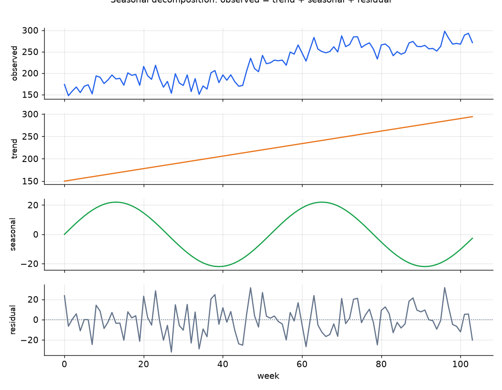
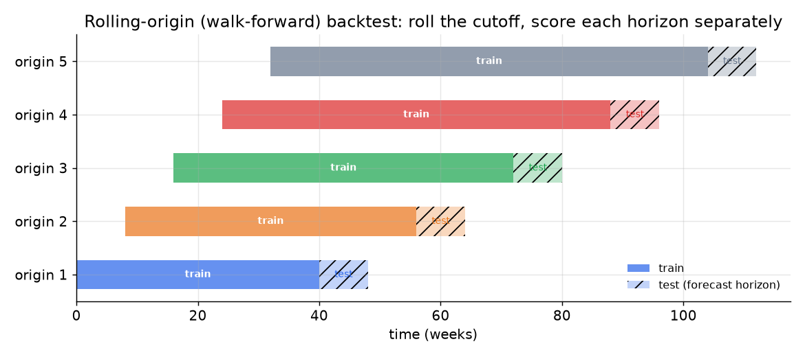

# 3. Data preparation

## Decomposing what you are predicting

Before building features, decompose the series mentally into its components: a slow-moving trend, a repeating seasonal pattern, and a residual. This is not just academic framing; it is what tells you which lag distances carry signal and where promotions and holidays sit.



*Observed demand (blue) decomposes into a trend (orange), a periodic seasonal component (green), and a mean-zero residual (gray). Features should encode all three components: rolling statistics for the trend, lag-at-period for seasonality, and calendar flags for structured residuals like holidays.*

## Feature engineering: the ML path's core asset

The global GBT path (and the neural path) treat forecasting as tabular regression: the model sees a row of features and predicts future demand. Getting these features right is where most of the accuracy comes from.

**Lag features.** Demand at time $t - k$ tells the model about autocorrelation (how correlated the series is with earlier copies of itself) and seasonality (patterns that repeat on a fixed calendar cycle, like weekly or yearly). For a weekly series with annual seasonality, the key lags are $t - 1$ (last week), $t - 7$ (same day of week one period ago for daily data), $t - 52$ (same week last year). The trap: a 12-week-ahead forecast cannot use the $t - 1$ lag, because that value is not yet known at forecast time. Choose lag distances that are available at the forecast horizon, or build one feature set per target horizon.

**Rolling statistics.** Mean, standard deviation, min, and max over 7-, 28-, and 90-day rolling windows capture the level and volatility of the series. These encode trend and regime information that individual lags miss.

**Calendar features.** Day-of-week, week-of-year, and month, encoded cyclically (e.g., $\sin(2\pi \cdot \text{week}/52)$ and $\cos(2\pi \cdot \text{week}/52)$) so that the distance between week 52 and week 1 is small, as it should be.

**Known-future covariates.** Holiday flags (the single strongest driver for many retail series), planned promotional indicators, and price are known in advance and must be included with lead windows (the next 12 weeks of each covariate), not just the current value. Dropping holiday and promotion flags guarantees a miss on exactly the high-demand events that matter most.

**Weather.** A genuine demand driver for grocery, outdoor, and ride-hailing series, but it is itself a forecast. You inherit the weather model's error. Include it with a skeptical eye on the horizon where weather forecasts degrade.

## The leakage trap

Any lag or rolling window that peeks past the forecast origin inflates offline metrics and collapses in production. A 7-day-ahead forecast evaluated with a $t - 1$ lag in the feature set will look spectacular offline and fail live because the $t - 1$ value is not yet available when the forecast runs. Enforce **point-in-time availability** (only use values that were actually known at the forecast origin, never anything from after it) per horizon: for a horizon of $h$ weeks, only lags $\ge h$ and rolling windows that close at least $h$ weeks before the origin are valid.

## Cold-start: new items and new locations

Lag features break entirely on a new SKU with no history. The solution is a **global model** that has learned a representation of item and location attributes. At inference time for a cold-start SKU, the model falls back to attribute priors and borrows the pattern from similar SKUs via hierarchical shrinkage (the parent-category average is the warm prior). Keep intervals wide until enough history has accumulated to trust the item's own signal.

Concretely, shrinkage is a weighted blend that leans on the category prior when the item's own history is thin and leans on the item as its history grows:

```python
def shrink(item_mean, parent_mean, n, k=10):   # n = weeks of item history, k = prior strength
    w = n / (n + k)                            # more history -> weight the item more
    return w * item_mean + (1 - w) * parent_mean
# shrink(item_mean=8.0, parent_mean=5.0, n=10, k=10) -> 0.5*8 + 0.5*5 = 6.5
```

## Building the rolling-origin backtest split

You cannot randomly split a time series; that leaks future demand into training. The correct split is **rolling-origin (walk-forward) evaluation**: fix an origin (the last training date), generate a 12-week forecast, score it against the realized outcomes, then roll the origin forward by one period and repeat.



*Each origin (row) trains on all history up to the cutoff (solid bar), then evaluates on the next 12 weeks (hatched bar). Rolling the origin forward mirrors what the production system does on each weekly retrain cycle. Never collapse these into a single hold-out period: horizon-dependent error decay only shows up when you score each horizon step separately.*

The practical rule: use at least 3 to 5 roll origins, scored at every horizon step (week 1, week 2, ..., week 12 out). Report error by horizon distance; it almost always rises with distance, and hiding that behind an aggregate hides where the model degrades.

## When to use which feature treatment

| Reach for | When | Instead of |
|---|---|---|
| Lag at period (t-52 for annual) | capturing stable seasonal cycle | a raw lag that falls inside the forecast horizon |
| Rolling mean over 28/90 days | capturing trend and volatility regime | instantaneous values that are noisy and non-stationary |
| Cyclic calendar encoding (sin/cos) | week-of-year or month features where the last period is adjacent to the first | integer-encoded calendar that treats December and January as far apart |
| Known-future promotion/holiday flag | the covariate is planned and available ahead of the origin | ignoring it, which guarantees a miss on peak demand events |
| Attribute priors / hierarchical shrinkage | cold-start SKUs with no lag history | per-series lag features that are all zero and uninformative on day zero |
