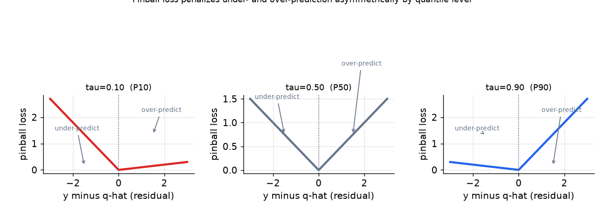

# 4. Model development

## The honest ordering of model families

Reaching for a Transformer before benchmarking a simpler baseline is a red flag. The mature answer goes from simple to complex, stopping at whichever level justifies the extra cost.

**Classical (ARIMA, ETS, Prophet, Theta).** One model per series. ARIMA models autocorrelation and differencing. ETS (exponential smoothing state space) models level, trend, and seasonality in a principled probabilistic form. Prophet is a robust additive decomposition with a piecewise linear or logistic trend plus Fourier-series seasonality and explicit holiday regression. These win when you have **few series with long, clean, stable history**, and they are the fast baseline you must benchmark against before claiming a deep model helps. At millions of series, fitting one model per series does not scale and cannot borrow strength across related items.

**Global gradient-boosted trees (LightGBM, XGBoost) on lag and calendar features.** Reframe forecasting as tabular regression: target is future demand, features are lags, rolling statistics, and calendar signals. One global model shares weights across all series, borrows strength, and generalizes to new items via attribute features. This is the **workhorse for many related series** and is cheap to iterate and retrain. Zalando runs LightGBM with Nixtla's MLForecast on 5 million SKUs weekly under a 2-hour budget, and found it faster to iterate than a Temporal Fusion Transformer at comparable accuracy.

**Deep learning (DeepAR, N-BEATS, TFT, PatchTST).** Global neural models that emit distributions natively. DeepAR parameterizes a likelihood (negative binomial for counts) and samples paths. TFT emits quantiles via a multi-horizon quantile head with attention over covariates. N-BEATS is a pure time-series model without covariates, based on residual stacks of basis expansions. PatchTST splits the series into patch tokens before a Transformer, which lets it handle long horizons cheaply and channel-independently. These earn their keep at **large scale, long horizons, or rich covariate structures**, but do not reliably beat a well-tuned global GBT on short-horizon tabular demand. The cost in training, serving, and iteration speed is real; justify it explicitly.

## Producing the probabilistic output

A probabilistic forecast is the output the decision layer needs. There are three practical paths to get there.

**Quantile regression / pinball loss.** For each target quantile $\tau \in \{0.1, 0.5, 0.9, \ldots\}$, minimize the **pinball loss**:

$$L_\tau(y, \hat{q}) = \max\!\bigl(\tau\,(y - \hat{q}),\;(\tau - 1)\,(y - \hat{q})\bigr)$$

When $y \gt \hat{q}$ (under-prediction), the penalty is $\tau \cdot (y - \hat{q})$. When $y \lt \hat{q}$ (over-prediction), the penalty is $(\tau - 1) \cdot (y - \hat{q})$. For $\tau = 0.9$, under-predictions are penalized 9x more than over-predictions, which correctly encodes the cost of stocking below the service-level target.

*Pinball loss for three quantile levels. At P10 (red, left), over-prediction is punished heavily; the model is incentivized to forecast a low value that is only undercut 10 percent of the time. At P90 (blue, right), under-prediction is punished heavily. P50 (gray, center) is symmetric and recovers MAE.*

GBT models grow separate trees per quantile head; TFT adds quantile output heads on top of its shared encoder. Both fit cleanly into the tabular regression framework.

**Parametric likelihood (DeepAR-style).** Instead of fixed quantiles, predict the parameters of a distribution (mean and dispersion of a negative binomial for count demand). Sample paths from that distribution for Monte Carlo downstream use. The advantage is a continuous density; the risk is distributional misspecification if the true shape changes across seasons.

**Conformal prediction.** A distribution-free calibration wrapper on any point model. Train the point model, compute residuals on a held-out calibration set, and widen intervals to achieve nominal empirical coverage. Cheap honest intervals for a model that is already in production.

## Hierarchical reconciliation

Forecasting each level independently (item, store, region, national) produces incoherent numbers: the item-level forecasts will not sum to the store total, and the business cannot act on levels that contradict each other. There are three reconciliation strategies:

- **Bottom-up.** Forecast the most granular level (item-store) and sum upward. Coherent by construction. Propagates leaf noise upward.
- **Top-down.** Forecast the aggregate, split by historical proportions. Stable aggregate but misses leaf dynamics.
- **Optimal reconciliation (MinT).** Forecast all levels independently, then project the entire set onto the coherent subspace using a trace-minimizing step derived from the estimated residual covariance matrix. Provably reduces total error by incorporating signal from every level. Amazon's hierarchical forecasting paper embeds this step as a differentiable layer, enabling end-to-end learning that emits coherent probabilistic forecasts without a post-hoc reconcile step.

## When to use which model family and output

| Option | Reach for it when | Skip it when |
|---|---|---|
| Classical (ARIMA, ETS, Prophet, Theta) | few series (dozens to hundreds), long and clean history, stable seasonality; the benchmark baseline | millions of related series where one-model-per-series does not scale and cannot borrow strength |
| Global GBT on lag and calendar features | many related series, short to medium horizons, cheap iteration and serving; the production workhorse | very long horizons or rich covariate structures where a deep model pulls ahead at acceptable cost |
| Deep (DeepAR, N-BEATS, TFT, PatchTST) | large scale, long horizons, rich covariates, or cold-start via learned series embeddings | short-horizon tabular demand where a tuned global GBT wins for less cost and iteration effort |

| Probabilistic output | Reach for it when | Skip it when |
|---|---|---|
| Quantile regression / pinball loss | you need specific operating points (P10, P50, P90) directly, assumption-free | you need full sampled paths for Monte Carlo downstream use, not just fixed quantiles |
| Parametric likelihood (negative binomial) | demand is count-valued and over-dispersed; sampled paths are useful | distributional assumption misfits (e.g., demand has two modes); quantile regression is assumption-light |
| Conformal prediction | you have a reliable point model and want calibrated intervals with minimal extra work | you need per-quantile asymmetric shape, not just nominal coverage symmetric around a point |

| Reconciliation | Reach for it when | Skip it when |
|---|---|---|
| Bottom-up | leaf-level forecasts are trustworthy and coherence by construction is the priority | leaf noise is high and propagates upward to degrade aggregates |
| Top-down | the aggregate is stable and historical split proportions are reliable | leaf dynamics shift over time and the top-down splits miss them |
| Optimal (MinT) or end-to-end coherent | all levels are forecast and you want provably lower total error using the full covariance | extra compute and covariance estimation overhead are prohibitive; an end-to-end coherent model can replace it |
