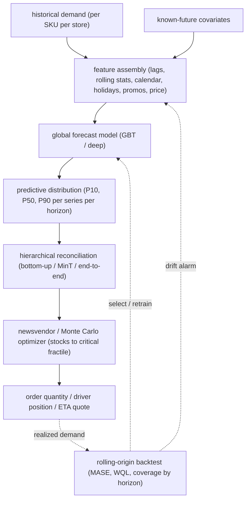

# 9. Summary

## One-page recap

- **The forecast is the intermediate; the decision is the product.** A replenishment optimizer stocks to the critical-fractile quantile, not the mean. ETA dispatches a quote. Driver positioning dispatches units. Name the downstream decision first; it sets the required output format.
- **The output must be a distribution, not a point.** Safety stock requires the spread of the forecast, not its mean. Emit quantiles (P10, P50, P90) or a full likelihood, and verify empirical coverage: a P90 forecast should be exceeded roughly 10 percent of the time.
- **Baseline before going deep.** Classical per-series models (ARIMA, ETS, Prophet) for few series with stable history. A global GBT on lag and calendar features for many related series: the production workhorse. Deep models (DeepAR, TFT, PatchTST) for large scale, long horizons, or rich covariate structures. A well-tuned GBT consistently matches or beats a deep model on short-horizon tabular demand at a fraction of the cost.
- **The leakage trap kills offline credibility.** Any lag that peeks past the forecast origin inflates offline metrics and collapses live. Enforce point-in-time feature availability per horizon.
- **Hierarchical levels must reconcile.** Forecasting each level independently produces incoherent numbers. Reconcile with MinT (optimal), bottom-up (coherent by construction, noisy), or top-down (stable aggregate, misses leaf dynamics). End-to-end coherent models (Amazon-style) embed reconciliation as a differentiable layer.
- **Evaluate with rolling-origin backtesting at the production horizon.** Score each horizon distance (week 1 through week 12) separately with MASE and WQL plus empirical coverage. Random splits, single hold-out periods, and MAPE are all broken.

## The system on one page

## Test yourself

1. A stakeholder wants a single MAPE number to compare two forecasts. Why is MAPE the wrong metric here, and what should you report instead?

2. The P90 forecast has an empirical coverage of 60 percent in backtesting. What does that mean, and what would the optimizer do wrong if you shipped this model?

3. Your 12-week-ahead forecast uses the same lag features as your 1-week-ahead forecast. Why is this likely leaking information, and how do you fix it?

4. When does a global GBT on lag features beat a Temporal Fusion Transformer, and when does the Transformer pull ahead?

5. The operations team says the forecasts for region and store totals do not add up to the national total. Name three reconciliation strategies and explain when you would choose each one.

6. A new product launches next week with no sales history. The production model uses lag features as its primary inputs. What falls back in place to produce a forecast, and why should the prediction intervals be wide?

## Further reading

- Dense reference with production case studies, comparison tables, and math: [../../topics/14-demand-forecasting-and-time-series.md](../../topics/14-demand-forecasting-and-time-series.md)
- Per-company teardowns with interview questions per system: [../../tools/teardowns/14.md](../../tools/teardowns/14.md)
- Method comparison table and design-space quadrant: [../../tools/comparisons/14.md](../../tools/comparisons/14.md)
- Trace the PatchTST patch-Transformer and CNN-LSTM-1D live in the [Model Zoo](https://github.com/neurarch-ai/awesome-llm-model-zoo) to see how the sequence structure wires up at real dimensions.
