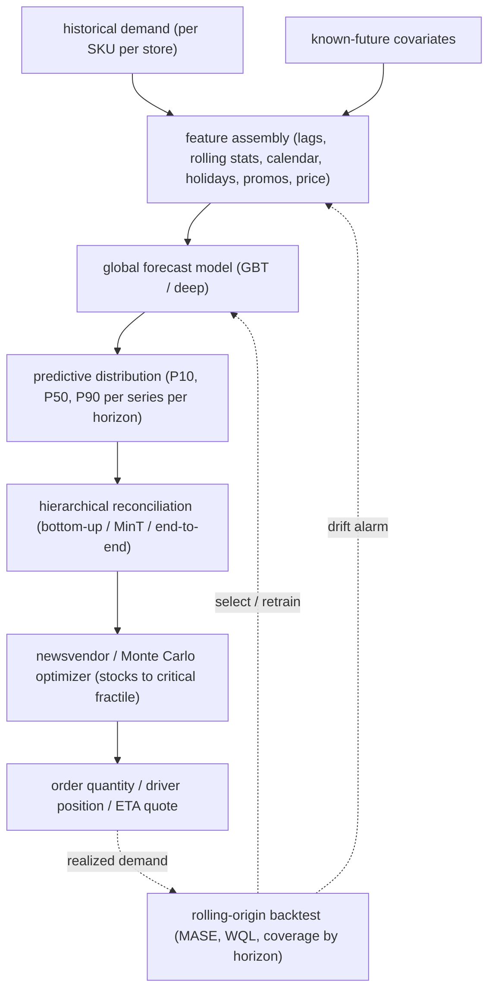

# 9. Summary

## One-page recap

- **The forecast is the intermediate; the decision is the product.** A replenishment optimizer stocks to the critical-fractile quantile, not the mean. ETA dispatches a quote. Driver positioning dispatches units. Name the downstream decision first; it sets the required output format.
- **The output must be a distribution, not a point.** Safety stock requires the spread of the forecast, not its mean. Emit quantiles (P10, P50, P90) or a full likelihood, and verify empirical coverage: a P90 forecast should be exceeded roughly 10 percent of the time.
- **Baseline before going deep.** Classical per-series models (ARIMA, ETS, Prophet) for few series with stable history. A global GBT on lag and calendar features for many related series: the production workhorse. Deep models (DeepAR, TFT, PatchTST) for large scale, long horizons, or rich covariate structures. A well-tuned GBT consistently matches or beats a deep model on short-horizon tabular demand at a fraction of the cost.
- **The leakage trap kills offline credibility.** Any lag that peeks past the forecast origin inflates offline metrics and collapses live. Enforce point-in-time feature availability per horizon.
- **Hierarchical levels must reconcile.** Forecasting each level independently produces incoherent numbers. Reconcile with MinT (optimal), bottom-up (coherent by construction, noisy), or top-down (stable aggregate, misses leaf dynamics). End-to-end coherent models (Amazon-style) embed reconciliation as a differentiable layer.
- **Evaluate with rolling-origin backtesting at the production horizon.** Score each horizon distance (week 1 through week 12) separately with MASE and WQL plus empirical coverage. Random splits, single hold-out periods, and MAPE are all broken.

## The system on one page

```mermaid
flowchart TD
  HIST["historical demand (per SKU per store)"] --> FEAT["feature assembly (lags, rolling stats, calendar, holidays, promos, price)"]
  COV["known-future covariates"] --> FEAT
  FEAT --> MODEL["global forecast model (GBT / deep)"]
  MODEL --> DIST["predictive distribution (P10, P50, P90 per series per horizon)"]
  DIST --> RECON["hierarchical reconciliation (bottom-up / MinT / end-to-end)"]
  RECON --> OPT["newsvendor / Monte Carlo optimizer (stocks to critical fractile)"]
  OPT --> ACT["order quantity / driver position / ETA quote"]
  ACT -.->|"realized demand"| BACKTEST["rolling-origin backtest (MASE, WQL, coverage by horizon)"]
  BACKTEST -.->|"select / retrain"| MODEL
  BACKTEST -.->|"drift alarm"| FEAT
```

## Test yourself

Answers are collapsed. Attempt each question before opening one.

1. A stakeholder wants a single MAPE number to compare two forecasts. Why is MAPE the wrong metric here, and what should you report instead?

   

Answer

   MAPE is broken on this data in three separate ways, so report **MASE** for point accuracy plus **WQL** and an **empirical coverage** check for the distribution. First, MAPE is undefined when the actual is zero, and zero weeks are constant at item-store granularity for intermittent demand. Second, it is asymmetric: an under-prediction and an over-prediction of the same magnitude contribute different amounts, so it quietly biases model selection toward over-forecasting. Third, it explodes on small denominators, which lets a SKU selling 2 units dominate the average. MASE fixes all three by normalizing against the in-sample seasonal-naive error: it is unit-free, comparable across heterogeneous series, defined at zero demand, and readable as skill, since MASE below 1 beats the naive baseline. One number is still not enough, because the optimizer consumes quantiles rather than a point, so add WQL for the whole predictive distribution and coverage to confirm the intervals mean what they say. Score every horizon week separately and business-weight the aggregate so a million noisy tail SKUs do not decide the winner. Sections [5](05-evaluation.md) and [8](08-interview-qa.md).

   

2. The P90 forecast has an empirical coverage of 60 percent in backtesting. What does that mean, and what would the optimizer do wrong if you shipped this model?

   

Answer

   It means realized demand landed at or below the forecast P90 only 60 percent of the time instead of 90 percent, so the intervals are far too narrow and the model is systematically overconfident. The quantile labelled P90 is really about the P60 of the true demand distribution, and every other quantile is shifted the same way. Shipped, this breaks the optimizer's contract directly: the newsvendor stocks to the critical fractile $c_u / (c_u + c_o)$, which is 0.75 for the chapter's 3:1 underage-to-overage ratio, and it treats the quantile as a promise about how often demand exceeds it. Because the promise is false, the order quantity sits well below the level the 90 percent service target requires and the stockout rate blows through it. The failure is invisible in the loss numbers, since pinball loss and WQL reward sharpness as well as calibration: a model can buy much sharper intervals almost everywhere by giving up tail coverage on volatile series and still improve aggregate WQL. That is why empirical coverage must be reported alongside the loss and checked level by level, not inferred from it. The fix is calibration, not a better point model: widen with conformal intervals from held-out residuals, or refit with monotone quantile heads or a count likelihood that can carry the true dispersion. Sections [5](05-evaluation.md), [8](08-interview-qa.md), and [10](10-putting-it-together.md).

   

3. Your 12-week-ahead forecast uses the same lag features as your 1-week-ahead forecast. Why is this likely leaking information, and how do you fix it?

   

Answer

   Because most of those lags are not observable at a 12-week forecast origin. The 1-week model may legitimately use the $t - 1$ lag; the 12-week model may not, since that value will not exist for another 11 weeks when the forecast actually runs. Offline the leak is invisible: the backtest table already contains every historical value, so the $t - 1$ column fills in cleanly and scores as strongly predictive, and all of that apparent accuracy evaporates live when the value has to be imputed or replaced with the model's own forecast. The rule is **point-in-time availability** per horizon: at horizon $h$, only lags of distance $h$ or greater are real features, and rolling windows must close at least $h$ periods before the origin. Fix it by building one feature set per target horizon, or by using a direct multi-horizon model with a separate output head per horizon distance, which also avoids the error compounding of recursive multi-step forecasting. Enforce the same discipline at serving time with a feature store that does point-in-time lookup, so training and serving cannot drift apart. Watch for the sibling leak while you are there: a per-series scaling statistic computed over the whole series leaks the target's own future level through the normalization constant, even though the feature list looks clean. Sections [3](03-data-preparation.md), [6](06-serving-and-scaling.md), and [8](08-interview-qa.md).

   

4. When does a global GBT on lag features beat a Temporal Fusion Transformer, and when does the Transformer pull ahead?

   

Answer

   The **global GBT wins on short-horizon tabular demand across many related series**, which is the common case and the production workhorse. The reason is where the signal lives: short-horizon demand is mostly explained by a handful of lag, rolling, calendar, and promotion features with tabular interactions, exactly the regime gradient-boosted trees are built for. The Transformer's advantage is learning representations of long raw sequences, and that capacity buys nothing when the useful context is already summarized into lag features, so you pay the training and serving cost without touching the accuracy bottleneck. Zalando made this call explicitly, adopting LightGBM with MLForecast for millions of SKUs after evaluating TFT, citing iteration speed and a robust ecosystem. The **TFT pulls ahead at long horizons, at very large scale, when the covariate structure is rich enough that the GBT plateaus, or when cold-start needs learned item and category embeddings** rather than hand-built attribute features. One structural caveat cuts the other way: a tree predicts a piecewise-constant function bounded by its training targets, so it cannot extrapolate a trend and flatlines once the horizon leaves the historical range, which is why lag-and-calendar GBT pipelines predict a differenced or deflated target. Baseline before going deep, and make the deep model beat the tuned GBT in the same rolling-origin backtest before it earns the extra cost. Sections [4](04-model-development.md), [7](07-how-teams-do-it-in-production.md), and [8](08-interview-qa.md).

   

5. The operations team says the forecasts for region and store totals do not add up to the national total. Name three reconciliation strategies and explain when you would choose each one.

   

Answer

   Forecasting each level independently produces incoherent numbers, and the three strategies are **bottom-up**, **top-down**, and **optimal reconciliation (MinT)**. Bottom-up forecasts the most granular item-store level and sums upward: coherent by construction, so choose it when the leaf forecasts are trustworthy and coherence is all you need, but it propagates leaf noise into the aggregates. Top-down forecasts the aggregate and splits it by historical proportions: choose it when the aggregate is stable and the split proportions are reliable, but it discards leaf dynamics and fails whenever the demand mix shifts through new products, regional trends, or promotions. MinT forecasts all levels independently and then projects the stacked base forecasts onto the coherent subspace with a covariance-weighted least-squares step, $\tilde{y} = S\,(S^\top W^{-1} S)^{-1} S^\top W^{-1}\,\hat{y}$, so levels with small reliable residuals pull the reconciled numbers toward themselves and noisy levels are trusted less; it provably reduces total error and is the default when more than one level is consumed. Bottom-up and top-down are the degenerate cases of that projection where all trust is placed on a single level regardless of its residual variance. At millions of series the dense covariance is infeasible to estimate or invert, so production uses approximate MinT with shrinkage or block-diagonal covariance, run once per forecast cycle after all series are forecast. The fourth option is an end-to-end coherent model (Amazon-style) that embeds reconciliation as a differentiable layer and removes the post-hoc step, at the cost of a full retrain whenever the hierarchy changes. Sections [4](04-model-development.md), [6](06-serving-and-scaling.md), and [8](08-interview-qa.md).

   

6. A new product launches next week with no sales history. The production model uses lag features as its primary inputs. What falls back in place to produce a forecast, and why should the prediction intervals be wide?

   

Answer

   Lag features are all zero and uninformative at day zero, so the forecast falls back to **attribute and category priors inside the global model**. Because one model is trained across the whole panel, it has learned a mapping from attributes (category, price point, and content or image embeddings in Wayfair's cold-start case) to demand pattern, which places the new item near similar items and lets its forecast inherit their level and seasonal shape. **Hierarchical shrinkage** then blends that parent prior with the item's own accumulating history, leaning on the prior while history is thin: `w = n / (n + k)` with n weeks of item history and k the prior strength, so `shrink(item=8.0, parent=5.0, n=10, k=10)` returns 6.5. A zero-shot time-series foundation model (TimesFM, Chronos, Moirai) is a credible alternative fallback here, since cold start is precisely where pretrained cross-domain priors are strongest. The intervals should be wide because at launch essentially all the uncertainty is in whether the prior fits this item at all, not in ordinary week-to-week noise, and nothing in the data has yet tested that assumption. Narrow intervals would be a false promise to the optimizer, which stocks to a quantile and would order as if the category analogy were verified. Let the intervals narrow as history accrues and the shrinkage weight shifts toward the item's own signal. Sections [3](03-data-preparation.md), [4](04-model-development.md), [6](06-serving-and-scaling.md), and [8](08-interview-qa.md).

   

## Further reading

- The capstone: [the complete build](10-putting-it-together.md), where every
  choice in this chapter is committed once for the scenario, sized, rebuilt
  under two other constraint sets, and compressed into a runnable one-file rolling-origin backtest.
- Dense reference with production case studies, comparison tables, and math: [../../topics/14-demand-forecasting-and-time-series.md](../../topics/14-demand-forecasting-and-time-series.md)
- Per-company teardowns with interview questions per system: [../../tools/teardowns/14.md](../../tools/teardowns/14.md)
- Method comparison table and design-space quadrant: [../../tools/comparisons/14.md](../../tools/comparisons/14.md)
- Trace the PatchTST patch-Transformer and CNN-LSTM-1D live in the [Model Zoo](https://github.com/neurarch-ai/awesome-llm-model-zoo) to see how the sequence structure wires up at real dimensions.
