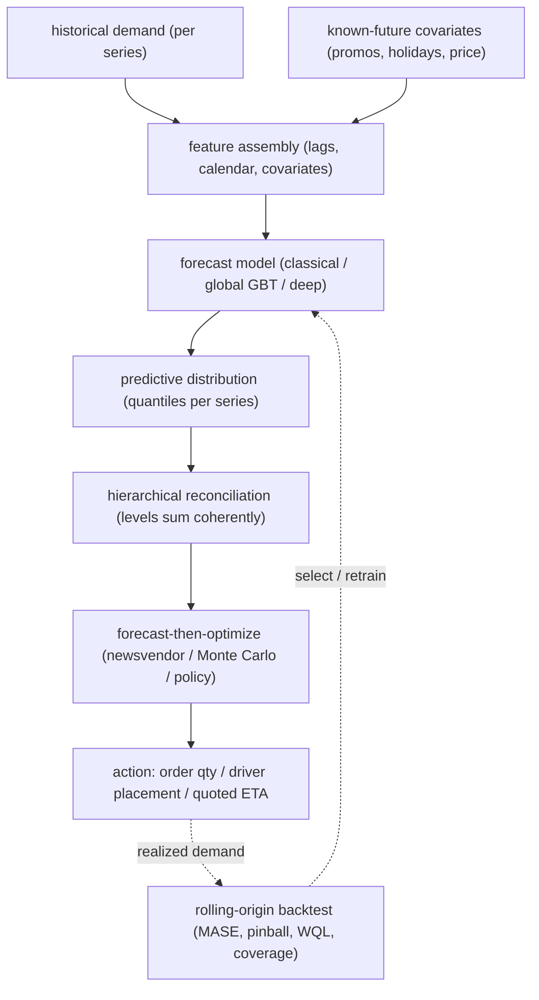

# Demand Forecasting and Time Series

> An interviewer rarely says "design a demand forecast." They say **"design the system that decides how much to stock at every location, how many drivers to position, and what ETA to quote, across millions of items."** That is demand forecasting: probabilistic, hierarchical, decision-coupled, and non-stationary by default. This chapter builds it end to end, and shows how Uber, Amazon, Google DeepMind, Instacart, Zalando, Grab, Wayfair, and others actually ship it.

The signal that separates strong answers from weak ones: you know that the **forecast is the intermediate** and the **decision is the product**. A point forecast cannot feed an optimizer that needs a service-level quantile for safety stock. Name that first.

## Sections

1. [Clarifying the requirements](01-clarifying-requirements.md) - the dialogue that scopes the problem.
2. [Framing it as an ML task](02-frame-as-ml-task.md) - point vs probabilistic forecast; horizon; input/output.
3. [Data preparation](03-data-preparation.md) - seasonality, feature engineering, backtesting splits, cold-start.
4. [Model development](04-model-development.md) - classical vs GBT vs deep; quantile loss; when to use which.
5. [Evaluation](05-evaluation.md) - MASE, pinball, WQL/CRPS; why not MAPE; rolling backtesting.
6. [Serving and scaling](06-serving-and-scaling.md) - batch forecasts, hierarchical reconciliation, bottlenecks.
7. [How teams do it in production](07-how-teams-do-it-in-production.md) - Uber, Amazon, Zalando, and how they differ.
8. [Interview Q&A](08-interview-qa.md) - commonly asked, tricky, and commonly answered wrong.
9. [Summary](09-summary.md) - recap, system diagram, test-yourself questions, further reading.

## The whole system on one page

Read the sections in order the first time; they build on each other. Each opens with the question an interviewer actually asks, then answers it.
