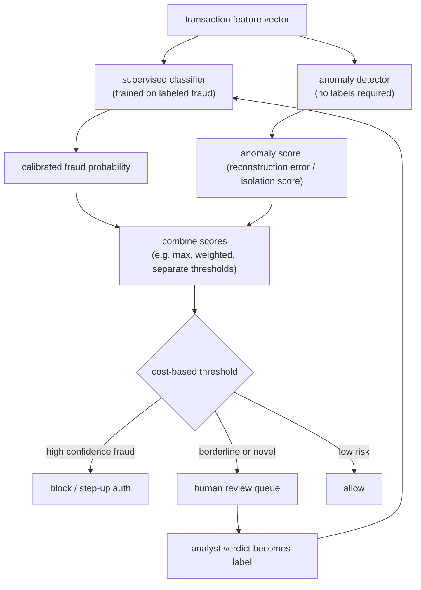

# 2. Framing it as an ML task

## Two paths: supervised classification and anomaly detection

The requirements describe two distinct problems that need two tools.

**Supervised classification** applies when we have labeled fraud. The model
learns to estimate $p(\text{fraud} \mid x)$ from historical (transaction,
label) pairs, and that calibrated probability feeds the cost-sensitive
threshold. Supervised models are accurate on known attack patterns and fast to
serve. Their blind spot is novelty: they cannot flag attacks they have never
seen labeled.

**Anomaly detection** applies when labels are absent or when the attack pattern
is new. Methods like Isolation Forest or autoencoder reconstruction error score
how unusual a transaction is relative to normal behavior, with no labels
required. The payoff is catching new fraud the supervised model has not yet
learned. The cost is a higher false-positive rate: unusual is not the same as
fraudulent. Anomaly hits feed the human review queue, and analyst verdicts there
become the labels that train the next supervised model.

The mature answer runs both in parallel: supervised for known fraud at high
precision, anomaly detection for novel attacks, and the human review queue
bridging the two.

## When to use which

| Reach for | When | Instead of |
|---|---|---|
| Supervised classifier (XGBoost, DNN) | you have mature labeled fraud and want high precision on known patterns | anomaly detection, which trades precision for novelty coverage |
| Anomaly detection (Isolation Forest, autoencoder) | novel attack with no labels yet, or as a first-pass layer to feed the review queue | supervised, which is blind to patterns it was never trained on |
| Both in parallel | you need high precision on known fraud AND want a safety net for novel attacks | either alone, which leaves one gap uncovered |
| Graph anomaly (GraphBEAN, RGCN) | fraud is coordinated across accounts sharing devices, cards, or addresses | per-transaction models that treat each event in isolation |

## The input feature vector

The model consumes a feature vector assembled at decision time from several
signal groups. Each group contributes a different kind of evidence.

**Transaction fields (raw).** Amount, currency, merchant category code,
merchant country, card BIN (the first six digits that identify the issuer and
card type), entry mode (chip, contactless, CNP), and time of day.

**Velocity and aggregate features.** Stateful counts precomputed over rolling
windows: transactions per card in the last minute / hour / 24 hours, distinct
merchants per card, total spend per account, number of distinct devices per
account, geo-velocity (two transactions from cities 1,000 km apart within an
hour). These are the most predictive signals and the hardest to serve correctly
(training-serving skew bites here).

**Graph and entity signals.** Whether the device, IP, or card has been linked
to known fraud accounts; connected-component size in the shared-entity graph;
hops-to-fraud in the identifier network; shared-device count. These surface
ring fraud that looks clean at the per-transaction level.

**Behavioral and session signals.** Typing cadence, mouse dynamics, device
orientation changes, time-on-page for the checkout flow. Feedzai uses these
as behavioral biometrics; they are hard for fraudsters to fake consistently.

**Identity signals.** Account age, email domain age, billing-to-shipping address
mismatch, whether the shipping address is a freight forwarder, device and
browser fingerprint.

## The output

The model outputs a **calibrated probability** $p(\text{fraud} \mid x) \in
[0, 1]$. Calibration matters because the cost-optimal threshold formula assumes
the score is a true probability. An uncalibrated model (for example a raw
logit, or a model trained on a resampled set) can be well-ranked but will place
the operating point at the wrong threshold.

The probability feeds a cost-based threshold that produces one of three actions:
allow, block, or route to review. The threshold is revisited whenever the cost
matrix or the base rate changes.
